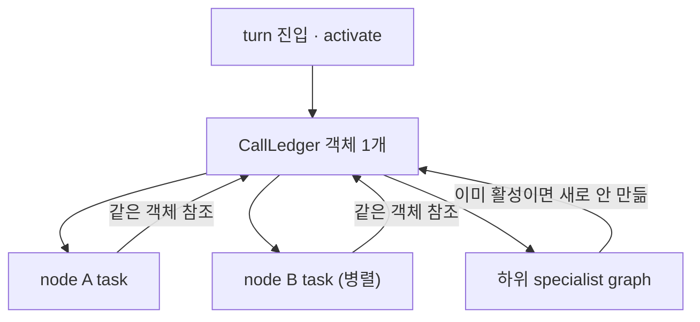

# LLM 호출 원장과 예산

- **원장(ledger)**: 이번 턴에 LLM을 몇 번 불렀는지 **실측**한다.
- **예산(budget)**: 그 수가 상한을 넘으면 막는다.
- 둘은 다른 일이다. 원장은 사실을 세고, 예산은 정책을 정한다.

## 왜 "자기 신고"가 안 되나

> 지금까지 호출 수는 각 handler가 "자기 신고"했다. 신고가 실제와 어긋나면 (실측: classify 예산 위반 3>2가 신고 오류인지 실제 초과인지 판별 불가) **시스템은 진실을 모른 채 계약 검사를 한다.**

핸들러가 `count += 1`을 직접 쓰면, 빼먹거나 재시도 경로를 놓친다. 그래서 **호출이 실제로 일어나는 자리** — provider runnable의 `invoke` — 에서 센다. 신고는 참고값이 되고 실측이 정본이 된다.

## ContextVar에 가변 객체를 담는다

```python
@dataclass
class CallLedger:
    """turn 하나의 실측 호출 수. 가변이어야 하위 task와 공유된다."""
    llm_calls: int = 0
    rag_calls: int = 0

_LEDGER: ContextVar[CallLedger | None] = ContextVar("ai_agent_call_ledger", default=None)
```

핵심은 **가변 객체**라는 점이다.

> contextvar가 가변 Counter 객체를 든다. asyncio 하위 task는 context를 **복사**하지만 같은 객체를 참조하므로, provider 호출이 어느 task에서 일어나든 증가가 원장에 보인다.



`int`를 담았으면 하위 task의 증가가 상위에 안 보인다. 컨텍스트는 복사되지만 **객체 참조는 공유**되기 때문에 가변 dataclass여야 한다 ([[ContextVar]], [[asyncio.gather와 병렬 실행]]).

이미 활성이면 새로 만들지 않는다. 그래서 workflow node 안에서 돌린 specialist graph의 호출도 상위 노드 실측에 합산된다.

## 원장이 하지 않는 것

> 예산 정책을 정하지 않는다. **실패한 provider 호출도 요청이 나갔으면 센다** — 비용은 성공 여부와 무관하게 발생한 사실이기 때문이다.

세는 것과 판단하는 것을 섞지 않는다. 이 분리가 없으면 "실패는 안 센다" 같은 정책이 계측 안에 숨어 버린다 ([[Observability]]).

## 래퍼는 파생까지 전파돼야 한다

```python
class BudgetedRunnable(Runnable):
    def __init__(self, inner: Runnable):
        self._inner = inner

    def __getattr__(self, name: str) -> Any:
        """provider/model 메타데이터 등 비호출 capability는 원본에 위임한다."""
        if name == "_inner":
            raise AttributeError(name)
        return getattr(self._inner, name)

    def bind_tools(self, tools, **kwargs) -> "BudgetedRunnable":
        """동적 tool binding 뒤에도 같은 예산 경계를 유지한다."""
        return BudgetedRunnable(self._inner.bind_tools(tools, **kwargs))

    def with_structured_output(self, schema, **kwargs) -> "BudgetedRunnable":
        """classifier 등 후행 structured-output 파생 모델도 예산 안에 둔다."""
        return BudgetedRunnable(self._inner.with_structured_output(schema, **kwargs))
```

**가장 흔한 버그가 여기 있다.** `with_structured_output`이나 `bind_tools`는 **새 Runnable을 반환한다.** 그대로 두면 알맹이만 나와서 계측과 예산이 끊긴다. 반환값을 **같은 래퍼로 다시 감싸야** 한다 ([[with_structured_output]], [[Tool Observability Wrapping]]).

`__getattr__` 위임도 짝이다. 래퍼가 모르는 속성(모델명, provider 메타데이터)은 안쪽으로 넘겨야 [[LLM Provider 추상화]]가 유지된다. `_inner`만 예외 처리하지 않으면 무한 재귀에 빠진다 ([[__getattr__ Lazy Import]]와 같은 함정).

## 예산 초과

```python
from ai_agent.workflow.runtime.budget.reservation import reserve_llm_call
```

호출 **전에** 자리를 예약한다. 넘으면 `WorkflowBudgetExceeded`를 던져 무한 루프를 끊는다 ([[Loop Control]], [[GraphRecursionError]]와 같은 계열의 안전장치).

## 한 줄 정리

원장은 **provider 경계에서 실측**하고, 예산은 그 위에서 정책을 건다. 래퍼는 파생 Runnable까지 따라가야 진실이 유지된다.

## 관련

- [[ContextVar]]
- [[with_structured_output]]
- [[Tool Observability Wrapping]]
- [[Observability]]
- [[Cost와 Token]]
- [[LLM Provider 추상화]]
- [[asyncio.gather와 병렬 실행]]
- [[Loop Control]]
- [[Mixin]]
