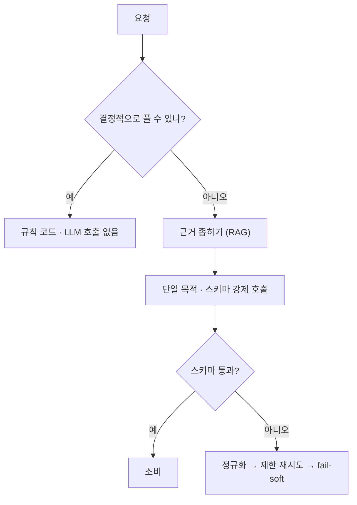

# sLLM(소형 LLM) 운용

- sLLM = small LLM. 수 B~수십 B 파라미터의 **자체 호스팅 가능한 모델**이다. [[Ollama]]로 돌리는 gemma·qwen·gpt-oss 계열이 여기 해당한다.
- 프런티어 모델과 **같은 API로 부르지만 같은 것을 기대하면 안 된다.** 설계가 달라져야 한다.

## 무엇이 다른가

| 항목 | 프런티어 (GPT-4o 급) | sLLM |
|---|---|---|
| 지시 준수 | 복잡한 다단계 지시도 따름 | 단계가 늘면 무너짐 |
| 스키마 준수 | 대체로 안정 | **중첩 객체에서 흔들림** |
| 컨텍스트 | 128K+ | 8K~64K, VRAM에 직결 |
| 긴 근거 활용 | 뒤쪽 정보도 씀 | 앞부분에 편향 |
| 비용 | 토큰 과금 | 하드웨어 고정비 |

## 설계 원칙 다섯

**1) 한 호출에 한 가지만 시킨다.** 분류 + 추출 + 계획을 한 번에 시키면 sLLM은 무너진다. [[Specialist Agent Pattern]]으로 쪼갠다.

**2) 답의 모양을 코드가 소유한다.** 자유 서술을 파싱하지 말고 [[Structured Output]] 스키마를 강제한다. sLLM일수록 더 강하게 — [[with_structured_output]]의 `json_schema` 방식.

**3) 결정적으로 할 수 있는 일은 시키지 않는다.** 카테고리 매칭 같은 건 키워드 사전으로 푼다 ([[구조화 검색 채널]]). LLM 호출은 판단이 필요한 곳에만 쓴다.

**4) 근거를 짧고 앞에 둔다.** 컨텍스트를 채운다고 품질이 오르지 않는다. [[RAG(Retrieval-Augmented Generation)|검색]]으로 좁힌 근거만 넣는다 ([[Context Engineering]]).

**5) 실패를 정상 경로로 만든다.** 스키마 위반은 예외 상황이 아니라 **자주 있는 일**이다. [[Structured Output 정규화]]와 제한된 재시도, 그리고 [[Fail-soft]]를 처음부터 설계에 넣는다.

## 모델 독립성

같은 파이프라인이 sLLM에서도 프런티어에서도 돌아야 한다. 그러려면 **모델 능력에 기대는 설계를 안 하는 것**이 답이다.

- 프롬프트에 "너는 똑똑하니까 알아서" 류의 여지를 남기지 않는다.
- 근거·형식·허용값을 전부 명시한다 ([[Grounded Generation]]).
- 모델 선택은 [[LLM Routing]]이 정하고, 파이프라인은 그걸 모른다.

역설적으로 **sLLM을 기준으로 설계하면 큰 모델에서도 품질이 올라간다.** 모호함이 사라지기 때문이다.

## 한 줄 정리

sLLM 운용은 **모델을 똑똑하게 만드는 게 아니라, 똑똑할 필요가 없게 문제를 잘라 주는 것**이다.

## 관련

- [[Ollama]]
- [[컨텍스트 윈도우와 num_ctx]]
- [[LLM 샘플링 파라미터]]
- [[Structured Output]]
- [[Structured Output 정규화]]
- [[LLM Routing]]
- [[LLM Provider 추상화]]
- [[Context Engineering]]
- [[Specialist Agent Pattern]]
