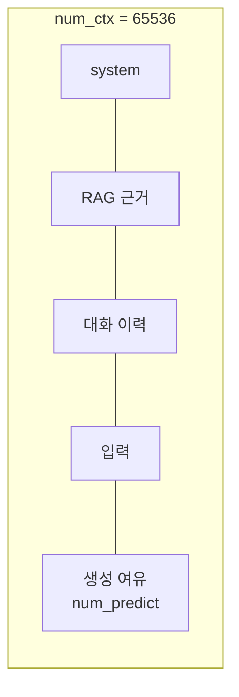

# 컨텍스트 윈도우와 num_ctx

- 컨텍스트 윈도우는 **모델이 한 번에 볼 수 있는 토큰 수**다. 프롬프트 + 지금까지의 대화 + 생성될 출력이 전부 여기 들어간다.
- [[Ollama]]에서는 `num_ctx`로 명시한다. OpenAI는 모델이 정해 놓은 값을 그냥 쓴다.

## 예산은 하나다

```text
num_ctx  =  system prompt + 근거(RAG) + 대화 이력 + 사용자 입력 + num_predict(생성분)
```



**생성할 자리를 안 남기면 출력이 잘린다.** 입력으로 창을 꽉 채우면 모델이 답을 쓸 공간이 없다.

## `num_ctx`를 키우면 생기는 일

| | 효과 |
|---|---|
| 좋음 | 긴 근거·긴 대화를 넣을 수 있다 |
| 나쁨 | **KV 캐시가 선형으로 커진다** → VRAM 급증 |
| 나쁨 | 동시 처리 슬롯 수가 줄어든다 (`ollama_parallel_slots`) |
| 나쁨 | 프리필 지연이 늘어난다 |

즉 `num_ctx`는 품질 다이얼이 아니라 **VRAM 예산 배분**이다. 크게 잡을수록 동시 사용자가 줄어든다.

## 인프라 계약이 되는 경우

사내 H200 배치에서는 게이트가 **약속된 `num_ctx` 이외의 값을 403으로 거부**한다. 서버가 VRAM 배치를 미리 계산해 두기 때문이다.

```python
ollama_num_ctx: int = _DEFAULTS["ollama_num_ctx"]     # 임의로 못 바꾼다
```

그래서 이 값은 애플리케이션이 **튜닝하는 값이 아니라 지켜야 할 계약**이다. 코드에서 하드코딩하지 않고 settings 하나에서만 읽는 이유다.

## 창이 모자랄 때의 순서

창을 키우는 건 마지막 수단이다. 그 전에:

1. **근거를 줄인다** — 검색 top-K를 낮추고 [[score_threshold]]를 올린다.
2. **대화를 압축한다** — 오래된 턴을 요약으로 대체 ([[Memory]], [[Session Context Store]]).
3. **호출을 쪼갠다** — 한 번에 다 넣지 말고 단계로 나눈다 ([[Specialist Agent Pattern]]).
4. **긴 근거를 앞에 둔다** — [[sLLM(소형 LLM) 운용|sLLM]]은 뒤쪽 정보를 덜 쓴다.

## 잘림을 감지하기

응답이 `done_reason=length`로 끝나면 **모델이 할 말을 다 못 하고 잘린 것**이다. 이건 실패로 취급해야 한다. 잘린 JSON은 [[Structured Output 정규화]]에서도 살릴 수 없다. `num_predict`(생성 상한)를 늘리거나 입력을 줄여야 한다.

## 한 줄 정리

`num_ctx`는 **입력과 출력이 나눠 쓰는 하나의 예산**이고, 로컬 배치에서는 VRAM 계약이라 마음대로 못 바꾼다.

## 관련

- [[Ollama]]
- [[sLLM(소형 LLM) 운용]]
- [[LLM 샘플링 파라미터]]
- [[Cost와 Token]]
- [[Context Engineering]]
- [[Prompt Caching]]
- [[Memory]]
