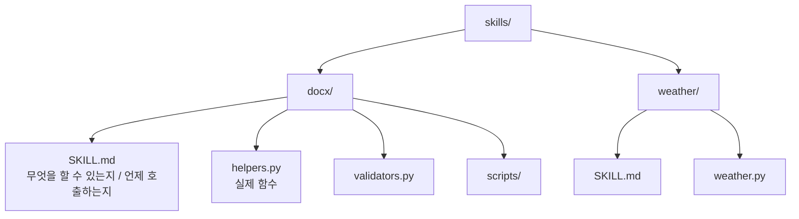
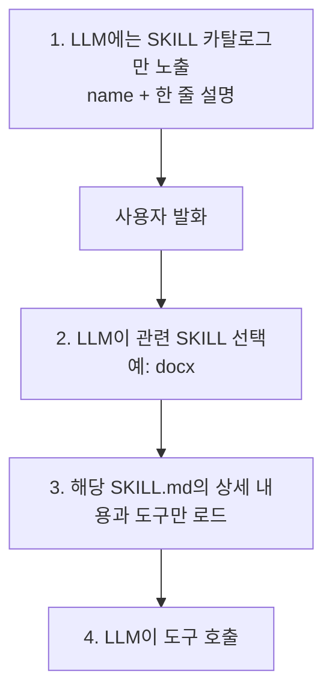

- SKILL = [[Strands Agents|Strands]]/Claude 환경에서 도입된 [[AI Agent|에이전트]] 능력 확장 단위. **도구·프롬프트·스크립트·문서**를 하나의 패키지로 묶고, 필요할 때만 LLM에 노출한다.
- 핵심 메커니즘은 **Progressive Disclosure(점진적 공개)** — 모든 능력을 한꺼번에 system prompt에 욱여넣지 않고, 사용자의 요청에 맞는 SKILL만 동적으로 로드.

## 왜 필요한가

- 도구가 20개를 넘으면 LLM이 어느 도구를 골라야 할지 헷갈린다.
- system prompt에 모든 도구 설명을 박으면 토큰·정확도 모두 손해.
- SKILL은 **카탈로그 → 후보 SKILL 선택 → 그 SKILL의 상세 매뉴얼·도구만 로드** 라는 2단계 구조.

## SKILL 패키지 구조



## SKILL.md 형식 (개념)

```markdown
---
name: docx
description: Word(.docx) 파일 작성·편집·redline 비교
when_to_use:
  - 사용자가 docx 파일 생성·수정을 요청
  - 문서 비교가 필요할 때
---

# Tools
- create_doc(path, content)
- redline_compare(a, b)
...
```

## Progressive Disclosure 동작



## Strands 자동 로딩

```python
from strands import Agent
agent = Agent(
    tools=[shell],
    load_tools_from_directory=True,   # ./tools 와 ./skills 를 자동 발견
)
```

- 에이전트가 새 SKILL을 직접 만들어 저장하면 다음 호출에서 도구로 인식 → [[Self-Improving Agent|Self-Extending]] 패턴의 토대.

## [[Tool Calling]] · [[MCP(Model Context Protocol)|MCP]]와의 관계

- **Tool** = 함수 1개.
- **SKILL** = 관련 도구·문서·스크립트의 묶음 + "언제 쓸지" 설명.
- **MCP 서버** = 도구·자원의 외부 호스팅 표준.
- SKILL은 운영 편의 + Progressive Disclosure에 초점, MCP는 프로세스 분리·표준화에 초점. 둘은 결합 가능.

## 설계 권장

- 한 SKILL은 **하나의 관심사**만 — docx, sheets, web, db 등.
- `when_to_use`를 구체적으로 — supervisor의 라우팅 정확도가 곧 SKILL 정확도.
- 큰 SKILL은 다시 sub-skill로 쪼개기 ([[Hierarchical Agent|계층화]]의 SKILL판).

## 관련

- [[Tool Calling]] · [[MCP(Model Context Protocol)]] — 하부 메커니즘.
- [[Self-Improving Agent]] — 에이전트가 SKILL을 스스로 생성.
- [[Strands Agents]] — 대표 구현.
