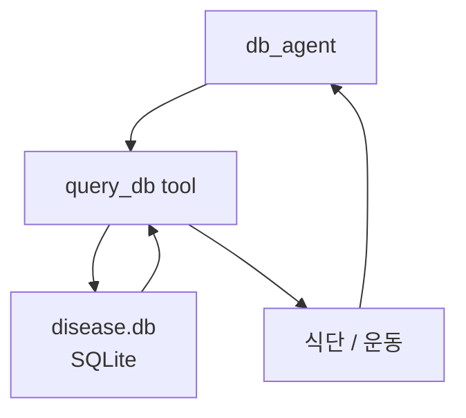

# SQLite 데이터 소스

- SQLite 데이터 소스 = `.db` 파일 하나에 테이블을 저장하고, Python의 `sqlite3`로 조회하는 로컬 데이터 소스다.
- 실습에서는 `disease.db`에 질병별 식단과 운동 정보를 넣고, `query_db` 도구가 이를 조회했다.
- 여기서의 SQLite는 **애플리케이션 데이터 조회용 DB**이고, [[LangGraph SqliteSaver]]는 **checkpoint 저장용 DB**다. 둘은 목적이 다르다.

## 실습 테이블 구조

```sql
CREATE TABLE disease (
    name TEXT PRIMARY KEY,
    diet TEXT,
    exercise TEXT
);
```

| 컬럼 | 의미 |
|---|---|
| `name` | 질병명 |
| `diet` | 권장 식단 |
| `exercise` | 권장 운동 |

## 도구로 감싸기

```python
@tool
def query_db(disease: str):
    """질병명으로 SQLite DB에서 권장 식단과 운동을 조회한다."""
    conn = sqlite3.connect("disease.db")
    cur = conn.cursor()
    cur.execute(
        "SELECT diet, exercise FROM disease WHERE name = ?",
        (disease,),
    )
    row = cur.fetchone()
    conn.close()

    if not row:
        return f"DB에 '{disease}' 정보가 없습니다."

    return f"[식단]: {row[0]} [운동]: {row[1]}"
```

- `@tool`을 붙이면 [[Tool Calling|LLM이 호출할 수 있는 도구]]가 된다.
- SQL 조회 결과를 자연어 문자열로 바꿔 agent에게 돌려준다.
- `?` placeholder를 쓰면 문자열을 직접 이어 붙이는 것보다 안전하다.

## Agent 안에서의 역할



- `db_agent`는 사용자의 질병명을 보고 `query_db`를 호출한다.
- `query_db`는 실제 DB를 조회한다.
- agent는 도구 결과를 받아 설명 형태로 정리한다.

## SqliteSaver와 헷갈리지 않기

| 구분 | SQLite 데이터 소스 | [[LangGraph SqliteSaver]] |
|---|---|---|
| 목적 | 업무 데이터 조회 | 그래프 실행 상태 저장 |
| 예 | 질병별 식단/운동 | messages, checkpoint |
| 호출 위치 | `query_db` tool 내부 | `builder.compile(checkpointer=...)` |
| 사용자 의미 | 답변 근거 | 세션 복구/대화 유지 |

## 운영 관점

- SQLite는 실습과 작은 로컬 앱에 좋다.
- 동시 접속, 권한, 백업, 운영 모니터링이 필요하면 PostgreSQL/MySQL 같은 서버형 DB가 더 적합하다.
- 에이전트가 DB를 조회할 때는 다음을 신경 쓴다.
  - 허용된 SQL만 실행하기.
  - 사용자 입력을 직접 SQL 문자열에 붙이지 않기.
  - 조회 결과에 출처를 남기기.
  - 의료·금융 정보는 "참고용"임을 명확히 하기.

## 한 줄 정리

- SQLite 데이터 소스는 **로컬 파일 DB를 agent 도구로 감싸서 구조화된 내부 지식을 조회하게 만드는 방식**이다.

## 관련

- [[Tool Calling]]
- [[LangChain @tool]]
- [[External Information MAS]]
- [[로컬 우선 정보 수집 MAS]]
- [[LangGraph SqliteSaver]]
