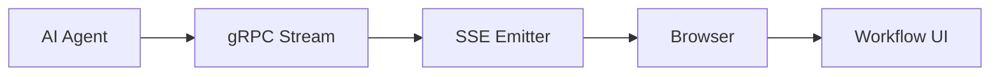

# SSE 기반 Agent Streaming

SSE 기반 Agent Streaming은 AI Agent의 중간 진행 상태를 서버에서 브라우저로 순차 전송하는 방식이다.

워크플로우 생성은 시간이 걸리므로 최종 결과만 기다리게 하면 사용자는 멈춘 것처럼 느낀다. `thinking`, `action`, `validation`, `complete` 같은 청크를 나눠 보내면 UI가 진행 상황을 보여줄 수 있다.

## 청크 타입

| chunk type | 의미 |
|---|---|
| `stage` | 현재 의도나 작업 단계 |
| `thinking` | 사용자에게 보여줄 요약 사고/진행 문구 |
| `action` | 수행 중인 도구/작업 |
| `validation` | 검증 결과 |
| `debug` | 개발자용 검색/라우팅 디버그 |
| `error` | 오류 |
| `complete` | 최종 응답 |

## 흐름

## stage hint

프론트는 사용자의 프롬프트와 현재 캔버스 상태로 대략적인 단계를 먼저 추정할 수 있다.

- 빈 캔버스면 `generate`
- 기존 블록이 있고 "수정", "옵션", "삭제"가 있으면 `modify`
- "선택", "방향", "다른 분석" 같은 말이 있으면 `proposal`

최종 `complete` 응답의 `mode`가 오면 이 추정을 실제 결과로 덮어쓴다.

## UI에 보여주면 안 되는 것

Streaming은 편리하지만 내부 노이즈가 섞일 수 있다.

- tool_call_id
- 내부 도구명
- raw state dump
- 검색 디버그 JSON

이런 값은 콘솔이나 trace로만 남기고 사용자 메시지에는 정리된 문장만 보여주는 것이 좋다.

## 한 줄 정리

SSE 기반 Agent Streaming은 **긴 AI 작업을 단계별 이벤트로 쪼개 사용자에게 진행감을 주는 UI/서버 통신 패턴**이다.

## 관련

- [[Streaming]]
- [[Observability]]
- [[AI Workflow 생성 파이프라인]]
- [[Trajectory]]
- [[LangGraph State]]
