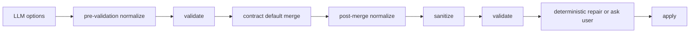

# Contract Guardrail Pipeline

Contract Guardrail Pipeline은 AI가 만든 action payload를 실행 가능한 입력으로 다듬고, 계약 위반을 검증하는 순서이다. UI mutation, API 호출, 데이터 변환처럼 LLM 출력이 외부 동작으로 이어지는 곳에 적용할 수 있다.

일반적인 흐름은 다음과 같다.

## 단계별 책임

| 단계 | 책임 |
|---|---|
| [[Pre-validation Normalizer]] | 검증 가능한 형태로 정리 |
| validate | 계약 위반 탐지 |
| default merge | 누락된 기본 옵션 채움 |
| [[Post-merge Normalizer]] | default까지 합쳐진 최종 옵션 보정 |
| sanitize | contract에 없는 위험/불필요 키 제거 |
| repair / ask | 결정론적으로 고칠 수 있는 값만 보정하고, 의미 판단은 사용자에게 질문 |
| advisory | 실행 가능하지만 주의할 점을 설명에 첨부 |

## blocking과 advisory

- blocking: 실행을 막아야 하는 위반
- warning/advisory: 실행은 가능하지만 사용자에게 알려야 하는 주의사항
- repairable: 명시 규칙으로 원래 의도를 보존하며 고칠 수 있는 위반
- structural blocking: 누락된 선행 작업, 권한, 데이터 형태처럼 옵션 추천만으로 고치면 안 되는 위반

## Repair의 경계

자동 복구는 `"3" -> 3`, 알려진 alias 정규화, 안전한 기본값처럼 결과가 결정론적인 경우에만 한다. 다음은 자동으로 확정하지 않는 편이 안전하다.

- 사용자 의도가 여러 해석으로 나뉘는 경우
- 삭제·발송·배포처럼 되돌리기 어려운 작업
- 데이터 의미나 모델 선택이 바뀌는 경우
- 명시적으로 잠긴 사용자 값과 충돌하는 경우

복구한 값에는 원래 값, 규칙 ID, 이유를 남기고 마지막 validate를 다시 통과시킨다. repair는 validator를 우회하는 예외가 아니다.

## 한 줄 정리

Contract Guardrail Pipeline은 **LLM 옵션을 계약 기준으로 정규화, 기본값 병합, 검증, 경고 첨부까지 처리하는 안전 파이프라인**이다.

## 관련

- [[Guardrails]]
- [[Block Contract]]
- [[Configuration Merge Pipeline]]
- [[AI Pipeline Error Normalization]]
- [[Structured Output]]
- [[Tool Execution Policy]]
