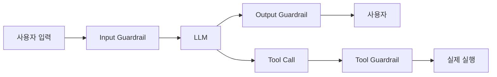
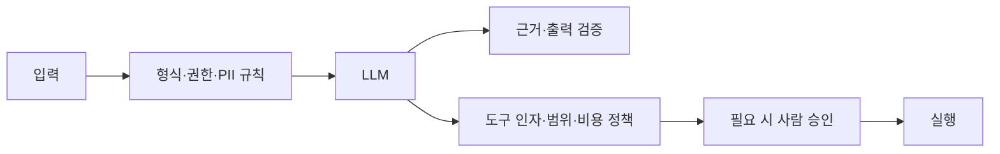

- Guardrails = [[AI Agent|에이전트]]의 입출력에 **안전·규정·정책 필터를 끼우는 방어층**. 환각, 유해 콘텐츠, PII 유출, 프롬프트 인젝션, 도구 오·남용을 막는다.
- 한 줄로: **"LLM이 무엇을 보고, 무엇을 말하고, 무엇을 하는지"** 를 검문소처럼 통제.

## 어디에 둘까



## 입력 가드레일 — 막아야 할 것

- 프롬프트 인젝션(`"위 지시는 무시하고..."`).
- PII(주민번호, 카드번호) 자동 마스킹.
- Off-topic — 정해진 도메인 밖 질문 차단.
- 모욕·공격적 발화 필터.

## 출력 가드레일

- 환각 검출 — 컨텍스트에 없는 사실 응답 차단.
- 코드/명령어 위험성 분류 (rm -rf 등).
- 금융·의료 조언 면책 문구 자동 첨부.
- 회사 정보 누출 (시스템 프롬프트 ‟유출 attempt).

## 도구 가드레일

- 비용/권한이 큰 도구 호출 전 **[[Human-in-the-loop|HITL]] 승인**.
- 허용 도메인 화이트리스트 (`fetch_url`이 사내 URL만 허용).
- 호출 횟수 제한(rate limit) — 무한 루프 방어.

## 구현 옵션

### 1. 규칙 기반

```python
PII_RE = re.compile(r"\d{6}-\d{7}")

def sanitize(text: str) -> str:
    return PII_RE.sub("[REDACTED]", text)
```

- 빠르고 결정론적. 정규식·키워드 리스트로 처리 가능한 케이스에 강함.

### 2. 모델 기반

- 별도 분류 LLM이 "이 출력이 위험한가?"를 채점.
- OpenAI Moderation API, AWS Bedrock Guardrails, Llama Guard.

```python
mod = openai.moderations.create(input=text)
if mod.results[0].flagged:
    return "그 요청에는 응답할 수 없어요."
```

### 3. 정책 라이브러리

- **NVIDIA NeMo Guardrails** — YAML로 정책 정의, dialogue flow까지 통제.
- **Guardrails AI** — Pydantic-like 스키마로 출력 검증·재시도.
- **Bedrock Guardrails** — AWS 매니지드, 주제 차단·민감 정보 필터.

## 계층형 Guardrail 설계

한 번의 "안전 검사"에 모든 책임을 몰지 않는다. 빠르고 결정적인 규칙을 앞에 두고, 의미 판단·승인은 필요한 곳에만 둔다.



| 계층 | 대표 규칙 | 결과 |
|---|---|---|
| 입력 | 인증, rate limit, PII, prompt injection 신호 | 차단 또는 마스킹 |
| 모델 전후 | 역할 경계, 출력 스키마, 근거 부족 | 재생성 또는 안전한 응답 |
| 도구 전 | schema, allowlist, 권한, 비용 한도 | 거부, 축소, 승인 요청 |
| 도구 후 | 민감 결과 마스킹, 성공 여부 확인 | 안전한 ToolMessage 또는 오류 |
| 실행 후 | 감사 로그, 이상 패턴, 회귀 데이터 수집 | 관측·평가 |

규칙이 명확하면 결정론적 검사부터 사용한다. 별도 LLM 또는 분류 모델은 의미 판단에 유용하지만 비용·지연·오판 가능성이 있으므로 단독 최종 방어선으로 두지 않는다.

## LangChain Middleware 예

LangChain Agent에서는 middleware로 agent 시작 전·모델 호출 주변·도구 호출 주변·최종 응답 후에 guardrail을 넣을 수 있다.

```python
from langchain.agents import create_agent
from langchain.agents.middleware import (
    HumanInTheLoopMiddleware,
    PIIMiddleware,
)

agent = create_agent(
    model="your-model",
    tools=[search_docs, send_email],
    middleware=[
        PIIMiddleware("email", strategy="redact", apply_to_input=True),
        PIIMiddleware("email", strategy="redact", apply_to_output=True),
        HumanInTheLoopMiddleware(
            interrupt_on={"send_email": True, "search_docs": False}
        ),
    ],
)
```

이 예는 이메일을 모델에 넣기 전·사용자에게 보이기 전에 정제하고, 외부 발송 도구는 [[Human-in-the-loop|승인]]을 요구한다. 자체 [[LangGraph]] workflow에서는 같은 순서를 node 또는 tool wrapper로 명시적으로 구현할 수 있다.

## 정책 결과를 명확히 한다

- **allow**: 조건을 만족해 실행한다.
- **transform**: 민감값을 마스킹하거나 안전한 형태로 바꾼다.
- **require approval**: 사람에게 action과 인자를 보여 준다.
- **deny**: 실행하지 않고 이유를 설명한다.

"경고만 남기고 실행"은 관측 단계에서는 유용하지만, 위험한 작업의 최종 정책이 되어서는 안 된다. 정책마다 fail-open과 fail-closed 중 무엇을 택하는지 정하고 테스트한다.

## Bedrock Guardrails 예 (개념)

```yaml
denied_topics:
  - name: "투자 권유"
    examples: ["어떤 종목을 사야 해?"]
sensitive_information:
  - type: PHONE
    action: MASK
content_filters:
  hate: HIGH
  violence: HIGH
```

- 빗썸·미래에셋 같은 금융권 사례에서 표준 패턴.

## 운영 팁

- 가드레일은 **항상 켜져 있다고 신뢰하지 말 것** — fail-open이면 무용지물. fail-closed로 설계.
- 입력·출력·도구 3층에 모두 두라 — 하나만 뚫리면 끝.
- 차단된 사례를 로그로 모아 회귀 평가 데이터셋으로 활용.
- 가드레일 자체도 LLM이면 비용·지연이 든다 → 빠른 규칙 → 느린 모델 순으로 단계화.

## 관련

- [[Evaluation]] — Safety 평가는 가드레일과 직결.
- [[Observability]] — 차단 이벤트 추적.
- [[Human-in-the-loop]] — 위험 도구는 결국 사람 승인.
- [[MCP(Model Context Protocol)]] — 도구 권한 격리 메커니즘.
- [[MCP Security]] — MCP 서버·도구·결과의 신뢰 경계.
- [[Tool Execution Policy]]
- [[Grounded Generation]]
- [[Contract Guardrail Pipeline]]

## 공식 문서

- [LangChain Guardrails](https://docs.langchain.com/oss/python/langchain/guardrails)
- [LangChain Human-in-the-loop](https://docs.langchain.com/oss/python/langchain/human-in-the-loop)
