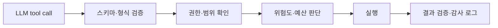

# Tool Execution Policy

Tool Execution Policy는 LLM이 도구를 선택한 뒤, 실제 실행 전에 적용하는 **권한·검증·비용·실패 처리 규칙**이다. [[Tool Calling]]이 "무슨 도구를 어떤 인자로 부를지"를 모델이 제안하는 단계라면, 실행 정책은 그 제안이 실제 세계에 영향을 줄 수 있는지를 시스템이 결정하는 단계다.

## 도구를 위험도로 나눈다

| 등급 | 예시 | 기본 정책 |
|---|---|---|
| 읽기 | 검색, 조회, 계산 | 입력 검증 후 자동 실행 |
| 제한적 쓰기 | 초안 저장, 임시 파일 생성 | 범위 제한·감사 로그 후 실행 |
| 외부 쓰기 | 메일 전송, 배포 요청, 결제 | 명시적 사용자 확인 또는 [[Human-in-the-loop\|승인]] |
| 고위험 쓰기 | 삭제, 권한 변경, 금전 이동 | 원칙적으로 차단하거나 다단계 승인 |

LLM의 신뢰도는 실행 권한이 아니다. 같은 `send_email` 도구라도 수신자·도메인·첨부 파일에 따라 위험도가 달라질 수 있으므로, 정책은 도구 이름뿐 아니라 인자와 사용자 권한을 함께 본다.

## 실행 전·후의 검문

- **스키마 검증**: 타입, 범위, 필수 인자, 허용 값을 확인한다.
- **권한 확인**: 현재 사용자·테넌트·세션이 해당 데이터와 동작에 접근할 수 있는지 확인한다.
- **예산 확인**: 호출 횟수, 시간, 비용, 병렬 실행 수의 상한을 둔다.
- **결과 검증**: 반환값이 예상 형식인지 확인하고, 민감 데이터는 모델에 다시 넣기 전에 마스킹한다.

## 실패 처리

도구 호출은 네트워크 오류, 중복 실행, 부분 성공을 전제로 설계한다.

- 읽기 작업은 시간 제한과 제한된 재시도를 둔다. 재시도는 지수 백오프와 전체 시간 예산 안에서만 한다.
- 쓰기 작업은 **idempotency key**로 중복 실행을 막는다. 같은 요청을 재시도해도 결과가 한 번만 반영돼야 한다.
- 여러 외부 시스템을 바꾸는 작업은 원자적 트랜잭션을 기대하지 말고, 실패 시 되돌리는 보상 작업을 정의한다.
- 연속 실패한 의존성은 circuit breaker로 잠시 차단하고, 모델에는 재시도 대신 가능한 대안을 알려 준다.

## 관측과 평가

모든 실행에는 호출 ID, 요청자, 인자 요약, 정책 결정, 승인 여부, 결과, 지연 시간, 비용을 남긴다. 단, 비밀값·개인정보·원문 파일은 로그에 그대로 남기지 않는다. 이 기록은 [[Tool Observability Wrapping]]과 [[Observability]]의 입력이며, 잘못된 도구 선택·권한 거부·재시도 폭증을 평가하는 근거가 된다.

## 관련

- [[Tool Calling]]
- [[Guardrails]]
- [[Human-in-the-loop]]
- [[Fail-soft]]
- [[Fallback]]
- [[Tool Observability Wrapping]]
- [[Concurrent Tool Execution]]
- [[LangGraph Durable Execution]]
- [[MCP Security]]
- [[Agent Middleware]]
