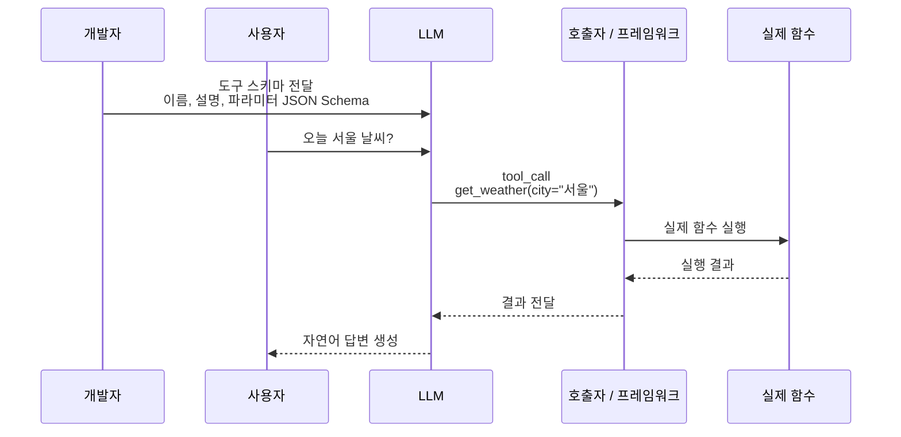

- Tool Calling(=Function Calling) = [[LLM(Large Language Model)]]이 사전에 등록된 함수 스키마를 보고, **자연어 응답 대신 "이 함수를 이런 인자로 불러줘"라는 구조화된 JSON**을 반환하는 기능.
- [[AI Agent|에이전트]]가 외부 세계와 상호작용할 수 있는 근본 메커니즘.

## 동작 흐름



- 3단계까지가 LLM의 일, 4단계는 사용자(또는 프레임워크)의 일. LLM이 직접 함수를 실행하지는 않는다.

## OpenAI 예제

```python
from openai import OpenAI
client = OpenAI()

tools = [{
    "type": "function",
    "function": {
        "name": "get_weather",
        "description": "도시의 현재 날씨를 반환한다",
        "parameters": {
            "type": "object",
            "properties": {"city": {"type": "string"}},
            "required": ["city"],
        },
    },
}]

resp = client.chat.completions.create(
    model="gpt-4o-mini",
    messages=[{"role": "user", "content": "서울 날씨?"}],
    tools=tools,
)
tc = resp.choices[0].message.tool_calls[0]
# tc.function.name == "get_weather", tc.function.arguments == '{"city":"서울"}'
```

## LangChain — @tool 데코레이터

```python
from langchain_core.tools import tool

@tool
def get_weather(city: str) -> str:
    """도시의 현재 날씨를 반환한다."""
    return weather_api.get(city)

llm = ChatOpenAI().bind_tools([get_weather])
```

- 함수 시그니처 + docstring이 자동으로 JSON Schema로 변환된다.
- 자세한 개념 정리는 [[LangChain @tool]] 참고.

### LLM이 보는 도구 설명

`@tool`에서 LLM이 주로 보는 것은 함수의 docstring이다.

```python
@tool
def care_tool(care: str):
    """감기에 걸렸을 때 해야 할 조치를 알려줄 때 사용한다."""
    return "충분히 쉬세요."
```

이 docstring은 도구 스키마의 설명으로 들어가므로 LLM이 도구 선택에 활용한다.

반면 `# 일반 주석`은 보통 tool schema에 포함되지 않는다.

```python
# 이 도구는 감기 조치를 알려준다.
@tool
def care_tool(care: str):
    return "충분히 쉬세요."
```

이런 주석만으로는 LLM에게 도구 용도가 전달되지 않을 수 있다.

관련: [[LangChain @tool]]

## LangGraph — ToolNode

- LangGraph에서는 LLM이 만든 tool call을 실제 도구 실행으로 연결하기 위해 [[LangGraph ToolNode]]를 사용할 수 있다.
- `@tool` 함수는 도구 정의이고, `ToolNode`는 도구 실행 노드이다.
- `retrieve` 같은 워크플로우 노드와 `@tool` 함수의 차이는 [[Workflow Node vs Tool]] 참고.

## 좋은 도구 설계 원칙

1. **이름은 동사형** — `get_weather`, `search_docs`, `send_email`.
2. **description은 LLM이 읽는 매뉴얼** — "언제 써야 하는지"를 명확히. 부정문도 좋다 ("FAQ에 없는 경우만 호출").
3. **인자는 최소·구조화** — 자유 텍스트 인자는 LLM이 마음대로 채워서 오작동.
4. **에러 메시지를 자연어로 — LLM이 보고 자가 수정**할 수 있게.
5. **부작용 큰 도구는 격리** — 결제·삭제 같은 도구는 [[Human-in-the-loop|승인 단계]] 추가.

## Parallel Tool Calling

- 최신 모델(GPT-4o, Claude 3.5+)은 **한 응답에 여러 tool_call**을 동시에 낼 수 있다.
- 독립적인 도구 호출을 병렬로 실행해 지연·비용을 줄인다.

```python
results = await asyncio.gather(*[tools[tc.name].arun(tc.args) for tc in tool_calls])
```

## ReAct 텍스트 파싱 vs Tool Calling

- 옛 [[ReAct 패턴]]은 LLM 출력 텍스트를 정규식·문자열 파싱했지만, 형식이 깨지기 쉬웠다.
- 네이티브 Tool Calling은 **모델 레벨에서 JSON을 보장** → 훨씬 안정적. 요즘은 거의 표준.

## 관련

- [[Memory]] — 도구 결과의 누적.
- [[MCP(Model Context Protocol)]] — 도구를 외부 프로세스로 표준화한 프로토콜.
- [[Pydantic]] — 인자 검증.
- [[LangChain @tool]]
- [[LangGraph ToolNode]]
- [[Workflow Node vs Tool]]
