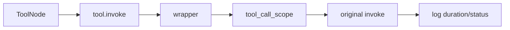

# Tool Observability Wrapping

Tool Observability Wrapping은 도구 함수 본체를 수정하지 않고, 도구의 `invoke`와 `ainvoke`를 감싸 호출 ID, 시간, 상태, 호출 횟수를 기록하는 패턴이다.

프로젝트에서는 [[LangGraph ToolNode]]가 도구를 실행할 때 자동으로 `tool_call_id`가 발급되고 로그가 남도록 LangChain Tool 인스턴스를 in-place로 감싼다.

## 흐름



## 왜 wrapper를 쓰나

- 모든 도구에 같은 로깅 코드를 반복하지 않아도 된다.
- tool call count 제한을 공통 처리할 수 있다.
- 도구 실패와 성공을 같은 형식으로 관측할 수 있다.
- [[ContextVar]] 기반 ID를 도구 호출 전체에 전파할 수 있다.

## Pydantic v2 우회

LangChain `StructuredTool`은 Pydantic 모델이라 일반 `setattr`이 막힐 수 있다.

```python
object.__setattr__(tool, "invoke", wrapper)
```

이때 [[object.__setattr__]]를 사용해 인스턴스 attribute를 직접 넣고, 메서드보다 인스턴스 attribute가 먼저 조회되는 특성을 이용한다.

## 한 줄 정리

Tool Observability Wrapping은 **도구 객체의 호출 메서드를 감싸 에이전트 도구 실행을 공통 관측 가능하게 만드는 패턴**이다.

## 관련

- [[Observability]]
- [[ContextVar]]
- [[object.__setattr__]]
- [[functools.wraps]]
- [[LangGraph ToolNode]]
