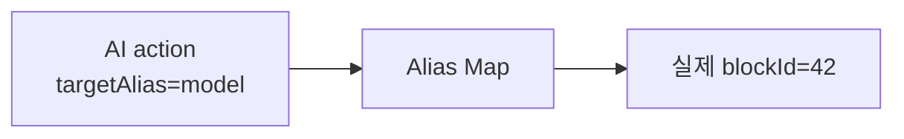

# Workflow Action

Workflow Action은 AI가 기존 워크플로우를 직접 덮어쓰지 않고, 작은 변경 명령들의 목록으로 표현하는 방식이다.

새 워크플로우 생성은 `blocks + links`로 충분하지만, 기존 캔버스 수정은 "무엇을 추가, 삭제, 변경할지"를 명령 단위로 쪼개는 편이 안전하다.

## 대표 action

| action | 의미 |
|---|---|
| `ADD_BLOCK` | 새 블록 추가 |
| `REMOVE_BLOCK` | 기존 블록 삭제 |
| `UPDATE_OPTION` | 블록 옵션 수정 |
| `ADD_LINK` | 블록 연결 추가 |
| `REMOVE_LINK` | 블록 연결 삭제 |

## 구조

```json
{
  "actionType": "UPDATE_OPTION",
  "targetAlias": "model",
  "optionUpdatesJson": "{\"xVar\":[\"age\"],\"yVar\":\"target\"}",
  "reason": "타깃 컬럼에 맞춰 모델 입력을 수정"
}
```

## alias가 필요한 이유

AI는 실제 캔버스의 blockId를 모를 수 있다. 그래서 응답에서는 `model`, `preprocess_1`, `tdl` 같은 alias를 쓰고, 프론트가 alias를 실제 blockId로 해석한다.



## 순차 실행

Action은 순서가 중요하다.

1. `ADD_BLOCK`으로 새 블록을 만든다.
2. 새 블록의 alias를 실제 blockId에 매핑한다.
3. `ADD_LINK`에서 그 alias를 사용해 연결한다.
4. `UPDATE_OPTION`으로 옵션을 주입한다.

## 구조 변경과 옵션 변경

| 변경 종류 | 예 | 후처리 |
|---|---|---|
| 구조 변경 | 블록 추가, 삭제, 링크 변경 | 캔버스 재정렬 필요 |
| 옵션 변경 | 모델 파라미터, 컬럼 선택 변경 | 기존 좌표 보존 가능 |

구조 변경이 없는데 매번 레이아웃을 다시 잡으면 사용자가 수동으로 정리한 캔버스 위치를 망칠 수 있다.

## 좋은 action 설계

- action은 작고 명확해야 한다.
- action 하나는 한 가지 변경만 표현한다.
- 실패해도 어느 단계에서 실패했는지 추적 가능해야 한다.
- 각 action에 `reason`을 붙이면 사용자 설명과 디버깅에 좋다.

## 한 줄 정리

Workflow Action은 **AI의 수정 의도를 캔버스가 안전하게 실행할 수 있는 작은 명령 목록으로 바꾼 것**이다.

## 관련

- [[Agent 응답 정규화]]
- [[캔버스 적용 오케스트레이터]]
- [[Planning]]
- [[Trajectory]]
- [[Human-in-the-loop]]
