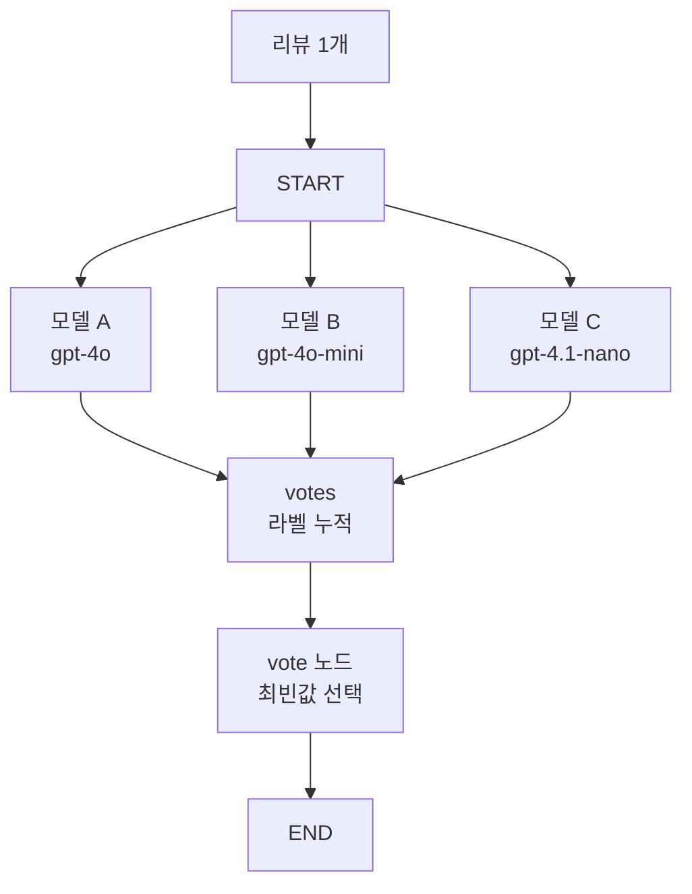

# 다수결 평가

- 다수결 평가 = 같은 입력을 여러 모델 또는 여러 프롬프트에 넣고, 가장 많이 나온 예측을 최종 답으로 삼는 [[Evaluation|평가]] 패턴이다.
- 실습에서는 `gpt-4o`, `gpt-4o-mini`, `gpt-4.1-nano`가 각각 감정을 분류하고, `vote` 노드가 최빈 라벨을 최종 판정으로 정했다.
- 핵심은 **Judge LLM에게 다시 판단시키는 것이 아니라, 각 모델의 결과를 규칙으로 합치는 것**이다.

## 구조



## LangGraph에서 중요한 부분

- 여러 분류 노드가 같은 state key에 결과를 넣기 때문에 `votes`에는 reducer가 필요하다.
- `Annotated[List[str], operator.add]`는 각 노드가 반환한 리스트를 덮어쓰지 않고 이어 붙인다.

```python
class State(TypedDict):
    text: str
    votes: Annotated[List[str], operator.add]
    final: str
```

- 각 모델 노드는 다음처럼 자기 라벨을 리스트로 반환한다.

```python
return {"votes": [label]}
```

- `vote` 노드는 누적된 라벨 중 가장 많이 나온 값을 고른다.

```python
def vote(state: State):
    v = state["votes"]
    final = max(set(v), key=v.count)
    return {"final": final}
```

## LLM-as-Judge와 차이

| 구분 | 다수결 평가 | [[LLM-as-Judge]] |
|---|---|---|
| 최종 판단자 | 코드 규칙 | 평가자 LLM |
| 입력 | 여러 모델의 라벨 | 리뷰, 모델 의견, 루브릭 |
| 장점 | 단순하고 빠름, 결정 규칙이 명확 | 맥락을 다시 읽고 판단 가능 |
| 단점 | 다수가 틀리면 그대로 틀림 | 비용과 편향이 있음 |
| 적합한 작업 | 정답 라벨이 있는 [[분류 평가 지표|분류 문제]] | 리포트, 요약, 상담 답변 같은 생성형 평가 |

## 언제 쓰면 좋은가

- 정답 라벨이 명확한 분류 문제.
- 모델 하나의 출력이 불안정해서 여러 모델을 비교하고 싶을 때.
- 평가 비용을 줄이고 싶을 때.
- Judge LLM의 편향을 피하고 싶을 때.

## 주의할 점

- 다수결은 **정답을 보장하지 않는다**.
- 세 모델이 모두 같은 편향을 갖고 있으면 같은 실수를 반복한다.
- 동률이 날 수 있으므로 운영 환경에서는 tie-break 규칙이 필요하다.
  - 예: 더 강한 모델의 라벨 우선.
  - 예: 보수적인 라벨 우선.
  - 예: 동률이면 [[LLM-as-Judge]] 호출.
- 예측 라벨은 반드시 평가 데이터셋의 정답 라벨과 맞아야 한다. 이 부분은 [[라벨 정규화]]에서 다룬다.

## 한 줄 정리

- 다수결 평가는 **여러 LLM의 판단을 state에 모은 뒤, 코드로 최종 라벨을 고르는 평가 패턴**이다.

## 관련

- [[Evaluation]]
- [[AI 평가 지표]]
- [[분류 평가 지표]]
- [[라벨 정규화]]
- [[LLM-as-Judge]]
- [[LangGraph State]]
- [[LangGraph Edge]]
