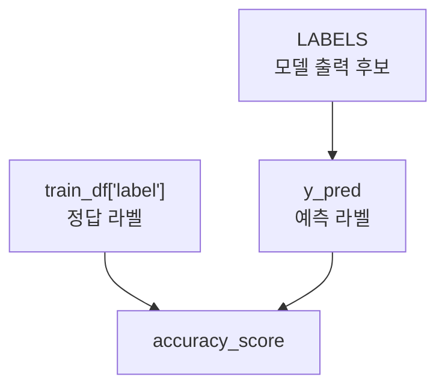

# 라벨 정규화

- 라벨 정규화 = LLM이 자유롭게 낸 답변을 평가 가능한 고정 라벨로 바꾸는 과정이다.
- 예를 들어 LLM은 `긍정`, `긍정입니다`, `이 리뷰는 긍정으로 보입니다`처럼 다양하게 답할 수 있다.
- [[분류 평가 지표|분류 평가]]에서는 이런 답변을 반드시 `긍정` 또는 `부정` 같은 정해진 라벨로 맞춰야 한다.

## 왜 필요한가

- `accuracy_score` 같은 평가지표는 문자열을 그대로 비교한다.
- 정답이 `긍정`인데 모델 출력이 `긍정입니다`이면 사람에게는 맞아 보여도 코드상으로는 다르다.
- 그래서 평가 전에 모델 출력을 정답 라벨 체계에 맞춰 정리해야 한다.

```python
def normalize_label(raw_text: str):
    text = str(raw_text).strip()

    if "긍정" in text and "부정" not in text:
        return "긍정"
    if "부정" in text and "긍정" not in text:
        return "부정"

    return "부정"
```

## 정답 라벨 스키마

- 정답 라벨 스키마 = 평가 데이터셋이 허용하는 정답 종류다.
- NSMC 영화 리뷰 데이터는 기본적으로 이진 분류 데이터다.

| 원본 label | 평가 라벨 |
|---|---|
| `0` | `부정` |
| `1` | `긍정` |

- 따라서 예측 라벨도 `긍정`, `부정` 중 하나여야 [[분류 평가 지표|Accuracy]]가 제대로 계산된다.

## 중립 라벨을 넣으면 생기는 일

- 사람이 보기에는 `중립`이 더 자연스러운 리뷰가 있을 수 있다.
- 하지만 정답 데이터셋에 `중립`이 없다면 `중립` 예측은 전부 오답 처리된다.

```text
정답: 부정
예측: 중립
결과: 오답
```

- 그래서 평가 목적에 따라 라벨 정책을 다르게 잡아야 한다.

| 목적 | 추천 라벨 정책 |
|---|---|
| NSMC 정확도 점수를 높이고 싶다 | `긍정/부정`만 강제 |
| 실제 서비스에서 애매한 감정을 따로 보고 싶다 | `긍정/부정/중립` 허용 |
| 안전한 후처리가 중요하다 | 애매하면 `보류`, `검토 필요` 같은 라벨 사용 |

## 다수결 평가에서의 정규화


- [[다수결 평가]]에서는 각 모델의 원문 출력을 먼저 정규화한 뒤 `votes`에 넣는다.
- 정규화하지 않으면 `긍정`, `긍정입니다`, `positive`가 모두 다른 표로 계산될 수 있다.

## 실습에서 기억할 점

- `LABELS`는 모델에게 기대하는 출력 목록이다.
- `train_df["label"]`은 정답 데이터셋의 라벨이다.
- `y_pred`는 모델 예측 라벨이다.
- 좋은 평가는 이 셋의 라벨 체계가 서로 맞아야 한다.



## 한 줄 정리

- 라벨 정규화는 **LLM의 말투를 평가 데이터셋이 이해하는 정답 라벨로 바꾸는 작업**이다.

## 관련

- [[분류 평가 지표]]
- [[다수결 평가]]
- [[LLM-as-Judge]]
- [[AI 평가 지표]]
