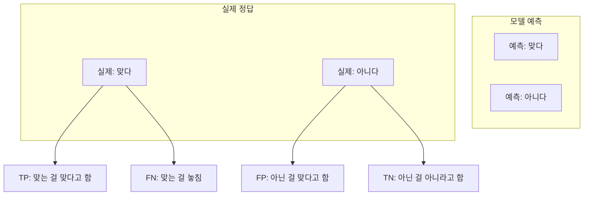
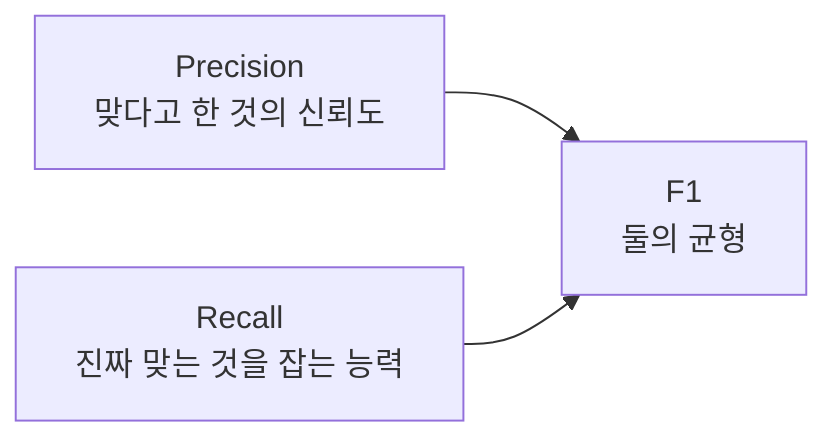

# 분류 평가 지표

- 분류 평가 지표 = 모델이 **맞다/아니다** 또는 **A/B/C 중 하나**를 얼마나 잘 골랐는지 보는 기준이다.
- 예: 스팸 메일 분류, 질병 여부 판단, 질문을 어떤 [[Tool Calling|도구]]로 보낼지 결정하는 [[Intent Classification|의도 분류]].

## 기본 표: Confusion Matrix

## TP, FP, FN, TN

- **TP(True Positive)**: 진짜 맞는 것을 모델도 맞다고 했다.
- **TN(True Negative)**: 진짜 아닌 것을 모델도 아니라고 했다.
- **FP(False Positive)**: 아닌데 맞다고 했다. 오탐이다.
- **FN(False Negative)**: 맞는데 아니라고 했다. 미탐이다.

## 쉬운 예시

예를 들어 AI가 "감기 환자인가?"를 분류한다고 하자.

| 상황 | 의미 |
|---|---|
| 실제 감기이고 AI도 감기라고 함 | TP |
| 실제 감기인데 AI가 감기 아니라고 함 | FN |
| 실제 감기 아닌데 AI가 감기라고 함 | FP |
| 실제 감기 아니고 AI도 감기 아니라고 함 | TN |

## Accuracy

- Accuracy = 전체 중에서 맞춘 비율.
- 쉽게 말하면 **총 몇 개 중 몇 개를 맞혔나**이다.
- 직관적이지만 데이터가 한쪽으로 치우치면 속을 수 있다.

예:
- 정상 메일 99개, 스팸 1개가 있다.
- 모델이 전부 정상이라고 해도 Accuracy는 99%다.
- 하지만 스팸을 하나도 못 잡았으므로 좋은 모델이라고 보기 어렵다.

## Precision

- Precision = 모델이 **맞다고 한 것 중 진짜 맞은 비율**.
- 쉽게 말하면 **괜히 맞다고 떠드는 실수**를 줄이고 싶을 때 본다.

예:
- 투자 추천, 질병 확진, 위험 알림처럼 잘못 맞다고 하면 비용이 큰 상황.
- Precision이 낮으면 오탐이 많다.

## Recall

- Recall = 실제로 맞는 것 중 모델이 얼마나 잡았는지.
- 쉽게 말하면 **놓치면 안 되는 것을 얼마나 안 놓쳤나**이다.

예:
- 암 검사, 보안 침입 탐지, 장애 알림처럼 놓치면 큰일 나는 상황.
- Recall이 낮으면 미탐이 많다.

## Specificity

- Specificity = 실제로 아닌 것 중 모델이 얼마나 잘 아니라고 했는지.
- 쉽게 말하면 **정상인 것을 정상이라고 잘 거르는 능력**이다.

예:
- 병이 없는 사람을 괜히 환자로 오판하지 않는 능력.
- FP를 줄이는 관점과 연결된다.

## F1 Score

- F1 = Precision과 Recall의 균형 점수.
- 쉽게 말하면 **괜히 맞다고 하는 것도 싫고, 진짜 맞는 걸 놓치는 것도 싫을 때** 보는 지표다.
- 둘 중 하나만 높고 하나가 낮으면 F1도 낮아진다.

## AI Agent에서의 활용

- 도구 선택 평가:
  - 정답 도구가 `food_tool`인데 모델도 `food_tool`을 골랐으면 TP처럼 볼 수 있다.
  - 정답 도구가 아닌데 엉뚱한 도구를 호출하면 FP 또는 잘못된 분류다.
- 라우팅 평가:
  - 중식 질문을 중식 LLM 도구로 보냈는지 본다.
  - 뉴스 질문을 뉴스 에이전트로 보냈는지 본다.
- 안전 평가:
  - 위험 요청을 위험하다고 잡는 Recall.
  - 정상 요청을 괜히 차단하지 않는 Precision.

## 한 줄 정리

- Accuracy: 전체적으로 몇 개 맞았나.
- Precision: 맞다고 한 말이 얼마나 믿을 만한가.
- Recall: 진짜 중요한 걸 얼마나 안 놓쳤나.
- Specificity: 아닌 것을 얼마나 잘 걸러냈나.
- F1: Precision과 Recall을 같이 본 균형 점수.

## 관련

- [[AI 평가 지표]]
- [[Evaluation]]
- [[Intent Classification]]
- [[Tool Calling]]
- [[LLM Tool Selection]]
