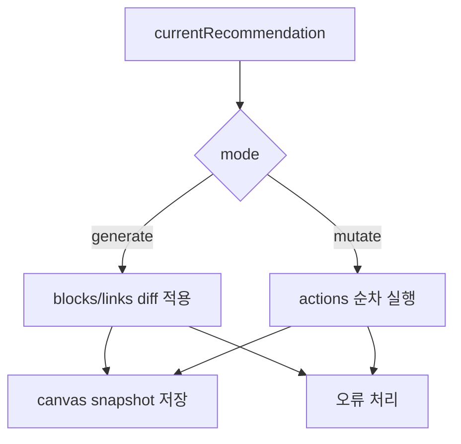

# 캔버스 적용 오케스트레이터

캔버스 적용 오케스트레이터는 AI가 추천한 워크플로우를 실제 UI 캔버스에 반영하는 상위 제어 로직이다.

AI 응답을 바로 DOM이나 블록 컴포넌트에 꽂지 않고, 진행 상태, race condition, undo 스냅샷, 오류 메시지를 함께 관리한다.

## 역할

- 추천 카드의 `blocks + links`를 캔버스에 배치한다.
- `Workflow Action` 목록을 순차 실행한다.
- 적용 중 progress 상태를 업데이트한다.
- 성공 시 스냅샷을 저장한다.
- 실패 시 사용자에게 복구 가능한 메시지를 보여준다.

## 적용 흐름

## diff 기반 배치

새 추천을 적용할 때 기존 캔버스를 전부 지우고 다시 만들면 사용자 상태가 쉽게 깨진다. 그래서 기존 블록과 새 블록을 타입 기준으로 비교한다.

| 분류 | 처리 |
|---|---|
| 재사용 가능 | 기존 blockId 유지 |
| 사라진 블록 | 삭제 |
| 새 블록 | 생성 |

이 방식은 캔버스의 안정성을 높이고, 이미 실행된 블록의 상태를 가능한 한 보존한다.

## race condition 방어

캔버스 UI에는 watcher, EventBus, block lifecycle이 얽혀 있다. AI가 블록을 자동 배치하는 동안 일반 사용자 조작 경로의 검사가 먼저 실행되면 잘못된 alert나 미완료 상태가 생길 수 있다.

대응 방식:

- 적용 중 플래그를 세워 watcher가 조기 반환하게 한다.
- 기존 데이터 블록은 input/output complete 상태로 보정한다.
- EventBus 응답이 필요한 곳은 동기 조회 헬퍼로 감싼다.
- 블록 생성 후 약간의 delay를 두어 UI 반영 시간을 준다.

## 스냅샷

AI 적용은 한 번에 여러 블록을 바꾸므로 undo 기준점이 중요하다.

- 적용 전 빈 히스토리면 초기 스냅샷을 만든다.
- 적용 완료 후 현재 블록, 링크, 생성된 blockId를 저장한다.
- 복원 시 Vue 반응성을 유지하도록 state를 교체한다.

## 한 줄 정리

캔버스 적용 오케스트레이터는 **AI 추천을 UI 이벤트, 상태, 오류 복구까지 고려해 실제 캔버스 변화로 바꾸는 제어층**이다.

## 관련

- [[AI Workflow 생성 파이프라인]]
- [[Workflow Action]]
- [[Agent 응답 정규화]]
- [[Observability]]
- [[Fallback]]
