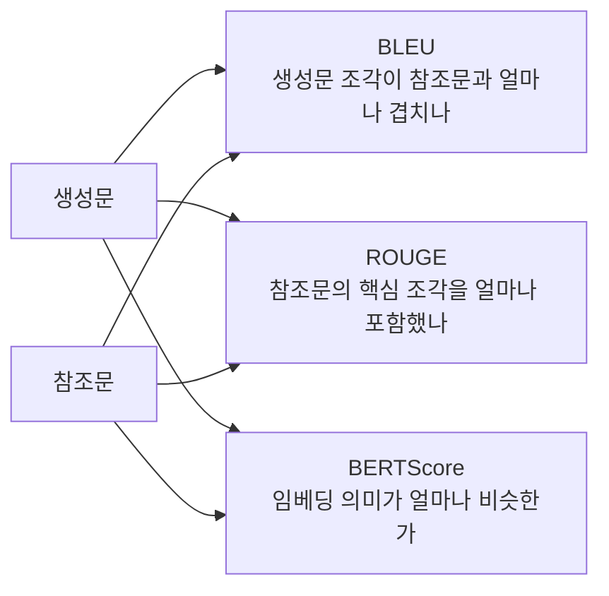

# 텍스트 생성 평가 지표

- 텍스트 생성 평가 지표 = 번역, 요약, 질의응답, 리포트처럼 **글로 나온 결과를 얼마나 잘 썼는지 점수화하는 방법**이다.
- 핵심은 두 가지다.
  - **문자/단어가 얼마나 겹치는가**: [[BLEU]], [[ROUGE]]
  - **의미가 얼마나 비슷한가**: [[BERTScore]], [[LLM-as-Judge]]

## 작업별 대표 지표

| 작업 | 대표 지표 | 감각 |
|---|---|---|
| 텍스트 분류 | [[분류 평가 지표|Accuracy / Precision / Recall / F1]] | 정답 라벨과 비교 |
| 기계 번역 | [[BLEU]], [[BERTScore]], 사람 평가 | 참조 번역과 비슷한지 |
| 요약 | [[ROUGE]], [[BERTScore]], [[LLM-as-Judge]] | 원문 핵심을 잘 담았는지 |
| 질의응답 | Exact Match, F1, [[LLM-as-Judge]] | 정답과 얼마나 일치하는지 |
| 자유 대화 / 리포트 | [[LLM-as-Judge]], 사람 평가 | 정답이 하나가 아니므로 기준표가 필요 |

## 왜 여러 지표가 필요한가

- 글은 정답이 하나가 아니다.
- 같은 뜻을 다른 단어로 말할 수 있다.
- 단어가 많이 겹쳐도 의미가 틀릴 수 있고, 단어가 안 겹쳐도 의미가 맞을 수 있다.

예:

| 문장 | 느낌 |
|---|---|
| "고혈압 환자는 나트륨 섭취를 줄여야 한다" | 기준 문장 |
| "혈압이 높다면 짠 음식을 줄이는 것이 좋다" | 단어는 덜 겹치지만 의미는 비슷함 |
| "고혈압 환자는 나트륨을 많이 먹어야 한다" | 단어는 겹치지만 의미는 반대임 |

그래서 단어 겹침 지표만 보면 위험하다. 의미 기반 지표나 [[LLM-as-Judge]]를 함께 보는 이유가 여기에 있다.

## BLEU, ROUGE, BERTScore 차이

- [[BLEU]]: 번역 평가에서 많이 쓴다. 생성문이 참조문과 n-gram으로 얼마나 겹치는지 본다.
- [[ROUGE]]: 요약 평가에서 많이 쓴다. 정답 요약에 있는 내용을 생성 요약이 얼마나 포함했는지 본다.
- [[BERTScore]]: 단어가 그대로 겹치지 않아도 [[BERT]] [[임베딩(Embedding)|임베딩]]으로 의미 유사도를 본다.

## 언제 무엇을 볼까

| 상황 | 우선 지표 |
|---|---|
| 번역 품질을 빠르게 자동 평가 | BLEU |
| 요약이 원문 핵심을 많이 담았는지 평가 | ROUGE |
| 다른 표현이지만 의미가 비슷한지 평가 | BERTScore |
| 사실성, 완성도, 친절함, 업무 기준 충족 여부 평가 | LLM-as-Judge |
| 중요한 최종 평가 | 사람 평가 |

## 한 줄 정리

- BLEU: 생성문이 정답 문장과 얼마나 겹치는가.
- ROUGE: 정답에 있는 핵심 내용을 생성문이 얼마나 포함했는가.
- BERTScore: 단어는 달라도 의미가 얼마나 비슷한가.
- LLM-as-Judge: 사람이 만든 채점 기준에 맞춰 답변 품질을 평가한다.

## 관련

- [[AI 평가 지표]]
- [[Evaluation]]
- [[BLEU]]
- [[ROUGE]]
- [[BERTScore]]
- [[BERT]]
- [[임베딩(Embedding)]]
- [[코사인 유사도]]
