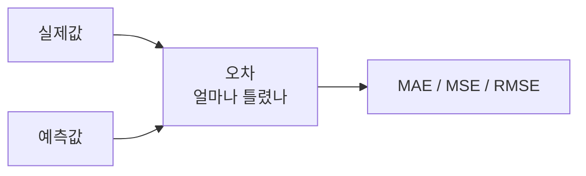

# 회귀 평가 지표

- 회귀 평가 지표 = 모델이 **숫자를 얼마나 가깝게 예측했는지** 보는 기준이다.
- 예: 주가, 매출, 수요량, 점수, 온도, 배송 시간 예측.

## 핵심 단어: 오차

- 오차 = 실제값과 예측값의 차이.
- 예: 실제 매출이 100인데 모델이 90이라고 예측했다면 오차는 10이다.
- 회귀 지표는 이 오차를 여러 방식으로 평균낸다.

## MAE

- MAE(Mean Absolute Error) = 오차의 절댓값을 평균낸 것.
- 쉽게 말하면 **평균적으로 얼마만큼 틀렸는가**이다.
- 단위가 원래 값과 같아서 직관적이다.

예:
- 실제값: 100, 예측값: 90이면 10만큼 틀렸다.
- 실제값: 100, 예측값: 130이면 30만큼 틀렸다.
- 평균 오차는 `(10 + 30) / 2 = 20`.
- 따라서 MAE는 20이다.

## MSE

- MSE(Mean Squared Error) = 오차를 제곱한 뒤 평균낸 것.
- 쉽게 말하면 **큰 실수를 훨씬 더 크게 벌주는 지표**다.
- 오차 10은 제곱하면 100이지만, 오차 30은 제곱하면 900이다.
- 그래서 작은 오차 여러 개보다 큰 오차 하나에 더 민감하다.

예:
- 오차가 10, 30이면
- 제곱 오차는 100, 900이다.
- 평균은 `(100 + 900) / 2 = 500`.
- 따라서 MSE는 500이다.

주의:
- MSE는 단위도 제곱된다.
- 예를 들어 원래 단위가 원이면 MSE는 원² 느낌이 되어서 사람이 직관적으로 읽기 어렵다.

## RMSE

- RMSE(Root Mean Squared Error) = MSE에 루트를 씌운 값.
- 쉽게 말하면 **큰 실수를 강하게 벌주되, 다시 원래 단위로 돌려 읽기 쉽게 만든 지표**다.
- MSE가 500이면 RMSE는 약 22.36이다.

## MAE, MSE, RMSE 비교

| 지표 | 쉬운 뜻 | 장점 | 조심할 점 |
|---|---|---|---|
| MAE | 평균적으로 얼마나 틀렸나 | 해석이 쉽다 | 큰 실수를 특별히 강하게 벌주지는 않는다 |
| MSE | 큰 실수를 강하게 벌준다 | 큰 오류에 민감하다 | 단위가 제곱되어 직관이 떨어진다 |
| RMSE | 큰 실수에 민감하면서 원래 단위로 읽는다 | 해석이 MSE보다 쉽다 | 큰 오류에 영향을 많이 받는다 |

## 어떤 걸 쓰면 좋나

- 실무 설명용으로는 MAE가 가장 이해하기 쉽다.
- 큰 예측 실패를 강하게 잡고 싶으면 RMSE를 같이 본다.
- 모델 학습이나 수학적 최적화에서는 MSE가 자주 쓰인다.
- 평가 리포트에는 보통 MAE와 RMSE를 함께 적으면 좋다.

## AI Agent에서의 활용

- 수요 예측 에이전트가 다음 달 주문량을 예측한다.
- 주가 분석 에이전트가 목표가를 예측한다.
- 운영 모니터링 에이전트가 응답 지연시간을 예측한다.
- 이때 실제 숫자와 예측 숫자의 차이를 MAE, MSE, RMSE로 본다.

## 한 줄 정리

- MAE: 평균적으로 몇 정도 틀렸는지.
- MSE: 큰 실수를 더 크게 벌주는 점수.
- RMSE: MSE를 다시 읽기 쉬운 단위로 바꾼 점수.
- 세 지표 모두 **낮을수록 좋다**.

## 관련

- [[AI 평가 지표]]
- [[Evaluation]]
- [[Observability]]
