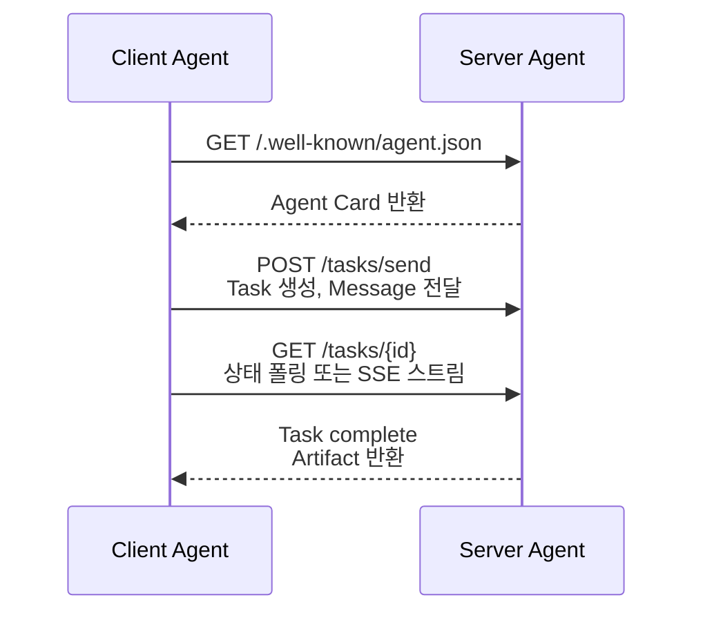

- A2A(Agent-to-Agent) Protocol = **서로 다른 조직·플랫폼의 [[AI Agent|에이전트]]가 표준화된 방식으로 통신**하기 위한 프로토콜. 2025년 Google이 공개하고 다수의 회사·프레임워크가 채택.
- 한 마디로: "내 회사의 에이전트가 다른 회사의 에이전트에게 일을 시키는 표준."

## 왜 필요한가

- [[Tool Calling]]·[[MCP(Model Context Protocol)|MCP]]는 **에이전트와 도구** 사이의 표준.
- A2A는 **에이전트와 에이전트** 사이의 표준 — 능력 발견(discovery), 작업 위임, 결과 반환.
- 사내 supervisor가 외부 SaaS 에이전트에 작업을 던지는 경우를 생각하면 명확.

## 핵심 추상화

| 용어 | 의미 |
|------|------|
| **Agent Card** | 에이전트의 능력·도구·인증 방식을 기술한 JSON manifest (`/.well-known/agent.json`) |
| **Task** | 위임된 작업 단위. 상태(submitted, working, completed, failed)를 가짐 |
| **Message** | 사용자/에이전트 발화 |
| **Artifact** | 작업 결과(파일, 텍스트, 구조화 데이터) |

## 통신 흐름



## 최소 Agent Card 예

```json
{
  "name": "translate-agent",
  "description": "텍스트를 한↔영 번역",
  "version": "1.0",
  "url": "https://example.com/a2a",
  "capabilities": {"streaming": true, "pushNotifications": false},
  "skills": [{
    "id": "translate",
    "description": "한국어 ↔ 영어 번역",
    "inputModes": ["text"],
    "outputModes": ["text"]
  }]
}
```

## MCP와의 차이

| | [[MCP(Model Context Protocol)|MCP]] | A2A |
|--|--|--|
| 연결 대상 | LLM ↔ 도구·자원 | 에이전트 ↔ 에이전트 |
| 권한 모델 | 호스트 권한 그대로 | 인증된 HTTP 계약 |
| 통신 | JSON-RPC (보통 stdio) | HTTP + SSE |
| 사례 | Claude Desktop이 GitHub 파일 읽기 | Salesforce 에이전트가 Workday 에이전트에 휴가 신청 위임 |

## 채택 현황

- Google이 발표, Salesforce·SAP·Workday·MongoDB 등 50+ 기업 동참.
- LangGraph·CrewAI·Strands·AutoGen이 호환 라이브러리 제공.

## 다른 관련 프로토콜

- **ACP** (Agent Communication Protocol) — IBM 주도, A2A와 유사 목표.
- **MCP** — 도구·자원 표준.
- **AGNTCY** — Cisco 등이 추진한 에이전트 인터넷 비전.
- 통합 방향: MCP(도구) + A2A(에이전트) + OAuth(인증) 3종이 점차 굳어지는 중.

## 관련

- [[MCP(Model Context Protocol)]] — 도구 레이어의 자매 프로토콜.
- [[Multi Agent]] · [[Supervisor 패턴]] — A2A로 외부 에이전트를 워커로 편입.
- [[Strands Agents]] · [[CrewAI]] · [[AutoGen]] — A2A 어댑터 보유.
