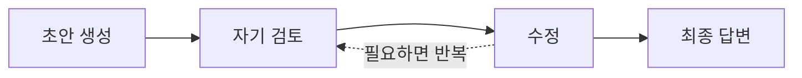
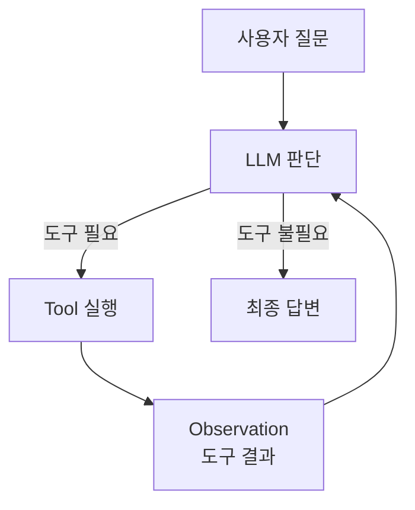
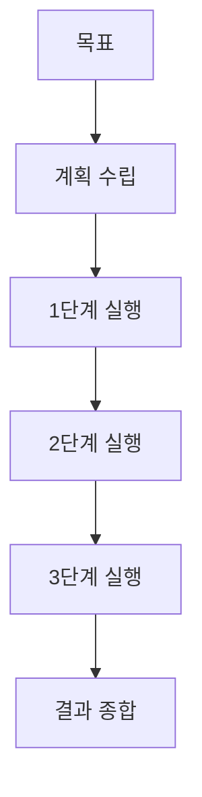
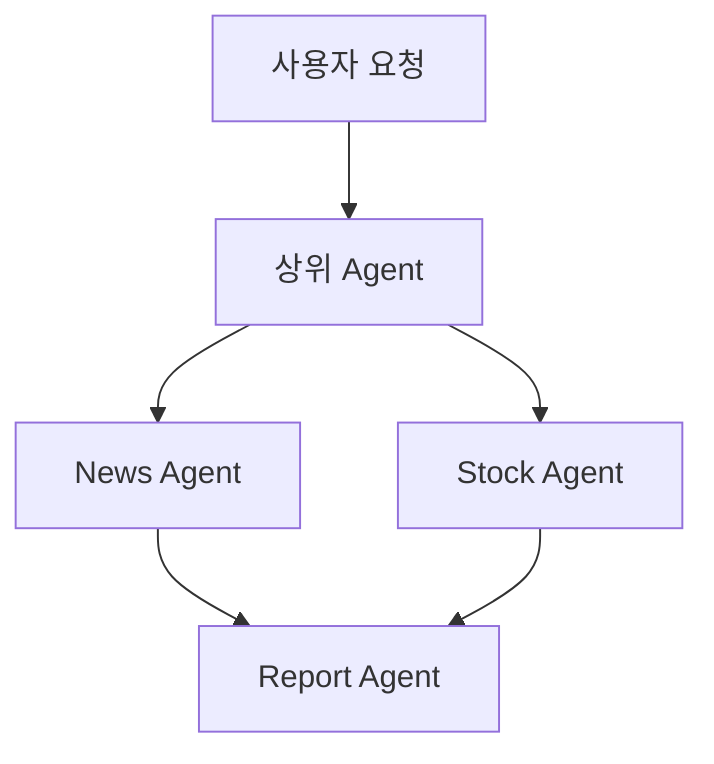

# Agent 4대 패턴

[[AI Agent|에이전트]]를 설계할 때 자주 나오는 기본 패턴은 크게 4가지다.

## 1. Reflection

Reflection은 에이전트가 자기 답변이나 중간 결과를 다시 보고 고치는 패턴이다.

- 초안 품질을 높이고 싶을 때 쓴다.
- 단점은 LLM 호출이 늘어나 비용과 시간이 증가한다는 점이다.

## 2. Tool Use

Tool Use는 LLM이 외부 도구를 선택해 실행하고, 결과를 다시 읽어 답하는 패턴이다.

- [[Tool Calling]], [[LangChain @tool]], [[LangGraph ToolNode]]와 연결된다.
- 실습의 `food_tool`, `stock_tool`, `news_tool`이 여기에 해당한다.

## 3. Planning

Planning은 큰 문제를 먼저 작은 단계로 나누고, 각 단계를 실행하는 패턴이다.

- 복잡한 작업, 긴 작업, 여러 도구가 필요한 작업에 유리하다.
- 계획이 틀리면 뒤 단계가 함께 흔들리므로 검증 노드를 두기도 한다.

## 4. Multi-Agent

Multi-Agent는 여러 에이전트가 역할을 나눠 협업하는 패턴이다.

- 한 에이전트에게 너무 많은 역할과 도구를 주기 어려울 때 사용한다.
- [[Serial Agent Pipeline]], [[Parallel Agent Fan-out]], [[Supervisor 패턴]], [[Sub-LLM as Tool]]로 확장된다.

## 실습에서의 위치

| 실습 코드 | 해당 패턴 |
|---|---|
| `@tool` + `bind_tools` + `ToolNode` | Tool Use |
| `create_react_agent(llm, tools)` | Tool Use + ReAct |
| 하위 LLM을 `@tool`로 감싼 코드 | Tool Use + Multi-Agent |
| 뉴스 agent → 주가 agent → reporter | Multi-Agent + Serial |
| START에서 뉴스/주가 agent 동시 실행 | Multi-Agent + Parallel |

## 관련

- [[Agentic Loop]]
- [[ReAct 패턴]]
- [[Tool Calling]]
- [[Multi Agent]]
