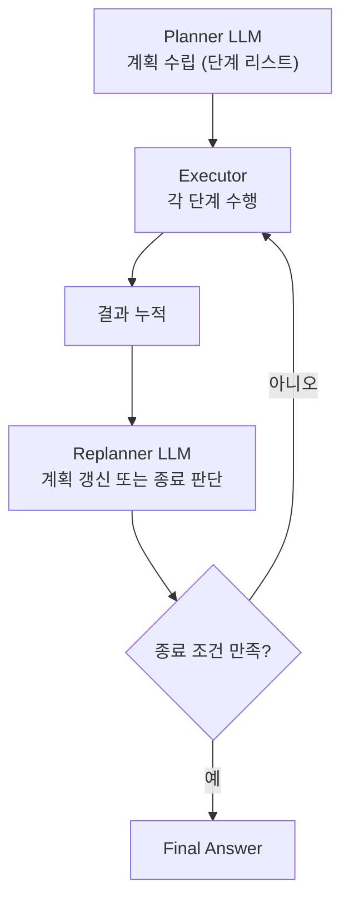

- Plan-and-Execute는 [[AI Agent|에이전트]]가 **작업을 시작하기 전에 전체 계획(plan)을 세우고**, 그 계획을 단계별로 실행한 뒤, 필요하면 계획을 갱신(replan)하는 패턴이다.
- [[ReAct 패턴]]이 한 스텝씩 즉흥적으로 결정한다면, Plan-and-Execute는 **선계획 → 후실행**으로 작업 흐름이 더 명확하다.

## 구조



## 의사 구현

```python
def plan_and_execute(goal: str):
    plan = planner_llm.invoke(f"목표: {goal}\n단계별 계획을 세워라")
    # 예: ["1. 사용자 정보 조회", "2. 최근 주문 가져오기", "3. 환불 처리"]

    history = []
    while plan:
        step = plan.pop(0)
        result = executor_agent.invoke(step)
        history.append((step, result))

        # 남은 계획이 여전히 유효한지 재검토
        decision = replanner_llm.invoke({"history": history, "remaining": plan})
        if decision.is_done:
            return decision.final_answer
        plan = decision.new_plan
```

## 장점

- **장기 작업에 강함** — 다단계 작업의 맥락을 계획 문서가 압축해 갖고 있어 컨텍스트 폭주를 막는다.
- **디버깅 용이** — 계획을 사람이 검토·수정 가능.
- **Planner는 강한 모델, Executor는 싼 모델** 식으로 비용 최적화가 쉽다.

## 단점

- **계획이 틀리면 통째로 흔들림** — Replanner 품질이 곧 성능.
- **즉흥적 분기엔 약함** — ReAct가 더 자연스러운 경우도 많다.

## 관련 패턴

- [[ReAct 패턴]] — 즉흥적 step-by-step.
- [[Reflexion]] — 실패에서 학습.
- [[Supervisor 패턴]] — 멀티 에이전트로 확장한 버전.
