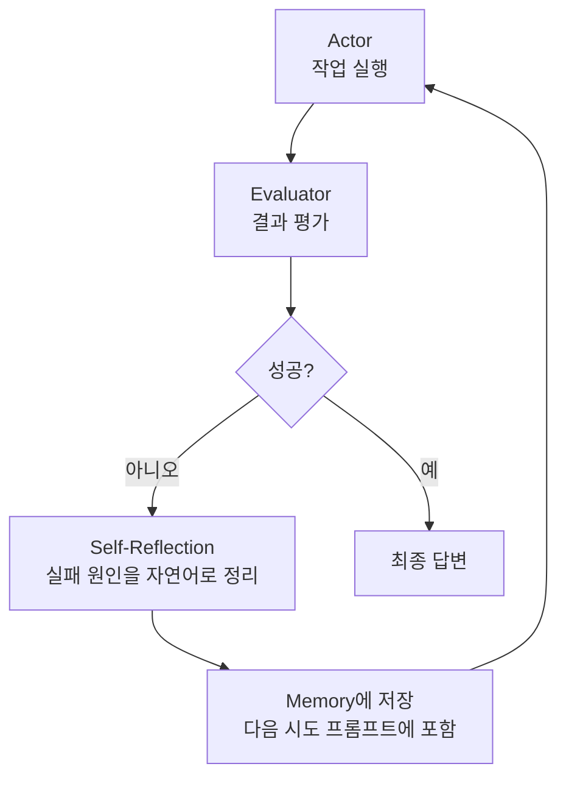

- Reflexion은 [[AI Agent|에이전트]]가 실행 결과를 **스스로 비평(self-critique)** 하고, 그 비평을 다음 시도의 컨텍스트로 넣어 성능을 개선하는 패턴이다.
- 2023년 Shinn et al. 논문에서 제안. 핵심: **언어로 된 자기 피드백**을 일종의 강화학습 신호처럼 활용.

## 구조



## 의사 구현

```python
def reflexion_loop(task: str, max_trials: int = 3):
    memory = []
    for trial in range(max_trials):
        # 1) 시도
        trajectory = actor.run(task, hints=memory)

        # 2) 평가
        score = evaluator.judge(task, trajectory)
        if score.is_success:
            return trajectory.final_answer

        # 3) 자기 비평 — 자연어 회고
        reflection = llm.invoke(
            f"이전 시도가 실패했다.\n경로: {trajectory}\n실패 원인을 짧게 분석하고 다음 시도에 적용할 교훈을 적어라"
        )
        memory.append(reflection)
    raise RuntimeError("모든 시도 실패")
```

## 장점

- 같은 작업을 반복할 때 **빠르게 학습**.
- 모델 파라미터를 건드리지 않고도 행동이 개선됨 (in-context learning).

## 한계

- 자기 평가가 부정확하면 잘못된 교훈을 학습.
- 시도마다 비용·시간이 누적.

## 관련 패턴

- [[ReAct 패턴]] — Actor가 흔히 ReAct.
- [[Plan-and-Execute]] — Replanner 단계가 Reflexion과 비슷한 역할.
- [[Evaluator-Optimizer]] — Workflow 버전.
