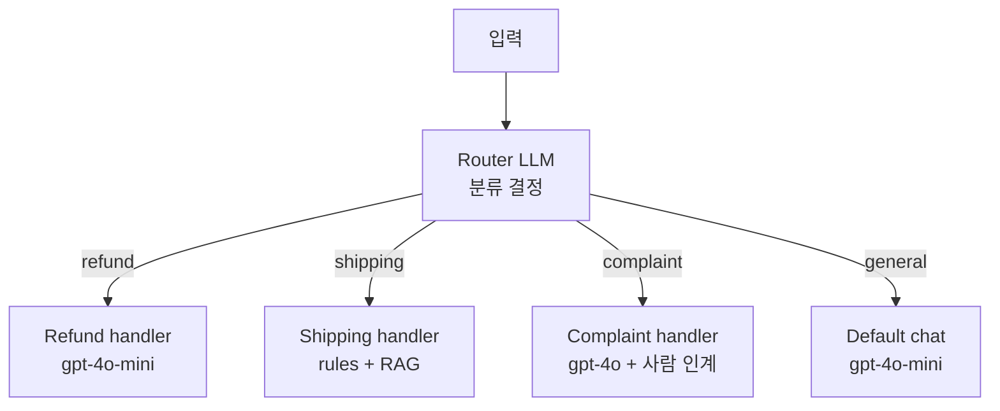
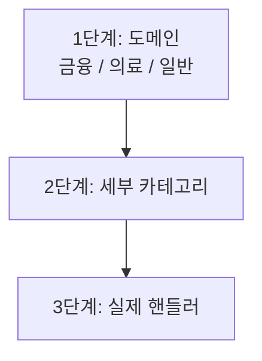

- Routing Workflow = 입력을 분류해 **여러 처리 가지(branch) 중 하나로 라우팅**하는 [[Agent vs Workflow|워크플로우 패턴]]. Anthropic이 정리한 5가지 workflow 패턴 중 하나.
- 모든 입력을 같은 강력 모델로 처리하는 대신, **유형별로 다른 프롬프트/모델/도구**를 쓴다. 비용과 정확도 모두 이득.

## 구조



## 간단 구현

```python
from typing import Literal
from pydantic import BaseModel

class Route(BaseModel):
    category: Literal["refund","shipping","complaint","general"]
    reason: str

router = llm.with_structured_output(Route)

def handle(user_msg: str):
    r = router.invoke(f"분류해라: {user_msg}")
    return HANDLERS[r.category](user_msg)
```

## [[Intent Classification]]과의 관계

- Intent Classification = "어떤 의도인가" 분류 단계.
- Routing Workflow = 분류 결과를 받아 **다른 처리 경로로 분기**까지 포함.
- 보통 둘은 같은 워크플로우 안에 한 쌍으로 묶인다.

## 장점

- **비용 최적화** — 단순 질의는 작은 모델, 복잡한 케이스만 큰 모델.
- **유지보수 용이** — 카테고리별로 프롬프트·도구·테스트가 분리.
- **품질** — 각 핸들러가 자기 도메인만 잘하면 됨.

## [[Supervisor 패턴]]과의 차이

| | Routing Workflow | Supervisor |
|--|------------------|------------|
| 처리 흐름 | 한 번 라우팅 → 1개 핸들러 → 끝 | 매 턴 라우팅, 워커→매니저→워커 반복 |
| 동적 | 정적 결정 트리 | 동적 다단계 |
| 비용 | 낮음 | 높음 |
| 복잡도 | 낮음 | 중~상 |

- 단발성 분류·처리에 충분하면 Routing Workflow가 더 가성비 좋다.

## 다단계 라우팅 ([[Hierarchical Agent|계층]])



- 카테고리가 20+ 이면 단층으로는 정확도 ↓ → 계층 분류로 쪼개기.

## 관련

- [[Agent vs Workflow]] · [[Intent Classification]] · [[Structured Output]].
- [[Supervisor 패턴]] — 라우팅의 동적·반복 버전.
- [[LLM Provider 추상화]] — 카테고리별 모델 라우팅과 결합.
