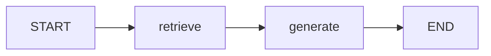
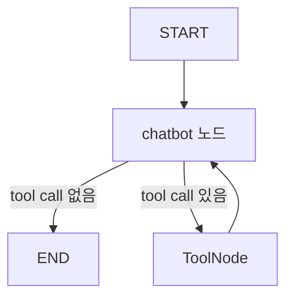

# Workflow Node vs Tool

## 핵심 구분

`retrieve` 같은 함수와 `@tool`이 붙은 함수는 둘 다 Python 함수처럼 보이지만 역할이 다르다.

`retrieve`는 **워크플로우의 고정 실행 단계**이고, `@tool` 함수는 **LLM이 필요할 때 선택해서 호출하는 도구**이다.

## 비교표

| 구분 | Workflow Node | Tool |
|---|---|---|
| 예시 | `retrieve(state)`, `generate(state)` | `@tool def food_tool(...)` |
| 역할 | 그래프의 작업 단계 | LLM이 호출할 수 있는 기능 |
| 실행 주체 | LangGraph의 Edge 흐름 | LLM의 tool calling 판단 |
| 실행 여부 | 그래프에 연결되면 실행됨 | LLM이 필요하다고 판단할 때 실행됨 |
| 실행 순서 | `add_edge()`로 사람이 정의 | LLM이 대화 상황에 따라 결정 |
| 입력 | 보통 전체 `state` | 함수 인자 |
| 출력 | State 업데이트용 딕셔너리 | 도구 실행 결과 |

## Workflow Node 예시

```python
def retrieve(state: State):
    question = state["question"]
    docs = [...]
    return {"context": docs}
```

이 함수는 다음처럼 그래프에 연결된다.

```python
builder.add_node("retrieve", retrieve)
builder.add_edge(START, "retrieve")
builder.add_edge("retrieve", "generate")
```

따라서 그래프가 실행되면 `retrieve`는 고정된 순서에 따라 실행된다.



## Tool 예시

```python
from langchain_core.tools import tool

@tool
def food_tool(food: str):
    """감기에 좋은 음식을 알려줄 때 사용한다."""
    return "생강차와 닭고기 수프를 드세요."
```

이 함수는 그래프 흐름에서 무조건 실행되지 않는다.

LLM에게 도구를 바인딩한 뒤:

```python
llm_with_tools = llm.bind_tools([food_tool])
```

이 상태에서는 아직 도구가 실행되지 않는다. 메시지를 넣어 LLM을 호출해야 한다.

```python
response = llm_with_tools.invoke(current_messages)
```

이때 LLM이 질문을 보고 필요하다고 판단하면 tool call을 만든다. 자세한 흐름은 [[LLM Tool Selection]] 참고.

## 실무 판단 기준

### 매번 정해진 순서로 실행되어야 한다면 Node

예:

- 문서 검색
- 답변 생성
- 결과 평가
- 로그 저장
- 사용자 승인 단계

```python
def evaluate(state): ...
```

### LLM이 필요할 때만 선택해야 한다면 Tool

예:

- 날씨 API 조회
- 주가 조회
- 계산기
- 뉴스 검색
- DB 조회

```python
@tool
def get_stock_price(ticker: str): ...
```

## 관계

Node와 Tool은 대체 관계가 아니다. 함께 쓴다.



여기서:

- `chatbot`은 Node
- `ToolNode`도 Node
- `food_tool`은 Tool

## 한 줄 정리

> Node는 사람이 설계한 워크플로우 단계이고, Tool은 LLM이 상황에 따라 꺼내 쓰는 기능이다.

관련:

- [[LangGraph Node]]
- [[LangChain @tool]]
- [[LLM Tool Selection]]
- [[Tool Calling]]
- [[Agent vs Workflow]]
