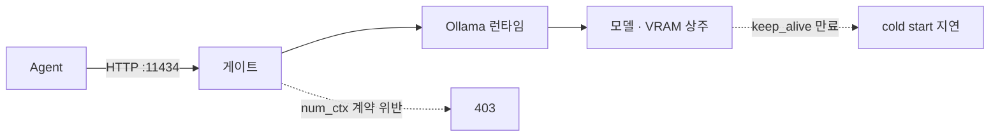

# Ollama

- Ollama는 **로컬/사내 서버에서 LLM을 돌리는 런타임**이다. 모델을 VRAM에 올려 두고 HTTP API(`:11434`)로 추론을 받는다.
- 프로젝트의 기본 provider다 (`DEFAULT_LLM_PROVIDER = "ollama"`, 허용 provider는 `{"openai", "ollama"}`).

## 왜 쓰나

| 이유 | 설명 |
|---|---|
| 내부망 | 데이터가 외부로 안 나간다. 공공·금융 요건 |
| 비용 | 토큰 과금이 없다 ([[Cost와 Token]]) |
| 지연 | 네트워크 왕복이 없다 |
| 대가 | 모델이 작다 → [[sLLM(소형 LLM) 운용]]의 제약을 그대로 받는다 |

## LangChain 연결

```python
from langchain_ollama import ChatOllama

def build_chat_ollama(*, model_name, base_url, temperature, num_predict,
                      num_ctx, keep_alive, request_timeout, callbacks=None):
    kwargs = {
        "model": model_name,
        "temperature": temperature,
        "base_url": base_url,
        "num_predict": num_predict,          # 생성 토큰 상한 (OpenAI의 max_tokens)
        "num_ctx": num_ctx,                  # 컨텍스트 창 크기
        "reasoning": resolve_ollama_reasoning(model_name),
        "keep_alive": normalize_keep_alive(keep_alive),
    }
    return ChatOllama(**kwargs)
```

인스턴스 조립을 **한 모듈에만** 둔다. chat 경로(Spring이 gRPC로 보낸 파라미터)와 workflow 경로(settings + ModelConfig)가 파라미터 출처만 다르고 조립 규칙은 같아야 하기 때문이다 ([[LLM Provider 추상화]]).

## Ollama 고유의 함정 셋

### 1. `keep_alive`는 Go duration 파서를 쓴다

```python
def normalize_keep_alive(raw):
    """Ollama HTTP API의 Go duration 파서는 단위 없는 문자열 "-1"을 거부한다."""
    if raw is None:
        return -1                       # 무기한 VRAM 유지
    if isinstance(raw, int):
        return raw
    if isinstance(raw, str):
        s = raw.strip()
        if s.lstrip("-").isdigit():
            return int(s)               # "300" → 300
        return s                        # "5m", "999h" 는 유효한 Go duration
    return raw
```

문자열 `"-1"`을 보내면 `time: missing unit in duration`으로 거부된다. **정수 -1이어야 무기한**이다. `keep_alive`가 짧으면 모델이 VRAM에서 내려가고 다음 요청이 cold start로 수 초~수십 초 얼어붙는다.

### 2. `reasoning` 인자가 모델마다 타입이 다르다

```python
def resolve_ollama_reasoning(model_name: str):
    enabled = get_settings().ollama_reasoning_enabled
    if model_name.startswith("gpt-oss"):
        return "high" if enabled else "low"     # effort 레벨만 받음
    return enabled                              # gemma/qwen 계열은 bool
```

`gpt-oss`는 harmony 포맷이라 thinking 완전 비활성이 불가능하다. `False`를 보내면 Ollama가 거부하므로 **최소 effort `low`로 매핑**한다. 같은 API인데 모델이 계약을 바꾸는 사례다.

### 3. structured output 반환 모양이 흔들린다

Ollama는 간헐적으로 파싱을 건너뛰고 JSON 문자열이 든 message envelope를 그대로 준다. 그래서 [[Structured Output 정규화]] 경계가 필요하다.

## 운영 파라미터

```python
ollama_base_url: str            # resolve_ollama_base_url()
ollama_num_ctx: int             # 컨텍스트 창 — 게이트 계약과 묶임
ollama_request_timeout: int     # 단일 호출 상한
ollama_keep_alive: int          # -1 = VRAM 무기한 유지
ollama_reasoning_enabled: bool
ollama_parallel_slots: int      # 동시 처리 슬롯
```



사내 H200 배치에서는 게이트가 **약속된 `num_ctx` 외의 값을 거부**하도록 돼 있다. 즉 `num_ctx`는 성능 튜닝 값이 아니라 **인프라와의 계약**이다 ([[컨텍스트 윈도우와 num_ctx]]).

## 한 줄 정리

Ollama는 **모델을 VRAM에 상주시키는 로컬 런타임**이고, keep_alive·reasoning·num_ctx가 OpenAI와 다르게 동작하는 세 지점이다.

## 관련

- [[sLLM(소형 LLM) 운용]]
- [[컨텍스트 윈도우와 num_ctx]]
- [[LLM 샘플링 파라미터]]
- [[Structured Output 정규화]]
- [[LLM Provider 추상화]]
- [[LLM Routing]]
- [[LangChain]]
- [[LLM(Large Language Model)]]
