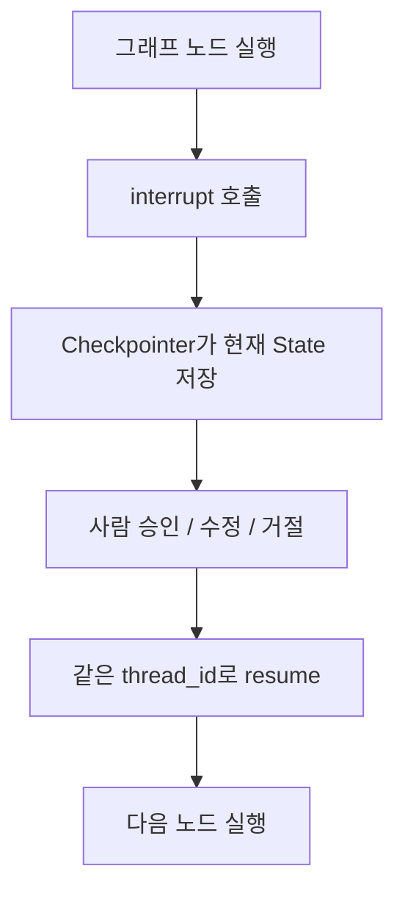

# LangGraph interrupt

- `interrupt`는 [[LangGraph]] 실행 중간에서 그래프를 **일시 중단하고 사람 입력을 기다리게 하는 기능**이다.
- 주로 [[Human-in-the-loop]]에서 사용한다.
- 결제, 메일 발송, DB 삭제, 리포트 제출처럼 사람이 승인해야 하는 단계 앞에 둔다.

## 핵심 감각



- `interrupt` 자체는 그래프를 멈추는 역할이다.
- [[LangGraph Checkpointer]]는 멈춘 지점의 [[LangGraph State|State]]를 저장한다.
- [[LangGraph thread_id]]는 나중에 같은 실행 흐름을 다시 찾는 세션 키다.

## 예시

```python
from langgraph.types import interrupt

def approval_node(state):
    decision = interrupt({
        "question": "이 작업을 진행할까요?",
        "preview": state["draft"],
    })
    return {"decision": decision}
```

- 이 노드에 도달하면 그래프가 멈춘다.
- 사용자에게 `question`, `preview` 같은 정보를 보여준다.
- 사람이 답하면 같은 `thread_id`로 그래프를 재개한다.

## 재개 문법

```python
from langgraph.types import Command

config = {"configurable": {"thread_id": "approval-123"}}

# 첫 호출은 interrupt payload를 반환하고 중단한다.
paused = graph.invoke({"draft": "..."}, config=config)

# 반드시 같은 thread_id로 재개한다.
result = graph.invoke(
    Command(resume={"approved": True}),
    config=config,
)
```

`Command(resume=...)`의 값은 중단된 노드 안에서 `interrupt()`의 반환값이 된다. 새 사용자 턴을 시작할 때는 `Command(update=...)`가 아니라 일반 입력 dict를 사용한다. 자세한 구분은 [[LangGraph Command]] 참고.

## Checkpointer가 필요한 이유

- 사람은 즉시 답하지 않을 수 있다.
- 서버가 재시작될 수도 있다.
- 다음 요청에서 "아까 어디서 멈췄지?"를 알아야 한다.

그래서 `interrupt`를 제대로 쓰려면 [[LangGraph Checkpointer]]가 필요하다.

| 상황 | 적합한 저장소 |
|---|---|
| 노트북 실습 | [[LangGraph InMemorySaver]] |
| 로컬 파일로 재개 테스트 | [[LangGraph SqliteSaver]] |
| 운영 서비스 | [[LangGraph PostgresSaver]] |

## 가장 중요한 함정: 노드는 다시 시작된다

재개 시 `interrupt()`가 있던 노드는 처음부터 다시 실행될 수 있다. 따라서 interrupt 이전에 메일 발송, DB insert, 결제 같은 부작용을 두면 승인 한 번에 같은 작업이 두 번 실행될 수 있다.

원칙은 다음과 같다.

1. interrupt 전에는 순수 계산·검증·미리보기만 둔다.
2. 부작용이 필요하면 idempotency key 또는 중복 검사로 보호한다.
3. interrupt payload와 resume 값은 JSON 직렬화 가능한 단순 구조로 둔다.
4. `interrupt()`를 넓은 `try/except`로 감싸지 않는다. 중단 신호를 일반 오류로 삼키면 안 된다.

위 원칙은 [[LangGraph Durable Execution]]과 연결된다.

## 승인 UI가 보여줄 것

- 실행하려는 action 이름과 사람이 읽을 수 있는 설명
- 실제 인자와 영향 범위
- `approve`, `edit`, `reject` 중 허용되는 결정
- 요청자, 시각, 만료 정책

수정된 인자는 서버에서 다시 schema·권한·정책 검증을 받아야 한다. 사람이 수정했다는 사실은 유효성 보장을 대신하지 않는다.

## 관련

- [[Human-in-the-loop]]
- [[LangGraph Checkpointer]]
- [[LangGraph thread_id]]
- [[LangGraph InMemorySaver]]
- [[LangGraph SqliteSaver]]
- [[LangGraph PostgresSaver]]
- [[LangGraph Command]]
- [[LangGraph Durable Execution]]
- [[Tool Execution Policy]]

## 공식 문서

- [LangGraph Interrupts](https://docs.langchain.com/oss/python/langgraph/interrupts)
- [LangChain Human-in-the-loop](https://docs.langchain.com/oss/python/langchain/human-in-the-loop)
