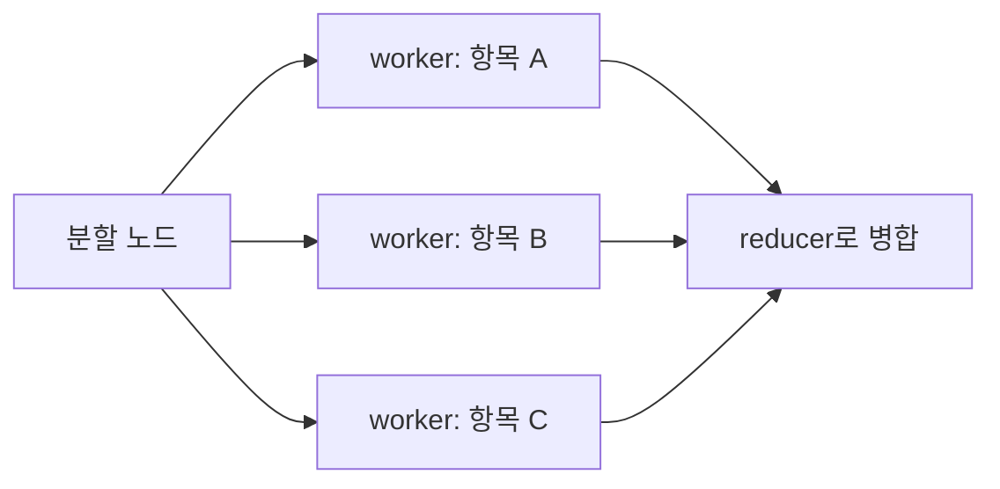

# LangGraph Send

`Send`는 실행할 노드 수가 런타임에 결정되는 LangGraph fan-out 문법이다. 정적으로 edge를 여러 개 선언하는 방식과 달리, 목록의 각 항목에 대해 독립 state를 만들어 worker 노드로 보낼 수 있다.

## Map-Reduce 구조



```python
import operator
from typing import Annotated
from typing_extensions import TypedDict
from langgraph.types import Send

class State(TypedDict):
    subjects: list[str]
    results: Annotated[list[str], operator.add]

class WorkerState(TypedDict):
    subject: str
    results: Annotated[list[str], operator.add]

def fan_out(state: State):
    return [
        Send("research_one", {"subject": subject})
        for subject in state["subjects"]
    ]

def research_one(state: WorkerState):
    return {"results": [f"조사 결과: {state['subject']}"]}
```

`fan_out`은 conditional edge에서 반환한다. worker는 전체 공유 state가 아니라 자신에게 필요한 최소 입력을 받도록 설계하는 편이 안전하다.

## reducer가 필수인 이유

여러 worker가 같은 `results` 키를 동시에 업데이트하면 기본 동작인 덮어쓰기로는 마지막 결과만 남을 수 있다. 따라서 병합 대상에는 명시적 [[LangGraph State Reducer|reducer]]가 필요하다.

| 결과 유형 | 흔한 reducer | 주의점 |
|---|---|---|
| 독립 결과 목록 | `operator.add` | 중복 제거와 최종 정렬은 별도 단계에서 한다. |
| 키별 집계 | 순수한 merge 함수 | 같은 키 충돌의 우선순위를 정한다. |
| 점수 | 합계 또는 최댓값 | 합계가 중복 이벤트를 과대평가하지 않는지 확인한다. |
| 메시지 | `add_messages` | tool call과 tool result의 대응을 보존한다. |

reducer는 입력을 직접 변경하지 않는 순수 함수로 만들고, 실행 순서가 달라도 의미가 변하지 않게 설계해야 한다. 병렬 결과의 도착 순서는 안정적인 정렬 기준이 아니다.

## 언제 쓰나

- 문서를 여러 부분으로 나눠 독립적으로 요약·평가할 때
- 여러 검색 채널이나 하위 질의를 동시에 수행할 때
- 후보별 점수 산정 후 하나의 ranking으로 합칠 때

공유 파일, DB 레코드, 캔버스처럼 동일 자원을 변경하는 작업에는 `Send` fan-out이 맞지 않는다. 이런 작업은 [[Concurrent Tool Execution]]의 직렬화 또는 트랜잭션 경계를 사용한다.

## 관련

- [[Parallel Agent Fan-out]]
- [[LangGraph State Reducer]]
- [[LangGraph Command]]
- [[async-await]]
- [[Concurrent Tool Execution]]

## 공식 문서

- [LangGraph Graph API: Send를 이용한 Map-Reduce](https://docs.langchain.com/oss/python/langgraph/use-graph-api)
