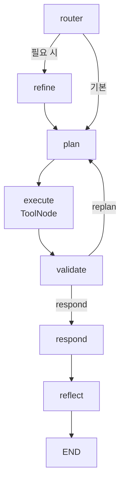

# LangGraph Agent Loop

LangGraph Agent Loop는 에이전트의 단계를 노드로 나누고, 검증 결과에 따라 다시 계획하거나 응답으로 종료하는 그래프 구조이다.

프로젝트에서는 `Router -> Refine -> Plan -> Execute -> Validate -> Respond -> Reflect -> END` 형태로 조립된다.

## 구조

## 각 노드의 역할

| 노드 | 역할 |
|---|---|
| router | 바로 계획할지, 이전 실패를 반영해 refine할지 결정 |
| refine | 반복 실패나 reject 신호를 강한 지시로 변환 |
| plan | LLM이 도구 호출 또는 워크플로우 계획을 생성 |
| execute | [[LangGraph ToolNode]]가 도구 실행 |
| validate | 계약/구조 검증 후 replan 또는 respond 결정 |
| respond | 최종 응답 객체 생성 |
| reflect | critic 평가를 기록 |

## 왜 loop가 필요한가

- LLM이 처음부터 완벽한 워크플로우를 만들지 못할 수 있다.
- 검증기가 구조 오류를 찾으면 다시 계획해야 한다.
- 최종 응답 전에 reflection을 남기면 [[Observability]]와 회귀 분석에 도움이 된다.

## 한 줄 정리

LangGraph Agent Loop는 **계획, 도구 실행, 검증, 재계획, 응답을 그래프 노드로 명시한 에이전트 실행 루프**이다.

## 관련

- [[LangGraph StateGraph]]
- [[LangGraph Node]]
- [[LangGraph ToolNode]]
- [[Reflection]]
- [[Contract Guardrail Pipeline]]
