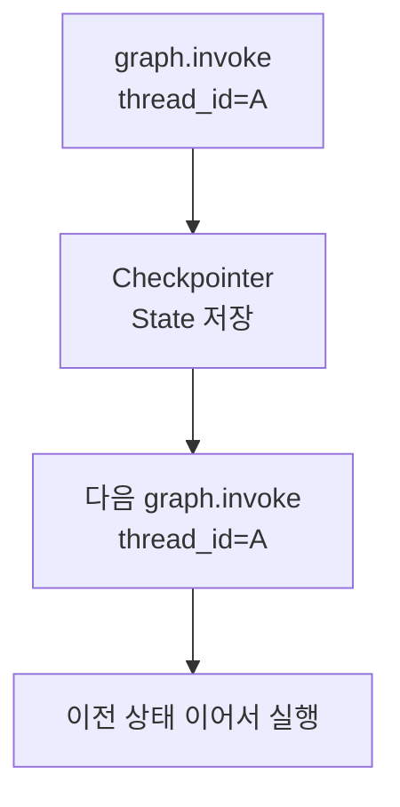

# LangGraph Checkpointer

- Checkpointer는 [[LangGraph]] 실행 중의 [[LangGraph State|State]]를 저장하는 장치다.
- 같은 대화 흐름을 이어갈 수 있게 하는 단기 기억 장치에 가깝다.
- 강의자료 표현으로는 "그래프의 실행 상태를 매 단계마다 저장해, 같은 대화(thread_id)를 이어갈 수 있게 하는 장치"다.

## 무엇을 저장하나

- 현재 `messages`
- 그래프가 어디까지 실행됐는지
- [[LangGraph interrupt]]로 멈춘 지점
- 같은 [[LangGraph thread_id]]에서 이어서 실행할 상태
- 다음에 실행해야 할 노드의 위치
- 중간 노드들이 반환한 State 값

## 구조

## 왜 필요한가

- 여러 턴 대화를 이어가야 할 때
- [[Human-in-the-loop]]에서 사람이 응답할 때까지 그래프를 멈춰야 할 때
- 실행 중 오류가 났을 때 상태를 복구해야 할 때
- 장시간 실행 workflow를 안정적으로 운영해야 할 때
- 같은 사용자의 같은 대화와 다른 대화를 분리해야 할 때

## 대표 구현

| 구현 | 특징 |
|---|---|
| [[LangGraph InMemorySaver]] | RAM에 저장. 빠르지만 프로세스가 꺼지면 사라짐 |
| [[LangGraph SqliteSaver]] | 로컬 SQLite 파일에 저장. 런타임이 죽어도 파일이 남으면 유지 |
| [[LangGraph PostgresSaver]] | 서버/운영 환경에 적합 |

## Checkpointer vs Store

| 구분 | Checkpointer | [[LangGraph Store]] |
|---|---|---|
| 목적 | 실행 상태 이어가기 | 장기 지식 저장 |
| 범위 | 같은 thread/session | 여러 thread/session에서 재사용 |
| 예시 | 대화 이력, interrupt 위치 | 사용자 선호, 학습된 사실 |
| 질문 | "어디까지 실행했지?" | "무엇을 기억해야 하지?" |

## 한 줄 요약

- Checkpointer = 그래프 실행 상태를 저장해서 같은 `thread_id`의 대화를 이어주는 장치.
- Store = 대화 세션을 넘어 재사용할 장기 지식을 저장하는 장치.

## 운영에서의 감각

- 실습에서는 [[LangGraph InMemorySaver]]나 [[LangGraph SqliteSaver]]로 충분하다.
- 실제 서비스에서는 서버 재시작, 여러 사용자, 장애 복구, 백업을 고려해야 한다.
- 그래서 운영에서는 PostgreSQL 같은 서버형 DB 기반 checkpointer를 고려한다.
- MySQL류 DB도 애플리케이션 저장소로는 사용할 수 있지만, LangGraph checkpointer로 쓰려면 해당 구현체나 커스텀 저장 계층이 필요하다.

## 관련

- [[Memory]]
- [[LangGraph Store]]
- [[LangGraph InMemorySaver]]
- [[LangGraph SqliteSaver]]
- [[LangGraph PostgresSaver]]
- [[LangGraph interrupt]]
- [[LangGraph thread_id]]
- [[Human-in-the-loop]]
- [[LangGraph State]]
- [[LangGraph 운영용 메모리 저장소]]
