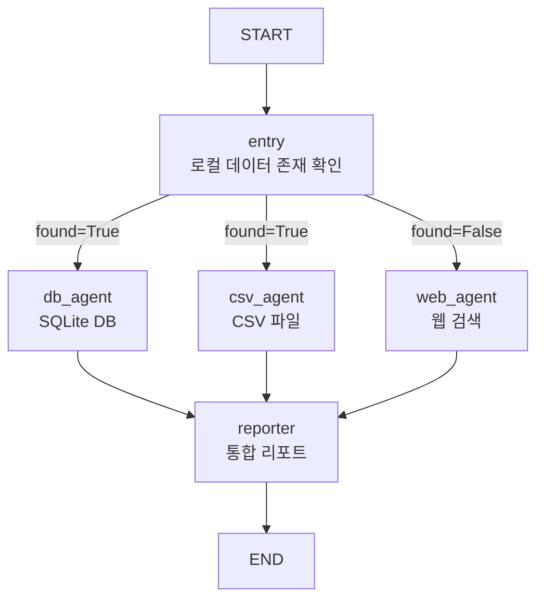
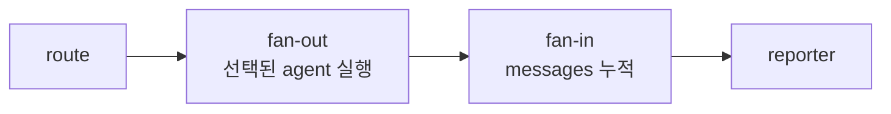

# LangGraph Conditional Fan-out

- Conditional Fan-out = [[LangGraph Edge|조건부 Edge]]의 라우터가 **다음 노드 1개가 아니라 여러 노드 목록을 반환**해서, 조건에 따라 병렬 실행 대상을 바꾸는 패턴이다.
- 일반 [[Parallel Agent Fan-out]]은 항상 같은 노드들로 퍼진다.
- Conditional Fan-out은 [[LangGraph State|State]]를 보고 `DB+CSV`, 또는 `Web`처럼 실행 경로를 동적으로 고른다.

## 구조



## 실습 코드 감각

```python
def route(state: AgentState):
    if state["found"]:
        return ["db_agent", "csv_agent"]
    return ["web_agent"]
```

- `found=True`이면 로컬 DB와 CSV를 둘 다 조회한다.
- `found=False`이면 웹 검색 agent만 실행한다.
- 즉 라우터 함수가 문자열 하나가 아니라 **문자열 리스트**를 반환한다.

```python
builder.add_conditional_edges(
    "entry",
    route,
    ["db_agent", "csv_agent", "web_agent"],
)
```

- 세 번째 인자는 라우터가 갈 수 있는 후보 노드 목록이다.
- `route()`가 반환한 값이 이 후보 중 어디인지 보고 LangGraph가 다음 노드를 실행한다.

## 일반 조건부 Edge와 차이

일반 조건부 Edge는 보통 한 경로만 고른다.

```python
def route(state):
    if state["ok"]:
        return "answer"
    return "fallback"
```

Conditional Fan-out은 여러 경로를 동시에 고를 수 있다.

```python
def route(state):
    if state["found"]:
        return ["db_agent", "csv_agent"]
    return ["web_agent"]
```

## State reducer가 필요한 이유

- 여러 노드가 같은 `messages` 필드에 결과를 추가한다.
- 이때 그냥 리스트 필드만 쓰면 나중 결과가 앞 결과를 덮을 수 있다.
- 그래서 `add_messages` reducer를 붙인다.

```python
class AgentState(TypedDict):
    messages: Annotated[Sequence[BaseMessage], add_messages]
    disease: str
    found: bool
```

- `db_agent` 결과와 `csv_agent` 결과가 둘 다 `messages`에 쌓이고, `reporter`가 이를 읽어 최종 답변을 만든다.

## Fan-out / Fan-in 관점



- Fan-out: `entry`에서 선택된 agent들로 퍼짐.
- Fan-in: 선택된 agent들의 결과가 `reporter`로 모임.
- Reduce: `reporter`가 모인 정보를 요약·종합함.

## 언제 쓰나

- 내부 DB에 정보가 있으면 내부 데이터를 우선 쓴다.
- 로컬 문서가 있으면 로컬 문서 agent를 함께 실행한다.
- 내부 정보가 없을 때만 웹 검색으로 fallback한다.
- 비용이 큰 agent는 필요한 경우에만 실행하고 싶다.

## 주의

- 여러 노드가 같은 필드를 업데이트하면 reducer를 꼭 확인한다.
- 라우터가 반환할 수 있는 노드 이름은 `add_conditional_edges` 후보에 포함되어야 한다.
- 병렬 결과의 순서에 의존하는 코드는 피한다.
- 웹 검색 fallback은 최신성은 좋지만, 출처와 신뢰도를 reporter에서 함께 정리해야 한다.

## 관련

- [[LangGraph Edge]]
- [[Parallel Agent Fan-out]]
- [[Routing Workflow]]
- [[Fallback]]
- [[LangGraph State]]
- [[External Information MAS]]
- [[로컬 우선 정보 수집 MAS]]
