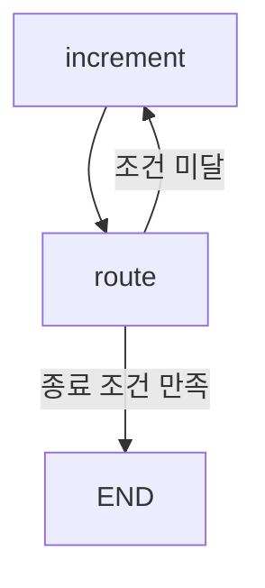

# LangGraph END

- `END`는 [[LangGraph]] 그래프에서 **실행이 정상 종료되는 특수 지점**이다.
- 실제 작업 노드가 아니라, "여기까지 오면 그래프 실행을 끝낸다"는 예약 상수다.

## 기본 사용

```python
from langgraph.graph import END

builder.add_edge("generate", END)
```

- 이 코드는 `generate` 노드가 끝난 뒤 그래프를 종료하라는 뜻이다.
- 정상적으로 `END`에 도달하면 `graph.invoke(...)`는 최종 State를 결과로 반환한다.

## 조건부 종료

```python
def route(state):
    if state["count"] >= 5:
        return "end"
    return "loop"

builder.add_conditional_edges(
    "increment",
    route,
    {
        "loop": "increment",
        "end": END,
    },
)
```



- 반복 그래프에서는 `END`로 가는 조건이 반드시 있어야 정상 종료된다.
- `END`로 가는 길이 없으면 [[LangGraph recursion_limit]]에 걸리거나 [[GraphRecursionError]]가 발생할 수 있다.

## START와 END의 역할

| 상수 | 역할 |
|---|---|
| [[LangGraph START|START]] | 그래프 실행 시작점 |
| END | 그래프 실행 종료점 |

## 주의

- `END`는 사용자가 만든 노드 이름이 아니다.
- `builder.add_node("END", ...)`처럼 등록하지 않는다.
- 종료 노드를 직접 구현하는 대신, `from langgraph.graph import END`로 가져와 edge 대상에 넣는다.
- 업무상 정상 종료 조건은 `add_conditional_edges`로 명시하는 것이 좋다.

## 관련

- [[LangGraph START]]
- [[LangGraph Edge]]
- [[LangGraph StateGraph]]
- [[Loop Control]]
- [[LangGraph recursion_limit]]
- [[GraphRecursionError]]
