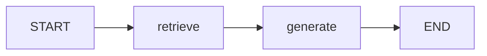
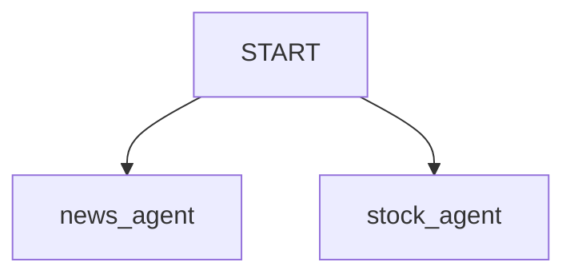
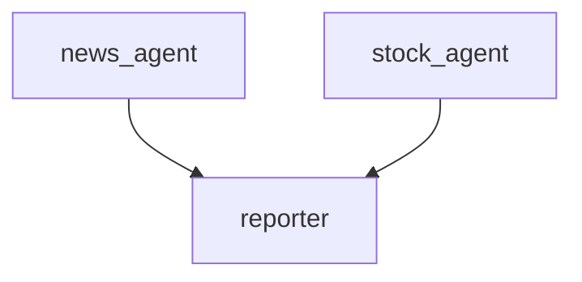
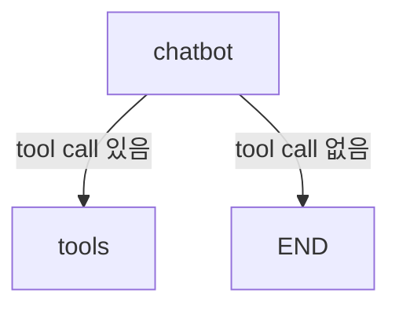

# LangGraph Edge

## 정의

`Edge`는 LangGraph에서 노드 간 실행 순서를 정의하는 연결선이다.

```python
builder.add_edge(START, "retrieve")
builder.add_edge("retrieve", "generate")
builder.add_edge("generate", END)
```

위 코드는 다음 흐름을 만든다.



## START와 END

`START`는 그래프의 시작점이다.

`END`는 그래프의 종료점이다.

```python
from langgraph.graph import START, END
```

이 둘은 실제 작업 노드라기보다, LangGraph가 실행 흐름을 이해하기 위한 특수 노드이다.

## 고정 Edge

고정 Edge는 항상 같은 다음 노드로 이동한다.

```python
builder.add_edge("retrieve", "generate")
```

이 경우 `retrieve`가 끝나면 무조건 `generate`가 실행된다.

## 여러 개의 시작 Edge

`START`에서 여러 노드로 edge를 연결할 수도 있다.

```python
builder.add_edge(START, "news_agent")
builder.add_edge(START, "stock_agent")
```

이 구조는 하나의 입력에서 여러 작업으로 퍼지는 fan-out이다.



이후 여러 노드를 하나의 노드로 합칠 수도 있다.

```python
builder.add_edge("news_agent", "reporter")
builder.add_edge("stock_agent", "reporter")
```

이 구조는 fan-in이다.



관련: [[Parallel Agent Fan-out]]

## 조건부 Edge

조건부 Edge는 State를 보고 다음 노드를 결정한다.

```python
builder.add_conditional_edges("chatbot", tools_condition)
```

예를 들어 LLM 응답에 tool call이 있으면 tool 노드로 가고, 없으면 종료할 수 있다.



## 예시 코드 의미

```python
builder.add_edge(START, "retrieve")
```

그래프가 시작되면 `retrieve`부터 실행한다.

```python
builder.add_edge("retrieve", "generate")
```

`retrieve`가 context를 만든 뒤 `generate`를 실행한다.

```python
builder.add_edge("generate", END)
```

`generate`가 answer를 만든 뒤 그래프를 종료한다.

## 한 줄 정리

> Edge는 LangGraph에서 "어떤 노드 다음에 어떤 노드를 실행할지"를 정하는 연결 규칙이다.

관련:

- [[LangGraph StateGraph]]
- [[LangGraph Node]]
- [[Routing Workflow]]
- [[Parallel Agent Fan-out]]
