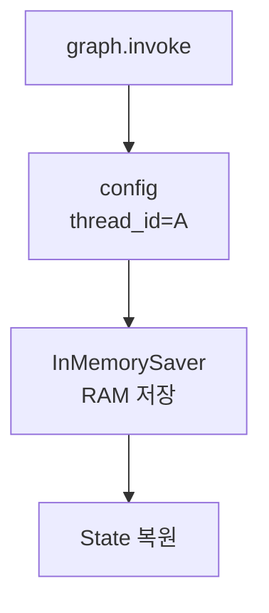
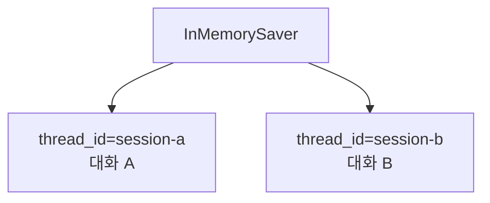

# LangGraph InMemorySaver

- InMemorySaver는 [[LangGraph Checkpointer]]의 한 구현체다.
- 그래프의 실행 상태를 메모리(RAM)에 저장한다.
- 같은 [[LangGraph thread_id]]의 대화를 이어갈 수 있게 한다.
- 이름에 `Memory`가 들어가지만, 장기 저장소가 아니라 실행 중 메모리에 올려두는 방식이다.

## 핵심 정의

- InMemorySaver는 세션별로 관리할 수 있는 대화 메모리다.
- `thread_id`별로 대화 상태를 나누어 저장한다.
- 서로 다른 `thread_id`는 기억을 공유하지 않는다.
- 저장 위치가 메모리이기 때문에 코드 실행 상태가 내려가면 저장된 대화 상태도 함께 사라진다.
- 그래서 "실습용 단기 기억"이라고 이해하면 좋다.

## 구조



## 특징

- 저장 위치: RAM
- 지속성: Python 프로세스가 살아 있는 동안만 유지
- 장점: 빠르고 설정이 단순하다.
- 단점: 커널이나 서버가 꺼지면 저장 내용이 사라진다.
- 실습 적합도: 높다.
- 운영 적합도: 낮다.

## 서로 다른 세션은 기억을 공유하지 않는다

- InMemorySaver는 `thread_id`를 기준으로 대화를 구분한다.
- 같은 `thread_id`를 쓰면 이전 대화를 이어간다.
- 다른 `thread_id`를 쓰면 새로운 대화로 본다.

```python
config_a = {"configurable": {"thread_id": "session-a"}}
config_b = {"configurable": {"thread_id": "session-b"}}
```

- `session-a`에서 나눈 대화는 `session-b`에서 자동으로 보이지 않는다.
- 이것이 강의자료에서 말한 "서로 다른 세션 설정은 기억을 공유할 수 없다"는 의미다.



## 코드 실행이 종료되면 휘발된다

- InMemorySaver는 파일이나 DB에 저장하지 않는다.
- 저장 위치가 메모리이므로 Jupyter 커널을 재시작하면 저장된 checkpoint도 사라진다.
- Python 프로세스가 종료되어도 마찬가지로 사라진다.
- 그래서 중요한 대화 상태를 오래 보존해야 한다면 [[LangGraph SqliteSaver]]나 [[LangGraph PostgresSaver]]를 사용해야 한다.
- 로컬 파일로 유지하려면 [[LangGraph SqliteSaver]]를 고려한다.
- 운영 서버에서는 [[LangGraph 운영용 메모리 저장소]] 기준으로 PostgreSQL 같은 저장소를 고려한다.


## 언제 쓰나

- checkpointer 개념을 처음 실습할 때
- 로컬 노트북에서 여러 턴 대화를 빠르게 확인할 때
- 영구 저장이 아직 필요 없는 프로토타입을 만들 때

## 언제 부족한가

- 서버를 재시작해도 대화가 이어져야 할 때
- [[Human-in-the-loop]]에서 사람이 나중에 돌아와 승인해야 할 때
- 운영 환경에서 사용자별 대화 이력을 보존해야 할 때
- 장애가 나도 그래프 실행 상태를 복구해야 할 때

이런 경우에는 [[LangGraph SqliteSaver]], [[LangGraph PostgresSaver]] 같은 영구 저장 checkpointer를 고려한다.

## 한 줄 요약

- InMemorySaver = `thread_id`별 대화 상태를 RAM에 저장하는 실습용 checkpointer.
- 같은 `thread_id`는 이어지고, 다른 `thread_id`는 분리된다.
- 커널이나 코드 실행이 종료되면 저장 내용은 사라진다.

## 관련

- [[LangGraph Checkpointer]]
- [[LangGraph SqliteSaver]]
- [[LangGraph PostgresSaver]]
- [[LangGraph thread_id]]
- [[LangGraph 메모리 상태 관리]]
- [[LangGraph 운영용 메모리 저장소]]
- [[Memory]]
