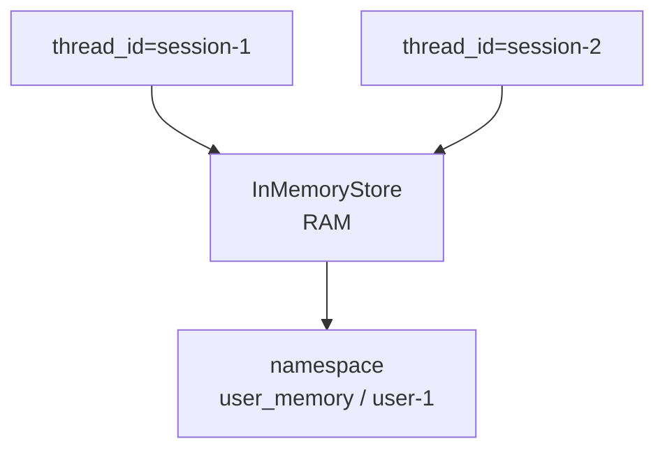

# LangGraph InMemoryStore

- InMemoryStore는 [[LangGraph Store]]의 한 구현체다.
- 기억을 메모리(RAM)에 저장한다.
- [[LangGraph Checkpointer]]가 "대화 상태"를 저장한다면, Store는 "재사용할 지식"을 저장한다.
- 즉, InMemoryStore는 대화 세션을 넘어 참고할 수 있는 지식을 RAM에 누적하는 실습용 저장소다.

## 핵심 정의

- InMemoryStore는 장기 기억의 개념을 연습하기 위한 메모리 기반 Store다.
- Store는 특정 `thread_id` 하나에만 묶이는 것이 아니라 여러 대화에서 재사용할 정보를 저장한다.
- 보통 [[LangGraph namespace]]로 기억을 분류한다.
- 다만 InMemoryStore도 RAM 기반이므로 프로세스가 종료되면 저장 내용이 사라질 수 있다.

## 구조



## Checkpointer와 다른 점

| 구분 | Checkpointer | InMemoryStore |
|---|---|---|
| 저장 대상 | 그래프 실행 상태 | 재사용할 지식 |
| 기준 | `thread_id` | `namespace` |
| 대표 질문 | "대화가 어디까지 진행됐지?" | "앞으로도 참고할 지식이 뭐지?" |
| 예시 | messages, 다음 노드 위치, interrupt 상태 | 사용자 선호, 프로젝트 규칙, 과거 요약 |
| 수명 | 구현체에 따라 다름 | RAM 기반이라 프로세스 종료 시 휘발 가능 |

## 예시 코드

```python
from langgraph.store.memory import InMemoryStore

store = InMemoryStore()
graph = builder.compile(store=store)
```

Store를 실제 노드에서 쓰려면 보통 namespace를 정해서 값을 넣고 꺼낸다.

```python
namespace = ("user_memory", "user-1")
```

## 무엇을 저장하면 좋은가

- 사용자가 선호하는 답변 형식
- 프로젝트에서 반복해서 쓰는 규칙
- 여러 대화에서 계속 참고해야 하는 도메인 지식
- 이전 작업에서 얻은 요약된 교훈
- 에이전트가 다음 실행에서 참고해야 하는 장기 프로필

## 무엇을 저장하면 안 좋은가

- 매 턴마다 바뀌는 임시 실행 상태
- 특정 대화 안에서만 필요한 중간 메시지
- 노드 실행 위치나 interrupt 복구 정보

이런 것은 Store가 아니라 [[LangGraph Checkpointer]] 쪽 책임이다.

## 운영에서는?

- InMemoryStore는 실습과 프로토타입에 좋다.
- 실제 운영에서는 RAM 기반만으로는 부족하다.
- 서버가 재시작되어도 유지되어야 하므로 PostgreSQL, MySQL, Redis, 벡터 DB 같은 외부 저장소를 함께 고려한다.
- 다만 LangGraph의 Store 인터페이스에 맞는 구현체나 별도 애플리케이션 저장 계층이 필요하다.

## 한 줄 요약

- InMemoryStore = 여러 대화에서 재사용할 지식을 RAM에 저장하는 실습용 Store.
- Checkpointer는 대화 상태, Store는 재사용 지식을 저장한다.
- 운영에서는 보통 영속 DB나 검색 저장소와 함께 설계한다.

## 관련

- [[LangGraph Store]]
- [[LangGraph namespace]]
- [[LangGraph Checkpointer]]
- [[LangGraph 메모리 상태 관리]]
- [[LangGraph 운영용 메모리 저장소]]
