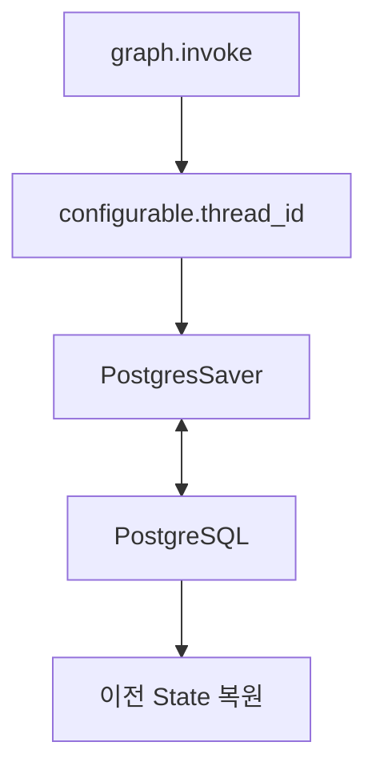

# LangGraph PostgresSaver

- PostgresSaver는 [[LangGraph Checkpointer]]를 PostgreSQL에 저장하는 운영용 구현체다.
- [[LangGraph SqliteSaver]]가 로컬 파일 실습에 적합하다면, PostgresSaver는 서버 환경에서 여러 사용자와 여러 프로세스가 checkpoint를 공유해야 할 때 적합하다.

## 왜 필요한가

- 서버가 재시작되어도 그래프 상태를 복구해야 한다.
- 여러 사용자의 [[LangGraph thread_id]]를 안정적으로 관리해야 한다.
- [[Human-in-the-loop]]에서 사람이 나중에 승인해도 멈춘 지점부터 이어가야 한다.
- 장애 복구, 백업, 권한 관리, 모니터링이 필요하다.

## 구조

## InMemorySaver, SqliteSaver와 비교

| 구현 | 저장 위치 | 적합한 상황 |
|---|---|---|
| [[LangGraph InMemorySaver]] | RAM | 빠른 노트북 실습 |
| [[LangGraph SqliteSaver]] | SQLite 파일 | 로컬 영속성 테스트 |
| PostgresSaver | PostgreSQL | 운영 서비스, 다중 세션, 장애 복구 |

## 운영 감각

- 운영에서는 checkpoint가 단순 대화 로그가 아니라 **실행 복구 데이터**라는 점이 중요하다.
- 사람이 읽기 쉬운 기록은 [[Observability]]나 별도 로그로 남기고, checkpointer는 그래프 재개를 위한 내부 상태 저장소로 본다.
- 민감한 대화 내용이 저장될 수 있으므로 보안, 보존 기간, 접근 권한을 함께 설계해야 한다.

## 관련

- [[LangGraph Checkpointer]]
- [[LangGraph SqliteSaver]]
- [[LangGraph InMemorySaver]]
- [[LangGraph thread_id]]
- [[Human-in-the-loop]]
- [[LangGraph 운영용 메모리 저장소]]
