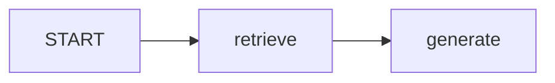
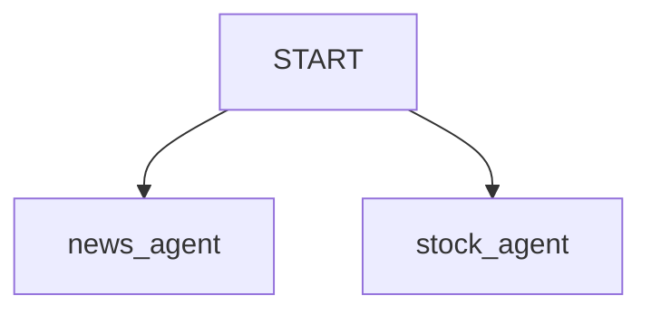

# LangGraph START

- `START`는 [[LangGraph]] 그래프에서 **실행이 시작되는 특수 지점**이다.
- 실제 업무를 수행하는 노드가 아니라, "그래프가 처음 들어갈 노드가 어디인가"를 표시하는 예약 상수다.

## 기본 사용

```python
from langgraph.graph import START

builder.add_edge(START, "retrieve")
```

- 이 코드는 그래프가 실행되면 `retrieve` 노드부터 시작하라는 뜻이다.
- `graph.invoke(...)`를 호출하면 LangGraph는 `START`에서 연결된 노드로 State를 보낸다.

## 하나로 시작하는 경우



- 가장 기본적인 직렬 워크플로우다.
- 예: `START -> retrieve -> generate -> END`

## 여러 갈래로 시작하는 경우

```python
builder.add_edge(START, "news_agent")
builder.add_edge(START, "stock_agent")
```



- `START`에서 여러 노드로 edge를 연결하면 fan-out 구조가 된다.
- 같은 초기 State를 바탕으로 여러 노드가 실행될 수 있다.

## 주의

- `START`는 사용자가 직접 만든 노드 이름이 아니다.
- `builder.add_node("START", ...)`처럼 등록하는 대상이 아니다.
- `from langgraph.graph import START`로 가져와 edge 연결에 사용한다.

## 관련

- [[LangGraph END]]
- [[LangGraph Edge]]
- [[LangGraph StateGraph]]
- [[Parallel Agent Fan-out]]
