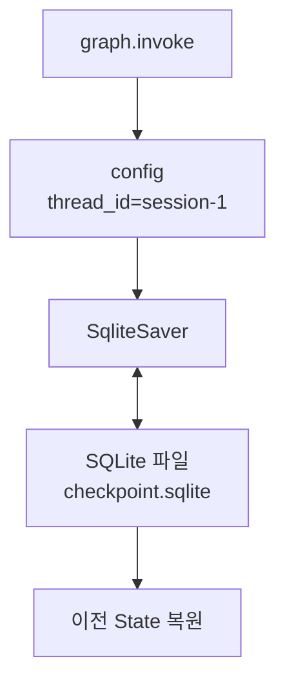

# LangGraph SqliteSaver

- SqliteSaver는 [[LangGraph Checkpointer]]의 한 구현체다.
- 그래프의 [[LangGraph State|상태(state)]]를 SQLite 데이터베이스 파일에 저장한다.
- [[LangGraph InMemorySaver]]와 마찬가지로 [[LangGraph thread_id]]를 기준으로 세션별 대화 상태를 관리한다.
- 차이는 저장 위치다.
- InMemorySaver는 RAM에 저장하고, SqliteSaver는 `.sqlite` 같은 파일에 저장한다.

## 핵심 정의

- SqliteSaver는 런타임이 죽거나 세션이 끝나도 SQLite 파일이 남아 있으면 기억을 유지할 수 있다.
- 저장 대상은 대화 내용만이 아니라 그래프 실행 상태다.
- 즉, 어느 노드까지 실행됐는지, 어떤 메시지가 쌓였는지, 다음 실행이 어디서 이어져야 하는지를 저장한다.
- 저장 형식은 사람이 읽기 좋은 텍스트가 아니다.
- 내부적으로는 msgpack 같은 바이너리 직렬화 형식으로 저장된다.

## 구조



## InMemorySaver와 비교

| 구분 | [[LangGraph InMemorySaver]] | SqliteSaver |
|---|---|---|
| 저장 위치 | RAM | SQLite 파일 |
| 휘발성 | 프로세스 종료 시 사라짐 | 파일이 남아 있으면 유지 |
| 세션 기준 | `thread_id` | `thread_id` |
| 실습 난이도 | 가장 쉬움 | 약간 더 설정 필요 |
| 운영 적합도 | 낮음 | 로컬/소규모 실습에 적합 |
| 저장 형식 | 메모리 객체 | msgpack 기반 바이너리 데이터 |

## 예시 코드

```python
from langgraph.checkpoint.sqlite import SqliteSaver

checkpointer = SqliteSaver.from_conn_string("checkpoints.sqlite")
graph = builder.compile(checkpointer=checkpointer)

config = {"configurable": {"thread_id": "session-1"}}
result = graph.invoke({"messages": "질문"}, config=config)
```

## 왜 사람이 읽기 어렵나

- SQLite 파일에 저장되지만, 테이블 안의 값이 일반 텍스트 대화록처럼 저장되는 것은 아니다.
- LangGraph는 State를 다시 정확히 복원해야 하므로 Python 객체와 메시지 정보를 직렬화해서 넣는다.
- 그래서 DB 브라우저로 열어도 사람이 바로 읽는 노트처럼 보이지 않을 수 있다.

## 언제 쓰나

- 노트북 커널을 재시작해도 같은 대화를 이어가고 싶을 때
- 로컬 실습에서 checkpointer의 영속성을 확인하고 싶을 때
- [[Human-in-the-loop]]처럼 중간에 멈췄다가 다시 이어가는 흐름을 테스트할 때
- 서버급 운영 DB까지는 필요 없지만 파일 기반 저장은 필요한 경우

## 언제 부족한가

- 여러 서버 인스턴스가 동시에 접근해야 할 때
- 많은 사용자의 checkpoint를 안정적으로 관리해야 할 때
- 백업, 모니터링, 권한 관리, 장애 복구가 중요한 운영 환경

이런 경우에는 PostgreSQL 같은 서버형 DB 기반 checkpointer를 고려한다.
MySQL류 저장소도 일반적인 애플리케이션 저장소로는 쓸 수 있지만, LangGraph checkpointer로 바로 쓰려면 해당 구현체나 커스텀 저장 계층이 필요하다.

## 한 줄 요약

- SqliteSaver = `thread_id`별 그래프 실행 상태를 SQLite 파일에 저장하는 checkpointer.
- InMemorySaver보다 오래 기억하지만, 운영용 대규모 저장소라기보다는 로컬/소규모 영속 저장에 가깝다.
- SQLite 안의 데이터는 사람이 읽는 텍스트가 아니라 복원을 위한 직렬화 데이터다.

## 관련

- [[LangGraph Checkpointer]]
- [[LangGraph InMemorySaver]]
- [[LangGraph thread_id]]
- [[LangGraph 메모리 상태 관리]]
- [[LangGraph 운영용 메모리 저장소]]
