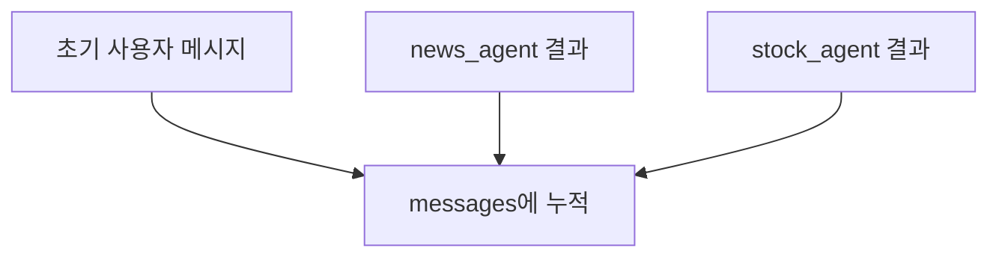

# LangGraph State

## 정의

`State`는 LangGraph 그래프 전체에서 노드들이 공유하는 데이터 구조이다.

노드는 State를 입력받고, 자신이 만든 결과를 State에 다시 반영한다.

## 기본 예시

```python
from typing import TypedDict, List

class State(TypedDict):
    question: str
    context: List[str]
    answer: str
```

## 필드 의미

| 필드 | 타입 | 의미 |
|---|---|---|
| `question` | `str` | 사용자가 입력한 질문 |
| `context` | `List[str]` | 답변 생성에 참고할 문서 목록 |
| `answer` | `str` | LLM이 만든 최종 답변 |

## State가 변하는 흐름

초기 입력:

```python
{"question": "감기에 좋은 음식을 알려줘"}
```

`retrieve` 실행 후:

```python
{
    "question": "감기에 좋은 음식을 알려줘",
    "context": [
        "생강차: 몸을 따뜻하게 하고 염증을 가라앉혀 목 통증 완화에 좋다.",
        "닭고기 수프: 수분과 단백질을 보충하고 코막힘을 풀어주는 데 도움이 된다.",
    ]
}
```

`generate` 실행 후:

```python
{
    "question": "감기에 좋은 음식을 알려줘",
    "context": [...],
    "answer": "감기에 좋은 음식으로는 생강차와 닭고기 수프가 있습니다..."
}
```

## 중요한 규칙

노드 함수는 전체 State를 모두 반환하지 않아도 된다.

```python
return {"context": docs}
```

이렇게 일부 필드만 반환하면 LangGraph가 기존 State에 병합한다.

## Reducer와 `add_messages`

여러 노드가 같은 State 필드를 업데이트할 수 있다면 reducer가 필요하다.

대표 예시는 `messages`이다.

```python
from typing import Annotated, Sequence
from langchain_core.messages import BaseMessage
from langgraph.graph.message import add_messages

class AgentState(TypedDict):
    messages: Annotated[Sequence[BaseMessage], add_messages]
```

`add_messages`는 새 메시지를 기존 메시지 리스트 뒤에 붙이는 reducer이다.

```text
기존 messages + 새 messages → 누적된 messages
```

특히 [[Parallel Agent Fan-out]]에서는 여러 agent가 같은 `messages` 필드에 결과를 반환한다.

이때 reducer가 없으면 어느 결과가 덮어써지거나 충돌할 수 있다.

`add_messages`를 붙이면 다음처럼 누적된다.



따라서 멀티 에이전트에서 `messages`를 공유 상태로 쓸 때는 보통 `Annotated[..., add_messages]`를 사용한다.

## 한 줄 정리

> State는 LangGraph 노드들이 함께 들고 다니는 작업 상태이며, 각 노드는 State의 일부를 읽고 일부를 업데이트한다.

관련:

- [[LangGraph StateGraph]]
- [[LangGraph Node]]
- [[Retrieve-Generate 패턴]]
- [[Parallel Agent Fan-out]]
