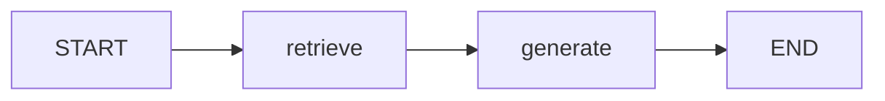
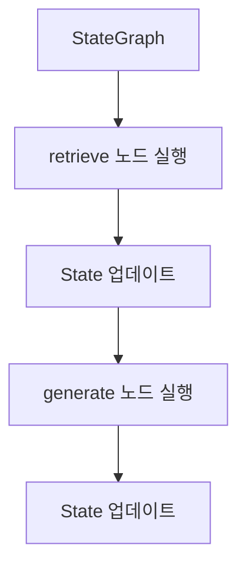
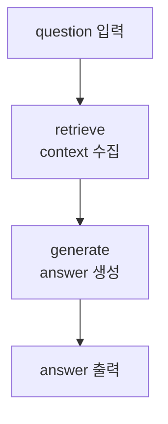

# LangGraph StateGraph

## 정의

`StateGraph`는 [[LangGraph]]에서 워크플로우를 **상태 기반 그래프**로 표현하는 핵심 객체이다.

그래프는 다음 요소로 구성된다.

- [[LangGraph State]]: 노드들이 공유하는 데이터 구조
- [[LangGraph Node]]: State를 입력받아 작업을 수행하는 함수
- [[LangGraph Edge]]: 노드 간 실행 순서
- [[LangGraph START|START]], [[LangGraph END|END]]: 그래프의 시작점과 종료점

## 기본 구조

```python
builder = StateGraph(State)

builder.add_node("retrieve", retrieve)
builder.add_node("generate", generate)

builder.add_edge(START, "retrieve")
builder.add_edge("retrieve", "generate")
builder.add_edge("generate", END)

graph = builder.compile()
```

이 코드는 다음 실행 흐름을 만든다.



## 핵심 아이디어

일반 Python 코드에서는 함수가 함수를 직접 호출한다.

```python
docs = retrieve(question)
answer = generate(question, docs)
```

LangGraph에서는 함수들이 직접 서로 호출하지 않고, StateGraph가 실행 순서를 관리한다.



## 왜 쓰는가

StateGraph를 쓰면 LLM 애플리케이션의 실행 흐름을 명시적으로 설계할 수 있다.

장점:

- 실행 순서가 눈에 보인다.
- 분기, 반복, 병렬 실행을 추가하기 쉽다.
- 각 단계의 입력과 출력이 State로 남는다.
- 디버깅과 평가가 쉬워진다.
- [[Human-in-the-loop]]나 checkpoint를 붙이기 쉽다.

## 단순 RAG 워크플로우 예시

가장 단순한 RAG형 워크플로우는 다음 구조로 표현할 수 있다.



관련:

- [[LangGraph State]]
- [[LangGraph Node]]
- [[LangGraph Edge]]
- [[Retrieve-Generate 패턴]]
- [[LangGraph 워크플로우 아키텍처]]
