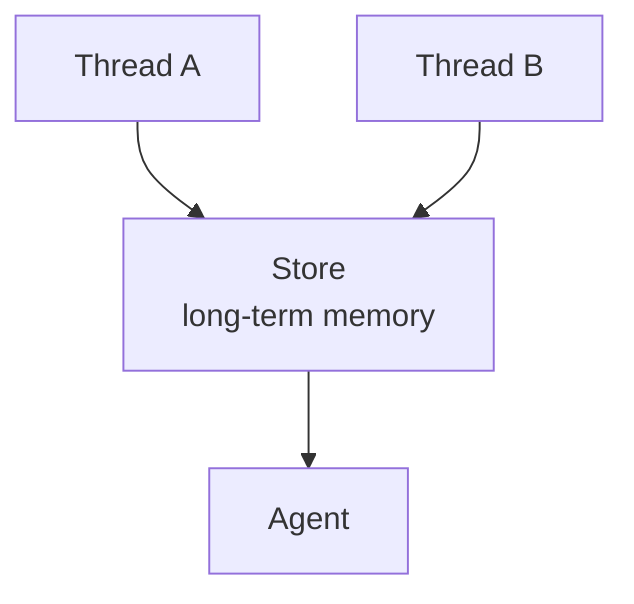
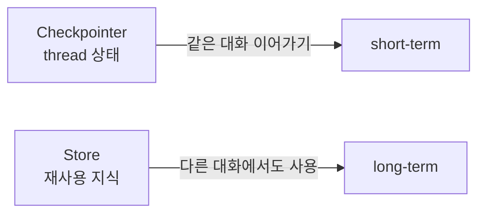

# LangGraph Store

- LangGraph Store는 여러 대화나 실행 사이에서 재사용할 수 있는 장기 기억 저장소다.
- [[LangGraph Checkpointer]]가 "이번 대화가 어디까지 진행됐는지"를 저장한다면, Store는 "앞으로도 기억할 사실"을 저장한다.
- 강의자료 표현으로는 "대화(thread_id)를 넘어 재사용할 지식을 namespace로 분류해 저장하는 장치"다.

## 구조



## 무엇을 저장하나

- 사용자 선호: "한국어로 설명 선호"
- 장기 프로필: "초보자라 개념 설명이 필요함"
- 프로젝트 지식: "이 프로젝트는 LangGraph 실습 노트북 기반"
- 과거 성공/실패 사례 요약
- 특정 사용자가 자주 요청하는 형식
- 팀이나 회사 내부 규칙

## Namespace

Store는 보통 [[LangGraph namespace]]로 데이터를 구분한다.

```python
namespace = ("user_memory", user_id)
```

- [[LangGraph namespace]]를 나누면 사용자별, 프로젝트별, 도메인별 기억을 섞지 않을 수 있다.
- `thread_id`가 대화 세션을 구분한다면, namespace는 장기 기억의 폴더를 구분한다.

## InMemoryStore

```python
from langgraph.store.memory import InMemoryStore

store = InMemoryStore()
graph = builder.compile(store=store)
```

- RAM 기반이라 빠르다.
- 프로세스가 종료되면 사라질 수 있다.
- 실습에서 장기 메모리 개념을 확인하기 좋다.
- 이름은 Store지만 구현이 InMemory라면 영구 저장은 아니다.
- 자세한 정리: [[LangGraph InMemoryStore]]

## 운영에서의 감각

- Store는 재사용할 지식을 저장하므로 운영에서는 영속 저장소가 필요하다.
- PostgreSQL, MySQL, Redis, Vector DB 같은 외부 저장소를 함께 고려한다.
- 사용자별 기억은 [[LangGraph namespace]]로 분리한다.
- 검색이 필요한 장기 지식은 RAG 저장소나 벡터 DB와 연결할 수도 있다.
- 중요한 점은 Checkpointer와 Store를 섞지 않는 것이다.
- Checkpointer는 실행 상태, Store는 재사용 지식이다.

## Checkpointer와 헷갈리지 않기



## 한 줄 요약

- Store = 여러 대화에서 재사용할 장기 지식을 저장하는 곳.
- namespace = Store 안에서 기억을 사용자별/프로젝트별로 나누는 기준.
- Checkpointer는 실행 상태, Store는 재사용 지식이다.

## 관련

- [[Memory]]
- [[LangGraph Checkpointer]]
- [[LangGraph InMemoryStore]]
- [[LangGraph namespace]]
- [[LangGraph 운영용 메모리 저장소]]
- [[RAG(Retrieval-Augmented Generation)]]
