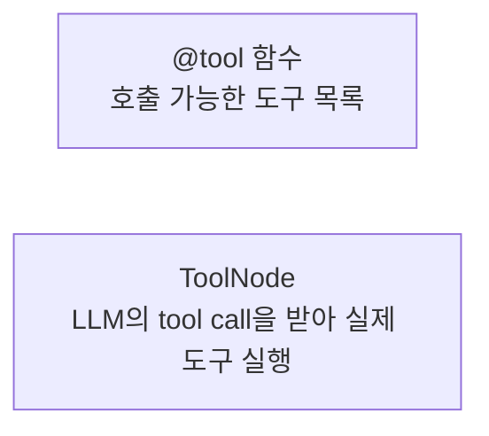
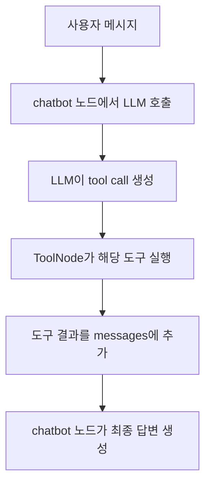
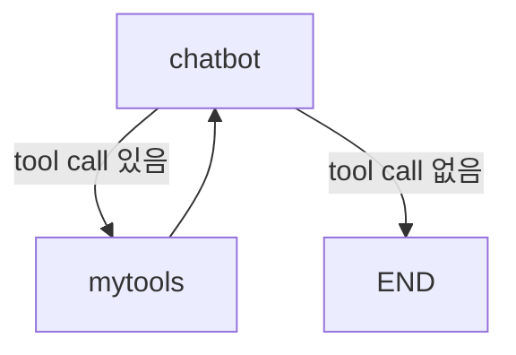

# LangGraph ToolNode

## 정의

`ToolNode`는 LangGraph에서 LLM이 요청한 tool call을 실제 도구 함수 실행으로 연결하는 미리 만들어진 노드이다.

```python
from langgraph.prebuilt import ToolNode

builder.add_node("mytools", ToolNode(mytools))
```

## 역할

`@tool` 함수는 도구 정의이고, `ToolNode`는 도구 실행 담당 노드이다.



## 기본 흐름



여기서 `chatbot` 노드의 핵심은 LLM에게 먼저 묻는 것이다.

```python
def chatbot(state: State):
    current_messages = state["messages"]
    response = llm_with_tools.invoke(current_messages)
    return {"messages": [response]}
```

`llm_with_tools.invoke(current_messages)`에서 LLM이 도구 호출 여부를 판단한다. `ToolNode`는 그 판단 결과에 tool call이 있을 때만 실제 도구를 실행한다.

## 예시 구조

```python
mytools = [food_tool, care_tool]
llm_with_tools = llm.bind_tools(mytools)

builder = StateGraph(State)
builder.add_node("chatbot", chatbot)
builder.add_node("mytools", ToolNode(mytools))
```

조건부 엣지와 함께 쓰면 도구 호출 여부에 따라 흐름을 나눌 수 있다.

```python
builder.add_conditional_edges("chatbot", tools_condition)
```

흐름:



## 주의점

`ToolNode`는 도구 호출을 실행할 뿐, 어떤 도구를 쓸지는 LLM이 결정한다.

도구 선택 품질은 다음에 영향을 받는다.

- 도구 이름
- 함수 인자 이름과 타입
- docstring
- 사용자 질문
- 시스템 프롬프트

## 한 줄 정리

> ToolNode는 LLM이 만든 tool call을 받아 실제 `@tool` 함수를 실행해주는 LangGraph 노드이다.

관련:

- [[LangChain @tool]]
- [[LLM Tool Selection]]
- [[Tool Calling]]
- [[Workflow Node vs Tool]]
