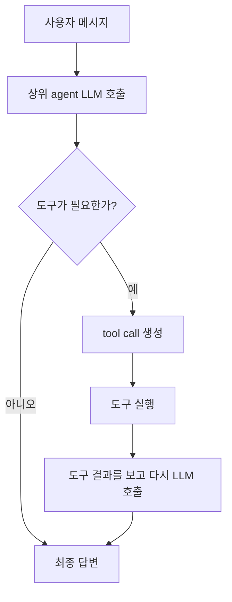
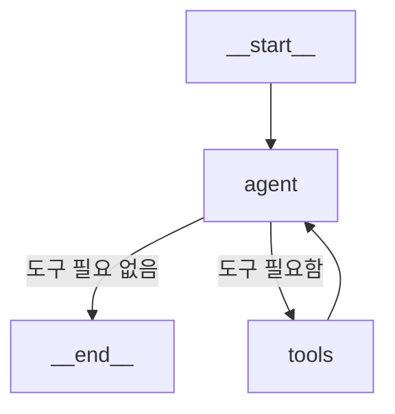

# LangGraph create_react_agent

## 정의

`create_react_agent`는 LangGraph가 미리 만들어둔 ReAct 스타일 에이전트 그래프를 빠르게 생성하는 함수이다.

직접 `StateGraph`, `ToolNode`, `tools_condition`, edge를 하나씩 연결하지 않아도, LLM과 도구 목록을 넘기면 기본적인 도구 호출 루프를 가진 agent를 만들어준다.

```python
from langgraph.prebuilt import create_react_agent

agent = create_react_agent(llm, mytools)
```

## 직접 StateGraph를 만들 때와의 차이

직접 만드는 방식:

```python
builder = StateGraph(State)
builder.add_node("chatbot", chatbot)
builder.add_node("mytools", ToolNode(mytools))
builder.add_edge(START, "chatbot")
builder.add_conditional_edges("chatbot", tools_condition, {"tools": "mytools", END: END})
builder.add_edge("mytools", "chatbot")
graph = builder.compile()
```

`create_react_agent` 방식:

```python
agent = create_react_agent(llm, mytools)
```

즉 `create_react_agent`는 위와 같은 반복 구조를 내부에서 만들어주는 편의 함수라고 이해하면 된다.

## 실행 흐름



## 기본 사용법

```python
mytools = [chinese_meal_expert, japanese_meal_expert, western_meal_expert]
agent = create_react_agent(llm, mytools)

result = agent.invoke({"messages": "나는 고혈압 환자인데 중식이 먹고싶어"})
print(result["messages"][-1].content)
```

`invoke()`에 넣는 `messages`는 agent가 시작할 사용자 입력이다.

## prompt 인자

`create_react_agent`는 선택적으로 `prompt`를 받을 수 있다.

```python
agent = create_react_agent(
    llm,
    mytools,
    prompt="너는 사용자의 요청을 보고 적절한 식단 도구를 선택하는 에이전트다."
)
```

하지만 간단한 실습에서는 prompt 없이도 동작할 수 있다.

```python
agent = create_react_agent(llm, mytools)
```

이때 상위 agent는 주로 다음 정보를 보고 도구를 고른다.

- 사용자 질문
- 도구 이름
- 도구 인자
- 도구 docstring

따라서 prompt를 생략하려면 도구 이름과 docstring을 더 명확하게 작성하는 것이 중요하다.

## agent를 실행하면 그림이 나오는 이유

노트북에서 아래처럼 `agent`만 마지막 줄에 두면 그래프 구조가 시각화되어 보일 수 있다.

```python
agent
```

이것은 agent가 단순한 문자열이나 함수가 아니라, LangGraph가 만든 실행 가능한 그래프 객체이기 때문이다.

대략 다음과 같은 구조를 가진다.



## 언제 쓰면 좋은가

- 기본적인 단일 agent + tool calling 구조를 빠르게 만들 때
- `StateGraph`를 직접 짜기 전에 개념을 실습할 때
- 도구 목록을 LLM에게 주고 선택하게 만들 때
- 하위 LLM 도구를 상위 agent가 라우팅하게 만들 때
- 만들어진 agent를 다른 `StateGraph`의 노드로 넣어 멀티 에이전트 그래프를 만들 때

## StateGraph 노드로 사용하기

`create_react_agent()`가 만든 agent는 실행 가능한 그래프 객체이다.

그래서 직접 만든 함수처럼 `add_node()`에 등록할 수 있다.

```python
news_agent = create_react_agent(llm, tools=[news_tool])
stock_agent = create_react_agent(llm, tools=[stock_tool])

builder = StateGraph(AgentState)
builder.add_node("news_agent", news_agent)
builder.add_node("stock_agent", stock_agent)
```

이후 `add_edge()`로 순서를 연결하면 에이전트 직렬 배치가 된다.

```python
builder.add_edge(START, "news_agent")
builder.add_edge("news_agent", "stock_agent")
```

관련: [[Serial Agent Pipeline]]

## 언제 직접 StateGraph를 쓰는가

- 노드 이름과 흐름을 직접 제어해야 할 때
- 조건부 분기가 여러 개 있을 때
- 여러 agent를 계층적으로 연결해야 할 때
- 중간 State를 세밀하게 관리해야 할 때
- 특정 도구를 반드시 실행하도록 강제해야 할 때

## 한 줄 정리

> `create_react_agent`는 LLM과 도구 목록만으로 기본 ReAct 도구 호출 그래프를 만들어주는 LangGraph의 편의 함수이다.

관련:

- [[ReAct 패턴]]
- [[Tool Calling]]
- [[LLM Tool Selection]]
- [[Sub-LLM as Tool]]
- [[LangGraph ToolNode]]
- [[LangGraph StateGraph]]
- [[Serial Agent Pipeline]]
