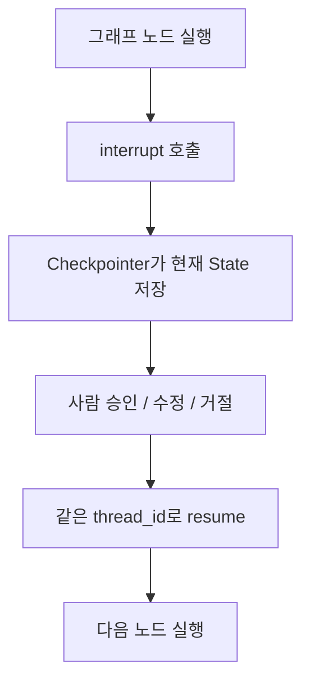

# LangGraph interrupt

- `interrupt`는 [[LangGraph]] 실행 중간에서 그래프를 **일시 중단하고 사람 입력을 기다리게 하는 기능**이다.
- 주로 [[Human-in-the-loop]]에서 사용한다.
- 결제, 메일 발송, DB 삭제, 리포트 제출처럼 사람이 승인해야 하는 단계 앞에 둔다.

## 핵심 감각



- `interrupt` 자체는 그래프를 멈추는 역할이다.
- [[LangGraph Checkpointer]]는 멈춘 지점의 [[LangGraph State|State]]를 저장한다.
- [[LangGraph thread_id]]는 나중에 같은 실행 흐름을 다시 찾는 세션 키다.

## 예시

```python
from langgraph.types import interrupt

def approval_node(state):
    decision = interrupt({
        "question": "이 작업을 진행할까요?",
        "preview": state["draft"],
    })
    return {"decision": decision}
```

- 이 노드에 도달하면 그래프가 멈춘다.
- 사용자에게 `question`, `preview` 같은 정보를 보여준다.
- 사람이 답하면 같은 `thread_id`로 그래프를 재개한다.

## Checkpointer가 필요한 이유

- 사람은 즉시 답하지 않을 수 있다.
- 서버가 재시작될 수도 있다.
- 다음 요청에서 "아까 어디서 멈췄지?"를 알아야 한다.

그래서 `interrupt`를 제대로 쓰려면 [[LangGraph Checkpointer]]가 필요하다.

| 상황 | 적합한 저장소 |
|---|---|
| 노트북 실습 | [[LangGraph InMemorySaver]] |
| 로컬 파일로 재개 테스트 | [[LangGraph SqliteSaver]] |
| 운영 서비스 | [[LangGraph PostgresSaver]] |

## 관련

- [[Human-in-the-loop]]
- [[LangGraph Checkpointer]]
- [[LangGraph thread_id]]
- [[LangGraph InMemorySaver]]
- [[LangGraph SqliteSaver]]
- [[LangGraph PostgresSaver]]
