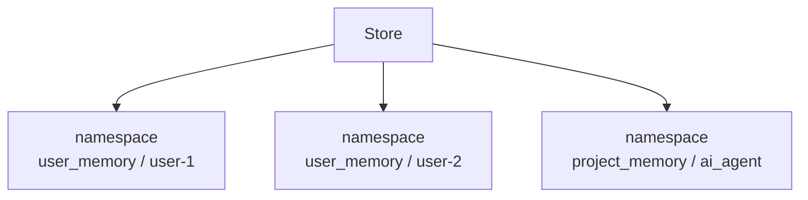

# LangGraph namespace

`namespace`는 [[LangGraph Store]]에서 장기 기억을 분류하는 이름 공간이다.

[[LangGraph thread_id]]가 대화 세션을 구분한다면, namespace는 저장된 지식의 소속을 구분한다.

## 왜 필요한가

Store에는 여러 사용자, 여러 프로젝트, 여러 도메인의 기억이 함께 들어갈 수 있다.

namespace가 없으면 기억이 섞인다.

## 구조



## 예시

```python
namespace = ("user_memory", "user-1")
```

이 namespace는 `user-1`의 장기 기억을 의미한다.

프로젝트 기억은 이렇게 나눌 수 있다.

```python
namespace = ("project_memory", "lg-cns-ai-agent")
```

## thread_id와 비교

| 구분 | [[LangGraph thread_id]] | namespace |
|---|---|---|
| 대상 | Checkpointer | Store |
| 목적 | 대화 흐름 유지 | 장기 기억 분류 |
| 수명 | 같은 대화 중심 | 여러 대화에서 재사용 |
| 예시 | `"session-a"` | `("user_memory", "user-1")` |

## 감각적으로 이해하기

`thread_id`는 채팅방 번호에 가깝다.

`namespace`는 기억 보관함의 폴더명에 가깝다.

## 관련

- [[LangGraph Store]]
- [[LangGraph thread_id]]
- [[LangGraph 메모리 상태 관리]]
- [[Memory]]
