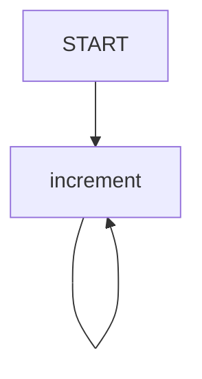
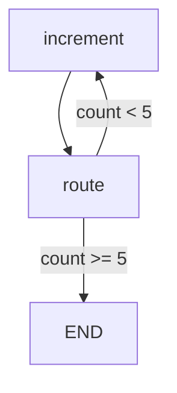

# LangGraph recursion_limit

- `recursion_limit`은 [[LangGraph]] 그래프가 너무 많이 반복될 때 강제로 중단시키는 안전장치다.
- 정상적인 업무 종료 조건이 아니라, 무한 루프를 막기 위한 보험에 가깝다.
- 그래프에 [[LangGraph END|END]]로 가는 길이 없거나, 조건이 잘못되어 같은 노드를 계속 돌 때 사용한다.

## 왜 필요한가

- 그래프가 끝없이 반복되는 것을 막기 위해 필요하다.
- LLM 호출, 도구 호출, API 호출이 무한 반복되면 비용이 폭발할 수 있다.
- 실습 중 edge를 잘못 연결했는지 확인할 때 유용하다.
- 운영에서는 장애 확산을 막는 마지막 안전장치 역할을 한다.

## 예시 코드

```python
from typing_extensions import TypedDict
from langgraph.graph import StateGraph, START
from langgraph.errors import GraphRecursionError

class State(TypedDict):
    count: int

def increment(state: State):
    new = state["count"] + 1
    print(f"count = {new}")
    return {"count": new}

builder = StateGraph(State)
builder.add_node("increment", increment)
builder.add_edge(START, "increment")
builder.add_edge("increment", "increment")

graph = builder.compile()

try:
    graph.invoke({"count": 0}, {"recursion_limit": 10})
except GraphRecursionError:
    print("recursion_limit 도달, 에러 중단")
```

## 이 코드가 무한 루프인 이유



- `START`에서 `increment`로 간다.
- `increment`가 끝나면 다시 `increment`로 간다.
- [[LangGraph END|END]]로 가는 edge가 없다.
- 그래서 LangGraph는 정상 종료할 수 없다.
- 이때 `recursion_limit`이 없으면 계속 반복될 수 있다.

## recursion_limit이 하는 일

```python
graph.invoke({"count": 0}, {"recursion_limit": 10})
```

- 그래프 실행의 최대 반복 깊이를 제한한다.
- 제한에 도달하면 정상 결과를 반환하지 않는다.
- 대신 `GraphRecursionError`를 발생시킨다.
- 그래서 `try / except GraphRecursionError`로 감싸서 에러 중단을 처리한다.

## 정상 루프 제어와 차이

정상 루프 제어는 조건을 만족하면 [[LangGraph END|END]]로 간다.

```python
def route(state: State):
    if state["count"] >= 5:
        return "end"
    return "loop"
```

```python
builder.add_conditional_edges(
    "increment",
    route,
    {
        "loop": "increment",
        "end": END,
    },
)
```

이 경우는 정상 종료다.



반면 `recursion_limit`은 [[LangGraph END|END]]로 보내는 로직이 아니다.

- 조건부 종료: 정상 종료
- `recursion_limit`: 강제 중단

## 언제 쓰나

- 실습 중 일부러 무한 루프를 만들어 확인할 때
- 조건부 edge가 빠졌는지 확인할 때
- agent가 같은 tool을 반복 호출하는 것을 막고 싶을 때
- 예상보다 그래프 실행이 오래 도는지 감시하고 싶을 때
- 운영에서 비용/시간 폭주를 막는 마지막 방어선이 필요할 때

## 언제 의존하면 안 되나

- 업무상 정상 종료 조건을 `recursion_limit`으로 대신하면 안 된다.
- 예를 들어 "목표 금액 달성 시 종료" 같은 문제는 조건부 edge로 [[LangGraph END|END]]에 보내야 한다.
- `recursion_limit`에 걸리면 에러로 끝나기 때문에 원하는 `result`를 안정적으로 받기 어렵다.

## 한 줄 요약

- `recursion_limit` = 무한 반복을 막는 강제 안전장치.
- 정상 종료는 `add_conditional_edges`와 [[LangGraph END|END]]로 설계해야 한다.
- 실무에서는 조건부 종료 + `recursion_limit` 보험을 함께 두는 것이 좋다.

## 관련

- [[Loop Control]]
- [[LangGraph Edge]]
- [[LangGraph StateGraph]]
- [[LangGraph END]]
- [[GraphRecursionError]]
