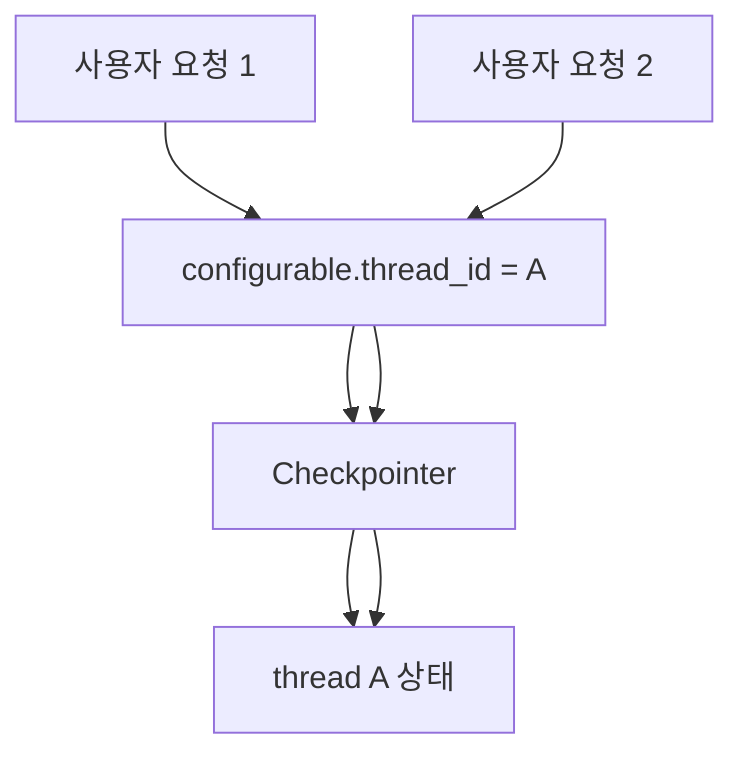
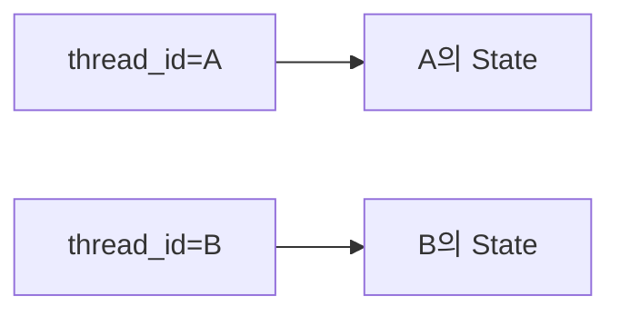

# LangGraph thread_id

`thread_id`는 LangGraph에서 하나의 대화 흐름을 구분하는 세션 ID다.

[[LangGraph Checkpointer]]는 `thread_id`를 기준으로 어떤 대화 상태를 이어갈지 판단한다.

## 왜 필요한가

LLM은 기본적으로 이전 실행을 기억하지 않는다.

그래서 LangGraph는 `thread_id`를 통해 "이 요청이 어느 대화의 다음 턴인지"를 구분한다.

## 구조



## 예시

```python
config = {"configurable": {"thread_id": "user-1-session-1"}}

graph.invoke(
    {"messages": "내 이름은 철수야"},
    config=config,
)

graph.invoke(
    {"messages": "내 이름이 뭐라고 했지?"},
    config=config,
)
```

같은 `thread_id`를 쓰면 checkpointer가 이전 State를 찾아 이어준다.

## 다른 thread_id를 쓰면?

```python
config_a = {"configurable": {"thread_id": "A"}}
config_b = {"configurable": {"thread_id": "B"}}
```

`A`와 `B`는 서로 다른 대화다.



그래서 `A`에서 말한 내용을 `B`가 자동으로 기억하지 않는다.

## thread_id와 namespace 차이

| 구분 | `thread_id` | [[LangGraph namespace]] |
|---|---|---|
| 쓰는 곳 | Checkpointer | Store |
| 목적 | 같은 대화 이어가기 | 장기 기억 분류 |
| 예시 | `session-1` | `("user_memory", "user-1")` |
| 질문 | "이 대화의 다음 턴인가?" | "어느 기억 저장소에 넣을까?" |

## 관련

- [[LangGraph Checkpointer]]
- [[LangGraph InMemorySaver]]
- [[LangGraph namespace]]
- [[LangGraph 메모리 상태 관리]]
