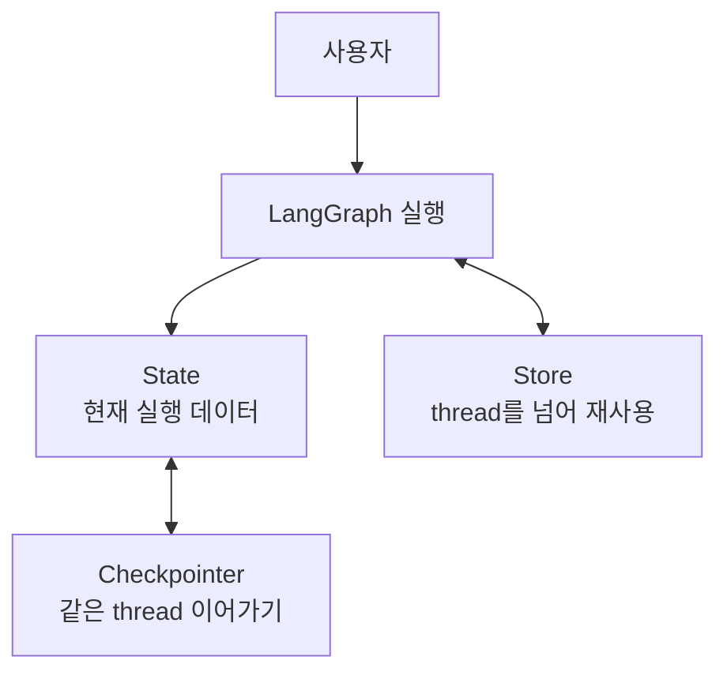
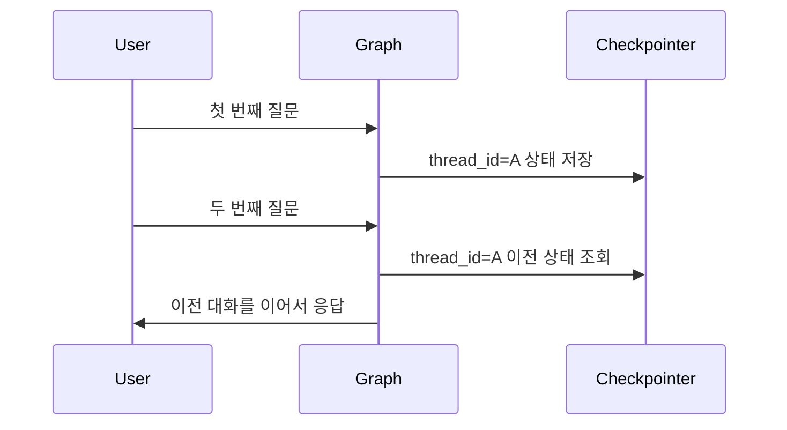
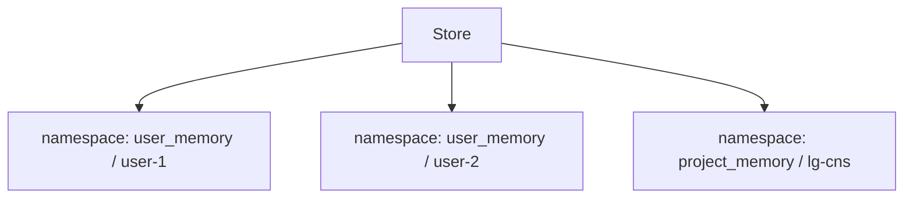

# LangGraph 메모리 상태 관리

- LangGraph에서 메모리 상태 관리는 그래프가 실행되는 동안 생긴 **대화, 중간 결과, 실행 위치, 장기 지식**을 어떻게 저장하고 다시 꺼내 쓸지 정하는 설계다.
- 강의자료 기준 핵심은 [[LangGraph Checkpointer]]와 [[LangGraph Store]]를 구분하는 것이다.
- 둘 다 "기억"처럼 보이지만, 저장 목적과 사용 범위가 다르다.

## 큰 그림

## Memory란 무엇인가

- Memory는 LLM이 이전 대화나 저장된 정보를 참고할 수 있게 만드는 기법이다.
- LLM 자체는 기본적으로 stateless다.
- stateless라는 말은 LLM이 이전 실행을 자동으로 기억하지 않는다는 뜻이다.
- 그래서 LangGraph에서는 기억을 크게 두 곳에 맡긴다.
- 하나는 같은 대화를 이어가기 위한 [[LangGraph Checkpointer]]다.
- 다른 하나는 대화를 넘어 재사용할 지식을 저장하는 [[LangGraph Store]]다.

## Checkpointer

- Checkpointer는 그래프의 실행 상태를 매 단계마다 저장하는 장치다.
- 같은 대화, 즉 같은 [[LangGraph thread_id]]를 이어갈 수 있게 해준다.
- 예를 들어 사용자가 한 번 질문하고, 다음 질문에서 이전 대화를 이어가려면 checkpointer가 필요하다.
- Checkpointer가 저장하는 것은 "장기 지식"이라기보다 "그래프가 어디까지 실행됐는가"에 가깝다.
- 그래서 `interrupt`로 멈췄다가 다시 실행하는 [[Human-in-the-loop]]에서도 checkpointer가 중요하다.

## InMemorySaver

- [[LangGraph InMemorySaver]]는 checkpointer의 한 종류다.
- 이름 그대로 메모리(RAM)에 실행 상태를 저장한다.
- 세션별로 대화 메모리를 관리할 수 있다.
- 서로 다른 `thread_id`는 기억을 공유하지 않는다.
- 메모리 상에 저장되기 때문에 코드 실행 상태가 내려가면 저장된 내용도 함께 휘발된다.
- 그래서 실습에는 좋지만, 운영 환경의 영구 저장 용도로는 부족하다.

## Store

- Store는 대화 thread를 넘어 재사용할 지식을 저장하는 장치다.
- Checkpointer가 "같은 대화 이어가기"라면 Store는 "다른 대화에서도 기억하기"다.
- Store는 보통 [[LangGraph namespace]]를 이용해 기억을 분류한다.
- 예를 들어 사용자별 기억, 프로젝트별 기억, 도메인별 기억을 namespace로 나눌 수 있다.
- Store에 들어가는 것은 실행 위치가 아니라 재사용 가능한 정보다.
- 예를 들면 사용자 선호, 프로젝트 규칙, 과거 작업 요약 같은 것들이다.

## Checkpointer vs Store

| 구분 | Checkpointer | Store |
|---|---|---|
| 목적 | 그래프 실행 상태 저장 | 재사용할 지식 저장 |
| 기준 | `thread_id` | `namespace` |
| 범위 | 같은 대화 안 | 여러 대화/세션 전체 |
| 대표 구현 | `InMemorySaver`, `SqliteSaver` | `InMemoryStore` |
| 예시 | 이전 메시지, interrupt 위치 | 사용자 선호, 프로젝트 지식 |

- Checkpointer는 같은 `thread_id` 안에서 대화를 이어가게 해준다.
- Store는 `thread_id`가 달라져도 다시 꺼내 쓸 수 있는 지식을 저장한다.
- Checkpointer는 "지금 그래프가 어디까지 왔는가"를 기억한다.
- Store는 "앞으로도 참고할 지식이 무엇인가"를 기억한다.

## 실습에서 보는 기준

| 질문 | 봐야 할 개념 |
|---|---|
| "같은 대화를 이어가려면?" | [[LangGraph Checkpointer]] |
| "InMemorySaver는 왜 꺼지면 날아가?" | [[LangGraph InMemorySaver]] |
| "세션을 어떻게 구분해?" | [[LangGraph thread_id]] |
| "다른 대화에서도 기억하려면?" | [[LangGraph Store]] |
| "기억을 사용자별로 나누려면?" | [[LangGraph namespace]] |

## 한 줄 요약

- [[LangGraph Checkpointer]] = 같은 대화의 실행 상태를 이어가기 위한 기억.
- [[LangGraph InMemorySaver]] = RAM에 저장하는 실습용 checkpointer.
- [[LangGraph thread_id]] = 어떤 대화를 이어갈지 구분하는 세션 ID.
- [[LangGraph Store]] = 여러 대화를 넘어 재사용할 장기 지식 저장소.
- [[LangGraph namespace]] = Store 안에서 기억을 분류하는 폴더 같은 기준.

## 관련

- [[Memory]]
- [[LangGraph Checkpointer]]
- [[LangGraph InMemorySaver]]
- [[LangGraph Store]]
- [[LangGraph thread_id]]
- [[LangGraph namespace]]
