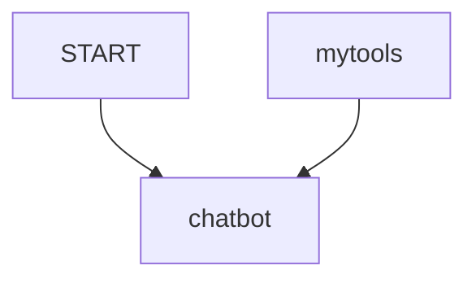
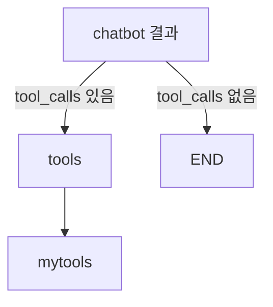
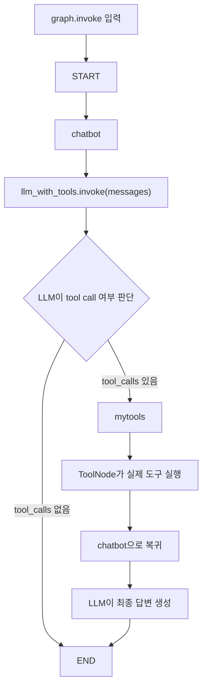
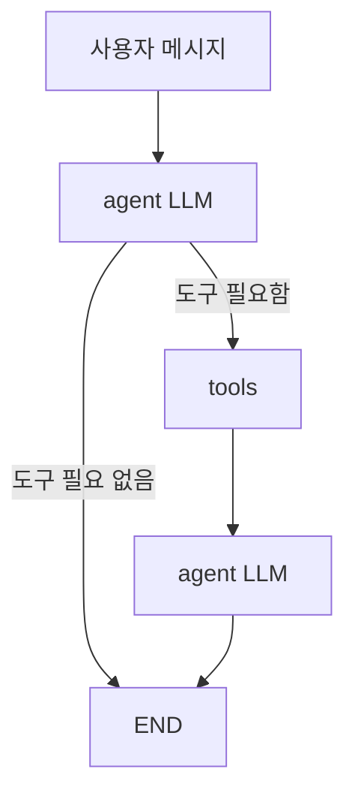

# LangGraph 문법 치트시트

## import

```python
from typing import Annotated, TypedDict
from langgraph.graph import StateGraph, START, END
from langgraph.graph.message import add_messages
from langgraph.prebuilt import ToolNode, tools_condition
from langgraph.prebuilt import create_react_agent
from langchain_core.tools import tool
from langchain_openai import ChatOpenAI
```

| 문법 | 출처 | 역할 |
|---|---|---|
| `TypedDict` | Python | State 구조 정의 |
| `Annotated` | Python | 타입에 reducer 같은 추가 정보 부여 |
| `StateGraph` | LangGraph | 그래프 워크플로우 생성 |
| `START` | [[LangGraph START]] | 그래프 시작 지점 |
| `END` | [[LangGraph END]] | 그래프 종료 지점 |
| `add_messages` | LangGraph | messages 누적 reducer |
| `ToolNode` | LangGraph | LLM이 요청한 도구를 실제 실행 |
| `tools_condition` | LangGraph | tool call 여부에 따라 라우팅 |
| `create_react_agent` | LangGraph | 기본 ReAct agent graph 생성 |
| `@tool` | LangChain | Python 함수를 LLM 도구로 변환 |
| `ChatOpenAI` | LangChain OpenAI | OpenAI chat model wrapper |

---

## 1. State 정의

```python
class State(TypedDict):
    messages: Annotated[list, add_messages]
```

`State`는 그래프 전체에서 공유되는 데이터 구조이다.

`messages`는 사용자 메시지, LLM 응답, 도구 결과를 담는 리스트이다.

`add_messages`를 붙이면 새 메시지를 기존 메시지에 이어 붙인다.

```python
return {"messages": [response]}
```

위처럼 일부 메시지만 반환해도 기존 `messages` 뒤에 누적된다.

관련: [[LangGraph State]]

---

## 2. LLM 생성

```python
llm = ChatOpenAI(model="gpt-4o-mini", temperature=0)
```

OpenAI Chat 모델을 LangChain 객체로 감싼다.

`temperature=0`은 답변의 랜덤성을 낮춰 일관성을 높인다.

---

## 3. Tool 정의

```python
@tool
def food_tool(food: str):
    """감기에 좋은 음식을 알려줄 때 사용한다."""
    return "생강차와 닭고기 수프를 드세요."
```

`@tool`은 Python 함수를 LLM이 호출 가능한 도구로 변환한다.

LLM은 다음 정보를 보고 도구 사용 여부를 판단한다.

- 함수 이름
- 인자 이름과 타입
- docstring

일반 `#` 주석은 보통 LLM에게 전달되는 tool schema에 포함되지 않는다.

```python
@tool
def cardio_food_tool(goal: str):
    """심폐지구력 향상에 도움이 되는 음식을 추천할 때 사용한다."""
    return "바나나, 오트밀, 고구마를 추천합니다."
```

도구 설명은 위처럼 docstring에 작성해야 한다.

관련: [[LangChain @tool]]

---

## 4. bind_tools

```python
mytools = [food_tool, care_tool]
llm_with_tools = llm.bind_tools(mytools)
```

`bind_tools()`는 LLM에게 도구 목록을 알려준다.

이 시점에는 도구가 실행되지 않는다.

실제 도구 선택은 다음 코드에서 일어난다.

```python
response = llm_with_tools.invoke(current_messages)
```

관련: [[LLM Tool Selection]]

---

## 5. Node 함수 정의

```python
def chatbot(state: State):
    current_messages = state["messages"]
    response = llm_with_tools.invoke(current_messages)
    return {"messages": [response]}
```

Node 함수는 State를 입력받아 State 일부를 반환한다.

`chatbot` 노드는 실제 도구를 실행하지 않는다. LLM에게 현재 메시지를 보내고, LLM이 도구를 쓸지 판단하게 한다.

관련: [[LangGraph Node]]

---

## 6. StateGraph 생성

```python
builder = StateGraph(State)
```

`StateGraph(State)`는 State 구조를 사용하는 그래프 설계도를 만든다.

아직 실행 가능한 그래프는 아니다.

관련: [[LangGraph StateGraph]]

---

## 7. add_node

```python
builder.add_node("chatbot", chatbot)
builder.add_node("mytools", ToolNode(mytools))
```

`add_node()`는 그래프에 실행 단계를 등록한다.

첫 번째 인자는 노드 이름이고, 두 번째 인자는 실행할 함수 또는 runnable이다.

| 코드 | 의미 |
|---|---|
| `"chatbot"` | LLM에게 메시지를 보내는 노드 이름 |
| `chatbot` | 직접 정의한 Python 함수 |
| `"mytools"` | 도구 실행 노드 이름 |
| `ToolNode(mytools)` | LangGraph가 제공하는 도구 실행 노드 |

---

## 8. add_edge

```python
builder.add_edge(START, "chatbot")
builder.add_edge("mytools", "chatbot")
```

`add_edge()`는 노드 간 고정 실행 순서를 만든다.



첫 번째 edge는 그래프 시작 후 `chatbot`을 실행하라는 뜻이다.

두 번째 edge는 도구 실행 후 다시 `chatbot`으로 돌아가 최종 답변을 만들라는 뜻이다.

관련: [[LangGraph Edge]]

---

## 9. add_conditional_edges

```python
builder.add_conditional_edges(
    "chatbot",
    tools_condition,
    {"tools": "mytools", END: END},
)
```

`add_conditional_edges()`는 조건에 따라 다음 노드를 다르게 선택한다.

여기서는 `chatbot` 실행 결과를 `tools_condition`이 검사한다.



`tools_condition`은 마지막 LLM 응답에 tool call이 있는지 확인하는 LangGraph 기본 조건 함수이다.

---

## 10. ToolNode

```python
ToolNode(mytools)
```

`ToolNode`는 LLM 응답의 `tool_calls`를 읽고 실제 Python 도구 함수를 실행한다.

중요한 구분:

```text
LLM = 어떤 도구를 쓸지 결정
ToolNode = 결정된 도구를 실제 실행
```

관련: [[LangGraph ToolNode]]

---

## 11. compile

```python
graph = builder.compile()
```

`compile()`은 그래프 설계도를 실제 실행 가능한 객체로 만든다.

`compile()` 전:

```text
그래프 설계 중
```

`compile()` 후:

```text
graph.invoke(...)로 실행 가능
```

---

## 12. invoke

```python
result = graph.invoke({"messages": "감기 걸렸을 때 뭘 먹어야 해?"})
```

`invoke()`는 입력값을 넣고 실제 실행하는 메서드이다.

객체에 따라 의미가 조금씩 다르다.

| 코드 | 의미 |
|---|---|
| `llm.invoke(prompt)` | LLM에 prompt를 넣고 실행 |
| `llm_with_tools.invoke(messages)` | LLM에게 메시지를 넣고 도구 사용 여부 판단 |
| `graph.invoke(state)` | 그래프 전체를 초기 State로 실행 |
| `tool.invoke(args)` | 도구를 인자로 실행 |

관련: [[invoke]]

---

## 13. 전체 실행 흐름



---

## 14. create_react_agent

```python
from langgraph.prebuilt import create_react_agent

mytools = [food_tool, care_tool]
agent = create_react_agent(llm, mytools)
```

`create_react_agent()`는 직접 `StateGraph`, `ToolNode`, `tools_condition`을 조립하지 않고 기본 ReAct 도구 호출 agent를 만드는 편의 함수이다.

```python
result = agent.invoke({"messages": "감기 걸렸을 때 뭘 먹어야 해?"})
print(result["messages"][-1].content)
```

내부 흐름은 대략 다음과 같다.



노트북에서 `agent`만 실행하면 그래프 그림이 나올 수 있다. 이는 `agent`가 LangGraph의 실행 가능한 그래프 객체이기 때문이다.

관련: [[LangGraph create_react_agent]]

---

## 한 줄 정리

> LangGraph 문법의 핵심은 State를 정의하고, Node를 등록하고, Edge로 흐름을 연결한 뒤, `compile()` 후 `invoke()`로 실행하는 것이다.

관련:

- [[LangGraph]]
- [[LangGraph StateGraph]]
- [[LangGraph State]]
- [[LangGraph Node]]
- [[LangGraph Edge]]
- [[Workflow Node vs Tool]]
- [[LLM Tool Selection]]
- [[Sub-LLM as Tool]]
- [[LangGraph create_react_agent]]
