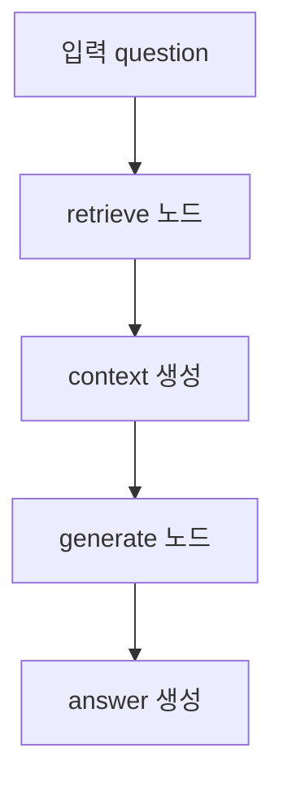
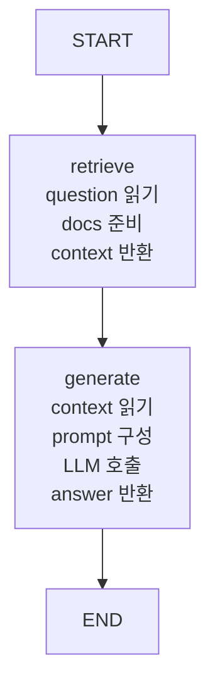
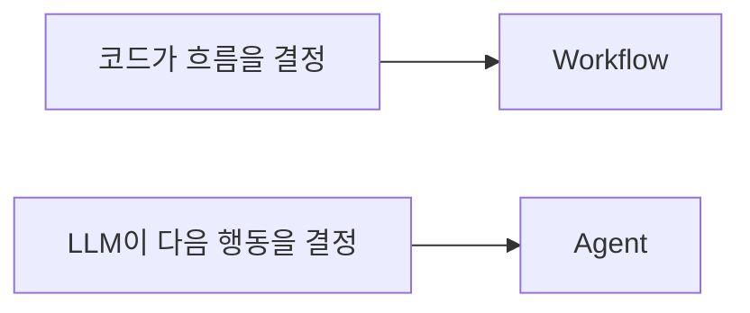
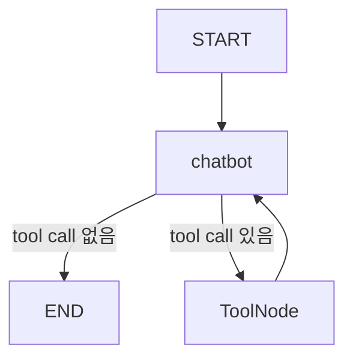
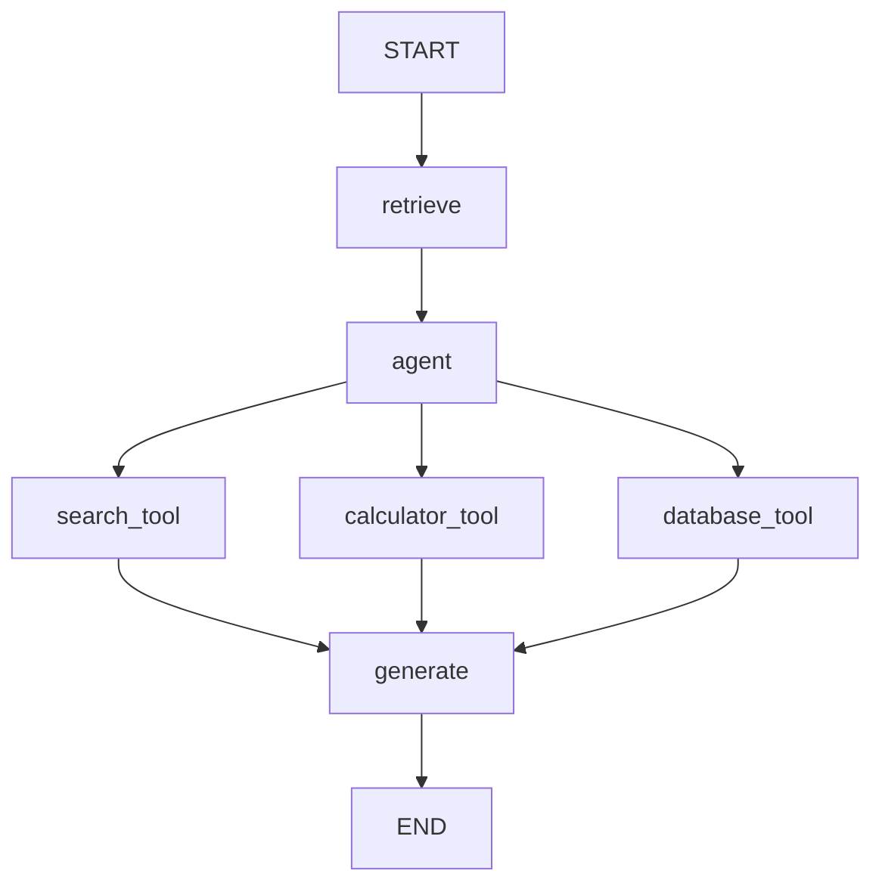

# LangGraph 워크플로우 아키텍처

## 개요

LangGraph 워크플로우 아키텍처는 LLM 애플리케이션을 여러 단계로 나누고, 각 단계를 그래프 노드로 연결하는 구조이다.

가장 단순한 검색-생성 워크플로우 아키텍처는 다음과 같다.

## 구성 요소

| 구성 요소 | 역할 |
|---|---|
| [[LangGraph State]] | 전체 워크플로우에서 공유하는 데이터 |
| [[LangGraph Node]] | 하나의 작업 단계 |
| [[LangGraph Edge]] | 실행 순서 |
| [[LangGraph StateGraph]] | 노드와 엣지를 묶은 실행 그래프 |
| LLM | 답변 생성 담당 |

## 기본 아키텍처 예시

## Workflow 성격

이 구조는 [[Agent vs Workflow]] 기준에서 Workflow에 가깝다.

왜냐하면 실행 순서를 LLM이 결정하지 않고, 개발자가 그래프로 고정했기 때문이다.

## Agent 구조로 확장할 때

이 워크플로우에 tool calling을 추가하면 더 Agent적인 구조가 된다.

또는 RAG 흐름과 Agent 흐름을 섞을 수 있다.

## 설계 기준

고정적으로 실행할 단계는 Node로 만든다.

예:

- retrieve
- generate
- evaluate
- save_log

LLM이 필요할 때 선택해야 하는 기능은 Tool로 만든다.

예:

- search_news
- get_stock_price
- query_database
- calculate

## 한 줄 정리

> LangGraph 워크플로우 아키텍처는 State를 중심으로 Node를 연결해 LLM 애플리케이션의 실행 흐름을 명시적으로 설계하는 방식이다.

관련:

- [[Workflow Node vs Tool]]
- [[LangGraph StateGraph]]
- [[Retrieve-Generate 패턴]]
