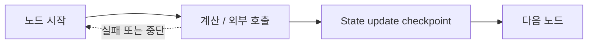

# LangGraph Durable Execution

Durable Execution은 그래프가 중단·재시작·오류를 겪어도 checkpoint를 기준으로 실행을 이어갈 수 있게 설계하는 방식이다. 단순히 [[LangGraph Checkpointer]]를 붙이는 것만으로 완성되지 않으며, **재실행 가능한 노드와 멱등적인 외부 효과**가 함께 필요하다.

## 실행 감각



그래프는 보통 노드 경계의 state를 저장한다. 따라서 노드 중간에 실패하거나 [[LangGraph interrupt|interrupt]] 후 재개하면, 그 노드는 처음부터 다시 실행될 수 있다. "한 번만 실행된다"는 가정을 두면 중복 메일, 중복 결제, 중복 DB 쓰기가 생긴다.

## 멱등성

동일 요청을 여러 번 처리해도 최종 효과가 한 번 처리한 것과 같다면 멱등적이다.

```python
def create_ticket(request_id: str, payload: dict):
    existing = repository.find_by_idempotency_key(request_id)
    if existing:
        return existing
    return repository.create(payload, idempotency_key=request_id)
```

외부 쓰기 전에 stable request ID를 만들고, 대상 시스템에 idempotency key를 전달하거나 자체 ledger로 중복을 막는다. `interrupt()` 앞의 부작용도 반드시 이 규칙을 따라야 한다.

## 오류를 네 종류로 나눈다

| 오류 | 예 | 처리 |
|---|---|---|
| 일시적 | timeout, 429, 일시적 DB 연결 실패 | 제한된 재시도와 backoff |
| 모델 복구 가능 | 잘못된 JSON, 누락된 필수 필드 | 오류를 구조화해 재생성 요청 |
| 사용자 해결 필요 | 모호한 선택, 승인 필요 | interrupt로 중단하고 질문 |
| 영구적 | 권한 없음, 계약 위반, 존재하지 않는 리소스 | 재시도하지 않고 설명·복구 경로 제공 |

재시도는 오류 유형과 전체 시간·비용 예산 안에서만 한다. 모든 예외를 retry하면 오류 폭주와 중복 효과를 만든다.

## checkpoint와 Store의 역할

- Checkpointer: 같은 `thread_id`의 실행 위치, 단기 state, 중단 지점을 보존한다.
- [[LangGraph Store]]: 여러 thread에서 다시 쓸 장기 지식과 선호를 보존한다.

둘을 같은 저장소에 넣을 수는 있어도 수명·삭제 정책·권한 모델은 분리하는 편이 좋다.

## 설계 점검

- 노드가 재실행돼도 같은 결과를 내는가?
- 외부 쓰기에 idempotency key 또는 중복 탐지가 있는가?
- state에는 JSON으로 직렬화 가능한 데이터만 남기는가?
- retry 횟수, 시간, 비용의 상한이 있는가?
- 재개에 사용할 `thread_id`가 안정적이고 권한 검사를 통과하는가?
- checkpoint 복구와 일반 새 턴 입력을 구분하는가?

## 관련

- [[LangGraph Checkpointer]]
- [[LangGraph interrupt]]
- [[LangGraph Command]]
- [[Fail-soft]]
- [[Fallback]]
- [[Tool Execution Policy]]

## 공식 문서

- [LangGraph Persistence](https://docs.langchain.com/oss/python/langgraph/persistence)
- [LangGraph Fault Tolerance](https://docs.langchain.com/oss/python/langgraph/fault-tolerance)
- [LangGraph Interrupts의 재실행·멱등성 규칙](https://docs.langchain.com/oss/python/langgraph/interrupts)
